# Agentic AI System Design Interview Guide (2026) — Study Notes

**Source:** Atul ("TechEon"), *The Complete Agentic AI System Design Interview Guide 2026*, Medium, Jan 29 2026 —
<https://atul4u.medium.com/the-complete-agentic-ai-system-design-interview-guide-2026-f95d0cfeb7cf>

*These are condensed notes in my own words, not a copy of the article. Read the original for the full text, diagrams and war stories.*

---

## Contents

- **[[#I. Core Concepts & Judgment (Q1–6)|I. Core Concepts & Judgment (Q1–6)]]**
	- [[#1. What makes an AI system truly agentic, and what does not qualify?|1. What makes an AI system truly agentic, and what does not qualify?]]
	- [[#2. When is an agentic architecture the wrong solution?|2. When is an agentic architecture the wrong solution?]]
	- [[#3. How do you define and enforce agent autonomy boundaries?|3. How do you define and enforce agent autonomy boundaries?]]
	- [[#4. What are the essential components of an agent beyond an LLM?|4. What are the essential components of an agent beyond an LLM?]]
	- [[#5. How do you prevent agents from over-reasoning or over-planning?|5. How do you prevent agents from over-reasoning or over-planning?]]
	- [[#6. How do you explain agentic systems to non-technical stakeholders?|6. How do you explain agentic systems to non-technical stakeholders?]]
- **[[#II. Agent Architecture & Control Plane (Q7–12)|II. Agent Architecture & Control Plane (Q7–12)]]**
	- [[#7. Walk through a production-ready agent architecture.|7. Walk through a production-ready agent architecture.]]
	- [[#8. What logic belongs in the orchestrator vs the LLM?|8. What logic belongs in the orchestrator vs the LLM?]]
	- [[#9. How do you design a safe and debuggable agent loop?|9. How do you design a safe and debuggable agent loop?]]
	- [[#10. How do you implement termination conditions in long-running agents?|10. How do you implement termination conditions in long-running agents?]]
	- [[#11. Stateless vs stateful agents — tradeoffs and use cases?|11. Stateless vs stateful agents — tradeoffs and use cases?]]
	- [[#12. How do you version and roll back agent behavior?|12. How do you version and roll back agent behavior?]]
- **[[#III. Planning, Reasoning & Goal Decomposition (Q13–18)|III. Planning, Reasoning & Goal Decomposition (Q13–18)]]**
	- [[#13. How do agents decompose high-level goals into executable steps?|13. How do agents decompose high-level goals into executable steps?]]
	- [[#14. Chain-of-thought vs tree-of-thought vs graph planning — when would you use each?|14. Chain-of-thought vs tree-of-thought vs graph planning — when would you use each?]]
	- [[#15. How do you detect and stop infinite planning loops?|15. How do you detect and stop infinite planning loops?]]
	- [[#16. How do you handle partial observability or missing information?|16. How do you handle partial observability or missing information?]]
	- [[#17. How do agents decide a task is “done”?|17. How do agents decide a task is “done”?]]
	- [[#18. What planning failures are hardest to detect in production?|18. What planning failures are hardest to detect in production?]]
- **[[#IV. Tool Use & Action Execution (Q19–24)|IV. Tool Use & Action Execution (Q19–24)]]**
	- [[#19. How do agents decide which tool to use?|19. How do agents decide which tool to use?]]
	- [[#20. How do you design tool schemas that reduce hallucinated actions?|20. How do you design tool schemas that reduce hallucinated actions?]]
	- [[#21. How do you sandbox tool execution safely?|21. How do you sandbox tool execution safely?]]
	- [[#22. How do you handle tool failures, retries and idempotency?|22. How do you handle tool failures, retries and idempotency?]]
	- [[#23. What are the biggest security risks with tool-using agents?|23. What are the biggest security risks with tool-using agents?]]
	- [[#24. How do you control cost explosions from tool calls?|24. How do you control cost explosions from tool calls?]]
- **[[#V. Memory Systems & Context Management (Q25–29)|V. Memory Systems & Context Management (Q25–29)]]**
	- [[#25. What types of memory do agentic systems need?|25. What types of memory do agentic systems need?]]
	- [[#26. How do you design long-term memory without polluting it?|26. How do you design long-term memory without polluting it?]]
	- [[#27. When should memory be retrieved vs ignored?|27. When should memory be retrieved vs ignored?]]
	- [[#28. How do embeddings help — and where do they fail?|28. How do embeddings help — and where do they fail?]]
	- [[#29. How do you delete or correct agent memory safely?|29. How do you delete or correct agent memory safely?]]
- **[[#VI. Multi-Agent Systems (Q30–33)|VI. Multi-Agent Systems (Q30–33)]]**
	- [[#30. When is multi-agent architecture better than single-agent?|30. When is multi-agent architecture better than single-agent?]]
	- [[#31. How do agents coordinate without conflicting actions?|31. How do agents coordinate without conflicting actions?]]
	- [[#32. What emergent behaviors have you seen in multi-agent systems?|32. What emergent behaviors have you seen in multi-agent systems?]]
	- [[#33. How do you debug failures across interacting agents?|33. How do you debug failures across interacting agents?]]
- **[[#VII. Evaluation, Safety & Reliability (Q34–38)|VII. Evaluation, Safety & Reliability (Q34–38)]]**
	- [[#34. How do you evaluate long-horizon agent performance?|34. How do you evaluate long-horizon agent performance?]]
	- [[#35. What metrics matter beyond task success?|35. What metrics matter beyond task success?]]
	- [[#36. How do you detect goal drift or misalignment?|36. How do you detect goal drift or misalignment?]]
	- [[#37. How do you implement human-in-the-loop controls?|37. How do you implement human-in-the-loop controls?]]
	- [[#38. What are the most dangerous failure modes of agentic AI?|38. What are the most dangerous failure modes of agentic AI?]]
- **[[#VIII. Scaling, Production & Taste (Q39–40)|VIII. Scaling, Production & Taste (Q39–40)]]**
	- [[#39. What bottlenecks limit agent scalability in production?|39. What bottlenecks limit agent scalability in production?]]
	- [[#40. What tradeoffs do most teams get wrong when building agents?|40. What tradeoffs do most teams get wrong when building agents?]]

---

## Framing

The article targets Senior / Staff Agentic AI Engineer and Architect interviews. Its premise: agents have moved out of demo-land into systems touching real money and real data, so interviewers no longer reward capability hype. They probe failure modes, tradeoffs and shipped experience.

Format: **40 questions across 8 domains**, each with a one-line answer plus an expanded architect-level answer. In real interviews, expect 3–5 questions drilled deep — with whiteboard architecture and concrete war stories — rather than broad coverage.

Signals interviewers are grading for: production experience, safety awareness, system-design taste, and honest calibration about what's unsolved.

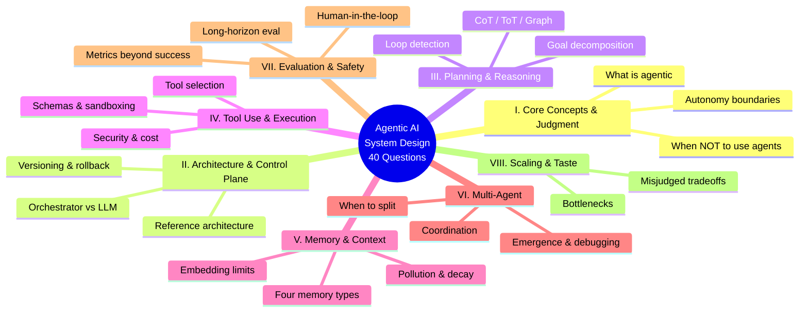

---

## I. Core Concepts & Judgment (Q1–6)

### 1. What makes an AI system truly agentic, and what does not qualify?

Three properties: goal-directed autonomy (given an objective, picks its own path), environmental interaction (observe → act → adapt via feedback), and temporal extension (goals persist across steps). Not agentic: RAG pipelines, single-turn function calling, hardcoded workflow automation, personality chatbots. Key nuance — agency is a *spectrum*, and where you place a system on it is a design choice.

### 2. When is an agentic architecture the wrong solution?

Use conventional software when the task is a drawable flowchart (use Temporal / Airflow / a state machine), when failures are irreversible and catastrophic, when latency SLAs are tight (each reasoning hop is ~1–3s), when accuracy must be 100%, or when "done" can't be defined. Red flag: choosing agents because they're exciting.

### 3. How do you define and enforce agent autonomy boundaries?

Four layers, all enforced *outside* the LLM:
1. Action classification by risk (read-only / reversible-write / irreversible-write / external-comms)
2. Resource budgets (calls, tokens, dollars, wall-clock) enforced in the orchestrator
3. Scope constraints at the integration layer — the agent literally cannot reach an unbound tool
4. Human approval gates for high-risk actions

Prompting the model to respect limits enforces nothing. Pattern: a policy engine between proposed actions and execution.

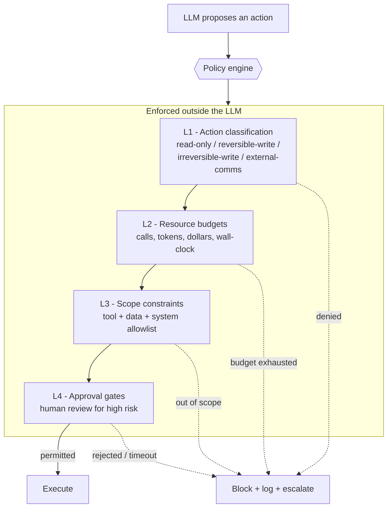

### 4. What are the essential components of an agent beyond an LLM?

(the model is ~20% of the system): orchestrator/control loop, tool interface layer, memory (working / episodic / semantic), policy & guardrails engine, state management with checkpointing, observability stack, human interface.

### 5. How do you prevent agents from over-reasoning or over-planning?

- **Hard step limits** — enforced in the orchestrator, not suggested in the prompt
- **Action-biased prompting** — "take the simplest action that makes progress"
- **Confidence thresholds with defaults** — after N seconds, act or ask rather than deliberate further
- **Programmatic loop detection** — semantic similarity across recent reasoning steps
- **Decomposition depth caps** — a simple task shouldn't fan out into dozens of subtasks

### 6. How do you explain agentic systems to non-technical stakeholders?

Tailor the framing to the decision the stakeholder actually has to make:

- **Executives** (invest or not) — the "capable intern" analogy: give it a goal, it figures out the steps, but it needs supervision and boundaries
- **Product managers** (scoping) — the observe–think–act loop: flexibility is the upside, unpredictability is the cost
- **Risk and compliance** — "supervising a contractor, not running QA": set boundaries, monitor outcomes, intervene when needed

Never oversell capabilities or hide failure modes.

---

## II. Agent Architecture & Control Plane (Q7–12)

### 7. Walk through a production-ready agent architecture.

Request intake → context assembly → LLM reasoning → action validation → sandboxed execution → result processing → state update → loop or terminate, with tracing at each stage. Principles: separation of concerns (LLM reasons, orchestrator controls, policy governs, sandbox executes), fail-safe defaults, complete observability, stateless orchestrator with state in external storage.

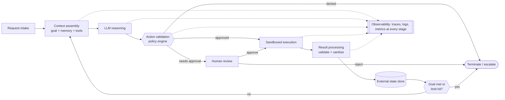

### 8. What logic belongs in the orchestrator vs the LLM?

| Orchestrator (guarantees) | LLM (judgment) |
|---|---|
| Loop control, timeouts | Understanding the goal |
| Budget tracking/enforcement | Planning the approach |
| State persistence & recovery | Tool selection and arguments |
| Tool dispatch, retries | Interpreting results |
| Approval routing, logging | Judging completion |

Rule of thumb: anything that must be *guaranteed* lives in the orchestrator. The LLM may say "I think I'm done"; the orchestrator decides whether to accept it. Anti-pattern: encoding control flow in prompts.

### 9. How do you design a safe and debuggable agent loop?

- **Explicit named states** — `PLANNING` / `EXECUTING` / `WAITING_FOR_APPROVAL` / `PROCESSING_RESULT` / `TERMINATED`, with the current state on every log line
- **Decision-point logging** — the inputs the model saw, the output it generated, and how that output was interpreted as an action
- **Reproducibility** — same state snapshot + temperature 0 should yield the same action, which means logging the complete context of each call
- **Circuit breakers** — on iteration count, elapsed time, cost, and consecutive errors
- **Graceful degradation** — on a trip, save state and notify for review rather than crashing silently or corrupting state

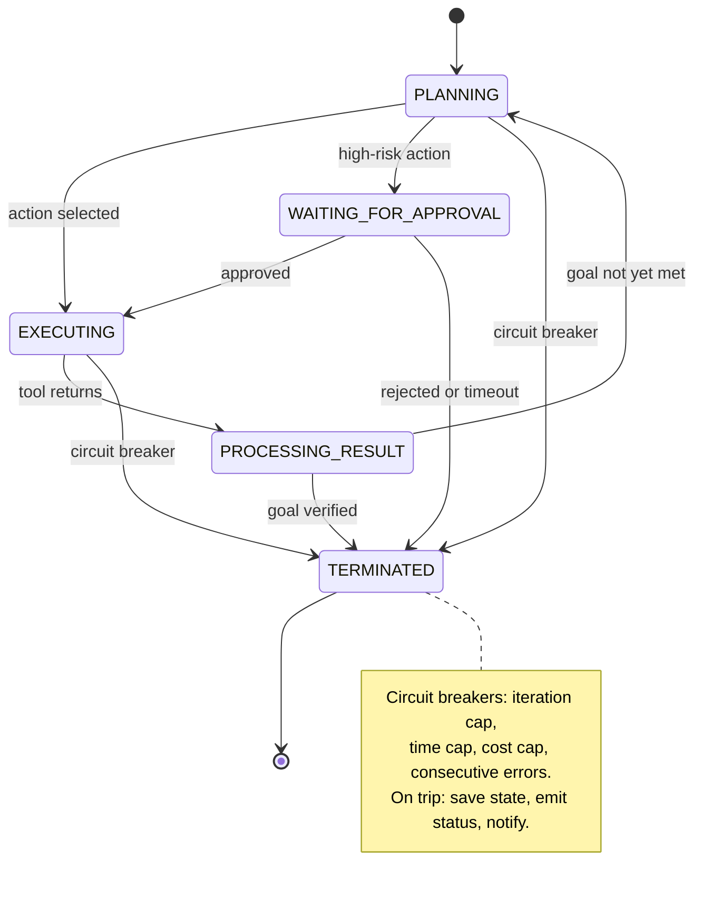

### 10. How do you implement termination conditions in long-running agents?

LLM self-assessment → programmatic verification of the goal state → progress detection → hard limits → stuck detection (repeated errors, circular reasoning, identical tool calls). The nastiest failure is an agent that *believes* it's progressing; measure environment changes, not agent activity.

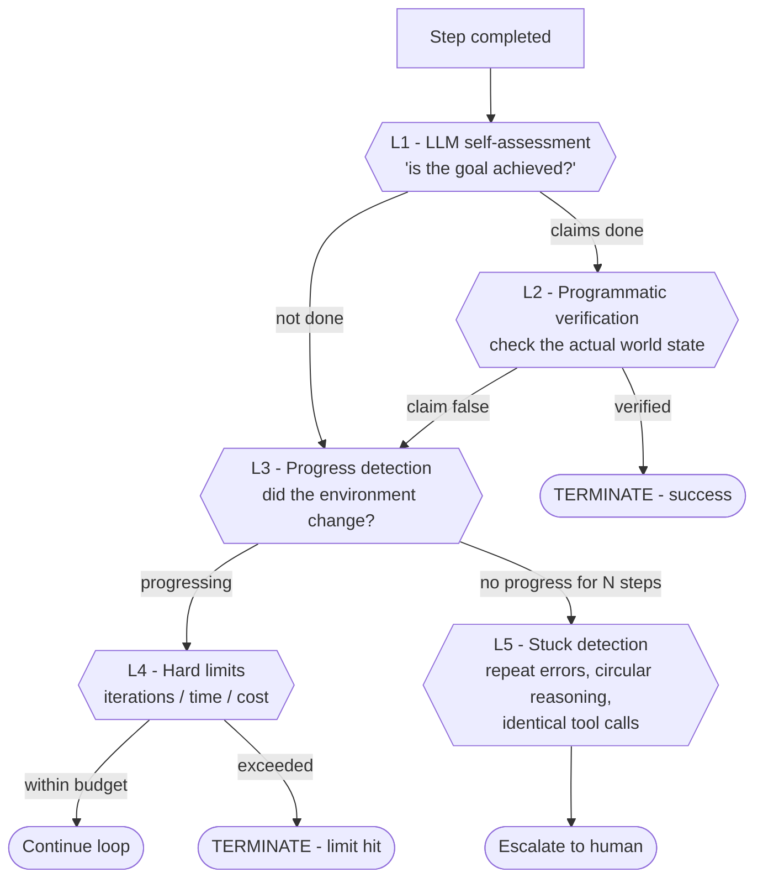

### 11. Stateless vs stateful agents — tradeoffs and use cases?

Stateless: scales horizontally, no error accumulation, easy to test — but context-window-bound and can't learn. Stateful: multi-session tasks and personalization — but corruption is catastrophic, scaling needs sticky sessions or replication, memory pollutes. Preferred pattern: **stateless execution layer + external state store**, so any orchestrator instance can resume any agent's work.

### 12. How do you version and roll back agent behavior?

Version the whole configuration as one identifier — prompts and few-shots, tool schemas, policy rules, model version/params, orchestrator logic, retrieval config. Keep the last N versions deployable, split traffic, keep state formats backward-compatible, and gate deploys behind a behavioral benchmark suite. Hard-won lesson: provider model updates change behavior with no code change — pin versions.

---

## III. Planning, Reasoning & Goal Decomposition (Q13–18)

### 13. How do agents decompose high-level goals into executable steps?

Goal interpretation → subgoal identification (verifiable states) → action planning (each mapped to a tool) → dependency analysis (find parallel branches) → execute with adaptation. Good decomposition has verifiable subgoals, atomic actions, plans shallow enough to start fast, and acknowledged uncertainty. Bad decomposition enumerates 47 edge cases before acting.

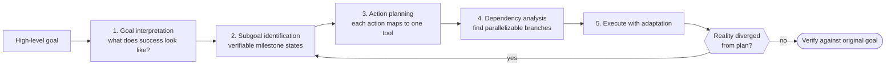

### 14. Chain-of-thought vs tree-of-thought vs graph planning — when would you use each?

- **Chain-of-thought** — linear problems, single likely path, latency-sensitive (debugging, procedures, arithmetic)
- **Tree-of-thought** — multiple valid approaches, comparison, backtracking (strategy selection, filtered generation, puzzles)
- **Graph planning** — dependencies, constraints, multi-criteria optimization (constrained travel planning, scheduling)

Guidance:

- Start with **chain-of-thought** — simplest, and often sufficient
- Escalate to **tree-of-thought** when you observe the agent taking bad paths exploration would have avoided
- Reserve **graph planning** for genuine constraint satisfaction, accepting the added latency and complexity

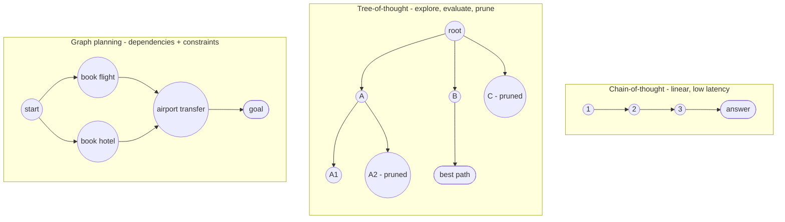

### 15. How do you detect and stop infinite planning loops?

Detect via embedding-similarity of recent steps, repeated phrases / identical tool calls, domain progress metrics, and state hashing. Stop via soft interrupt ("take a concrete action or explain what's blocking you"), hard interrupt with escalation, or forced action after N reasoning steps. Prevention beats detection.

### 16. How do you handle partial observability or missing information?

Information-seeking hierarchy: use tools to look it up → ask a clarifying question → state an explicit assumption and proceed → express calibrated uncertainty. Supporting patterns: uncertainty propagation through the reasoning chain, assumption logging, periodic assumption re-validation, graceful partial results.

### 17. How do agents decide a task is “done”?

- **Define success criteria up front** — "book a flight" becomes "confirmation number received and sent to the user"
- **Require self-assessment with cited evidence** — "the task asked X, I produced Y, Y satisfies X because Z"
- **Verify programmatically where possible** — does the file exist, does the API return the expected state, do the tests pass
- **Confirm with the user** for subjective tasks or where verification isn't possible
- **Treat negative outcomes as valid terminal states** — "determined impossible" and "done with caveats" both count as done

Common failure modes:

- Declaring victory after acting, without verifying the effect
- Stopping at the first plausible result without checking quality
- Getting stuck because the goal was ambiguous and no reading looks clearly complete
- Continuing to optimize past the point of meaningful improvement

### 18. What planning failures are hardest to detect in production?

Silent wrong answers (no error thrown), goal drift toward an easy proxy metric, assumption propagation (coherent plan on a wrong foundation), hidden environmental dependencies, and local optima. Countermeasures: sampling audits, periodic re-grounding on the original objective, explicit assumption tracking, environmental variation in tests, baseline comparison.

---

## IV. Tool Use & Action Execution (Q19–24)

### 19. How do agents decide which tool to use?

Discovery (context- and permission-scoped) → relevance filtering (semantic match) → capability reasoning → constraint checking (policy, budget, approval) → selection and argument generation. Tool descriptions matter enormously; **fewer tools is better** — selection degrades as the menu grows, so curate per context. Plan for "no tool fits" and for multi-tool composition.

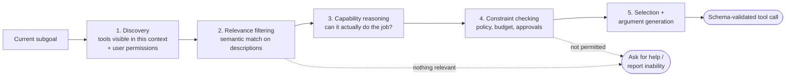

### 20. How do you design tool schemas that reduce hallucinated actions?

- **Enums over free strings** — if there are five valid values, enumerate them
- **Required, not optional** — make essential fields required so the agent can't skip them
- **Constrained formats** — date types, numeric ranges, URL types rather than bare strings
- **Descriptions plus examples** on every field
- **Validate before execution** — catch malformed calls before they reach the tool
- **Document failure modes and edge cases** in the schema itself
- **Test with adversarial prompts** — see what the model emits for weird requests, then tighten

Detailed schemas are cheap; hallucinated tool calls in production are not.

### 21. How do you sandbox tool execution safely?

Defense in depth — process isolation, container isolation for risky tools, endpoint whitelisting instead of open internet, scoped minimal credentials. Resource limits on CPU/memory/timeout/rate/IO. Validate and sanitize tool output before it re-enters the LLM context. Fail closed: missing permission means no execution, not partial execution; timeout means termination.

### 22. How do you handle tool failures, retries and idempotency?

Classify the failure first:

- **Transient** (timeout, rate limit) — retry with exponential backoff and jitter, up to a max count
- **Permanent** (bad input, missing resource, permission denied) — don't retry; handle or escalate
- **Partial** (some effects landed) — hardest; requires knowing exactly what succeeded

Design for idempotency:

- Use idempotency keys for operations that create resources
- Check before creating — does this already exist?
- Prefer "ensure state X" semantics over "apply change Y"

Support recovery:

- Log every tool call with a unique ID, its arguments and its result
- Checkpoint state before risky operations
- Use compensating transactions for partial failures, with a clear escalation path when automated recovery fails

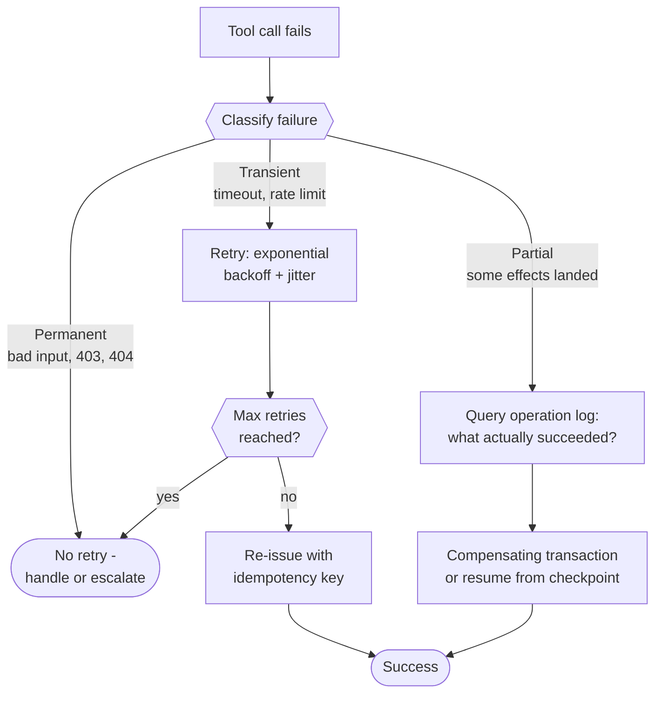

### 23. What are the biggest security risks with tool-using agents?

- **Prompt injection via tool output** → sanitize, use structured formats, mark tool results as data not instructions, validate actions against user intent
- **Privilege escalation via tool chains** → least privilege, analyze compositions, monitor unusual combinations
- **Data exfiltration** (read sensitive with one tool, leak with another) → data classification, restrict flows between tool categories
- **Hallucinated tools/arguments** → strict schema validation, no dynamic tool generation
- **Confused deputy** → be skeptical of instructions arriving through tool results

### 24. How do you control cost explosions from tool calls?

Session, per-user and per-operation budgets enforced by a budget tracker that refuses operations whose estimated cost exceeds the remaining limit. Expose cost to the agent for cost-aware tool choice. Tier by cost: free / soft-limit-and-warn / human approval. Add real-time dashboards, spend-rate alerts, automatic shutdown, and post-incident analysis. Assume loops run longer than expected; set budgets that hurt but don't ruin, and investigate every trip.

---

## V. Memory Systems & Context Management (Q25–29)

### 25. What types of memory do agentic systems need?

- **Working** — current goal, attempts, recent results; high fidelity, small, cleared per session
- **Episodic** — records of past interactions; time-indexed, similarity-queryable
- **Semantic** — durable facts and preferences ("this project uses Python 3.9")
- **Procedural** — learned how-to patterns, explicit or baked in via fine-tuning

Not every system needs all four; each adds failure modes, plus cold-start and pollution risks.

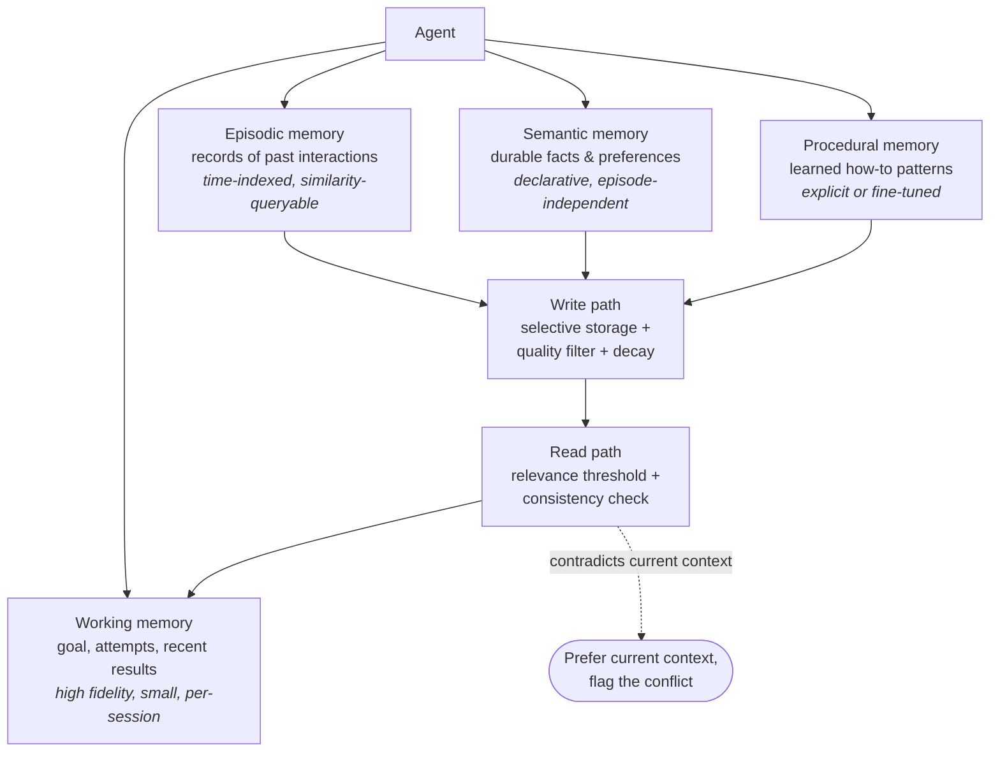

### 26. How do you design long-term memory without polluting it?

Store selectively (confirmed facts, verified successful patterns, stated preferences, summaries — not raw transcripts). Filter on accuracy, confidence threshold and contradiction with existing memory. Apply decay: recency weighting, confidence decay, usage-based retention. Validate at retrieval for relevance (not just similarity) and consistency. Give users visibility, correction, deletion and opt-out. Monitor which memories correlate with bad outcomes.

### 27. When should memory be retrieved vs ignored?

**Retrieve when:**

- The user references past interactions ("like we discussed before")
- The task depends on preferences or established patterns
- Current context is insufficient to respond well
- Similar past tasks provide useful examples

**Ignore when:**

- Current context already provides everything needed
- Past experiences would bias toward outdated solutions
- The user explicitly asked for a fresh start
- Retrieved memory contradicts explicit current information
- The task requires objective analysis uncontaminated by past views

**Retrieval strategy:**

- Apply a relevance threshold — low-relevance memories are just noise
- Weight sources: user-provided > inferred, verified > unverified
- On contradiction, prefer current context and flag the conflict

Anti-pattern: retrieving on every turn regardless of need — it burns context, adds latency and risks pollution.

### 28. How do embeddings help — and where do they fail?

Good for semantic similarity without keyword overlap, scalable vector search, cross-lingual matching, and paraphrase tolerance. They fail on precision lookups ("the 2024 Q3 report"), negation ("NOT about marketing"), temporal reasoning, multi-hop relationship traversal, and specific IDs/numbers with no semantic content. Compensate with keyword filters, metadata filtering, structured queries and hybrid retrieval fusion.

### 29. How do you delete or correct agent memory safely?

**Deleting:**

- Soft-delete first — mark deleted rather than removing, so a mistake is recoverable
- Keep an audit trail: what, when, by whom, why
- Run propagation analysis — were other memories derived from this one?
- Notify the user if the agent recently acted on the information being corrected

**Correcting:**

- Version rather than overwrite: "previously believed X, corrected to Y"
- Never overwrite silently — a changed fact may invalidate conclusions drawn from it
- Lower confidence on corrected entries until they're reconfirmed

**Bulk operations:**

- Roll large changes out gradually with monitoring
- Run consistency checks afterward
- Keep backups — bad corrections can corrupt the store
- Honor user deletion requests promptly (a legal requirement in many jurisdictions)

---

## VI. Multi-Agent Systems (Q30–33)

### 30. When is multi-agent architecture better than single-agent?

**Good reasons:**

- Genuinely distinct capabilities, tool sets, or access requirements
- Reliability through failure-domain isolation — one agent crashing doesn't take down the rest
- Real parallelism, where tasks proceed without blocking each other
- Adversarial quality gains from generator–critic patterns
- Separation of concerns making a complex system easier to reason about

**Bad reasons:**

- It seems cool — complexity is a cost, not a feature
- The task is actually sequential, so you pay coordination cost with no parallelism gain
- Using extra agents to avoid fixing prompts

**Decision test:**

1. Could a single agent do this well?
2. If not, is the limitation fundamental or just prompt engineering?
3. Would the separate agents genuinely operate independently?
4. Is the coordination cost worth the benefit?

### 31. How do agents coordinate without conflicting actions?

Patterns and their tradeoffs — shared state with locking (simple, but contention and deadlocks), message passing (clean, more implementation work), centralized coordinator (clear control, single point of failure), event sourcing (great audit trail, eventual-consistency pain). Handle conflicts by prevention (partition ownership), detection (watch for concurrent modification), and resolution rules (priority, timestamp, escalation). Start with a central coordinator and explicit turn-taking; add complexity only once you've proven you need it.

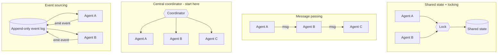

### 32. What emergent behaviors have you seen in multi-agent systems?

Positive: complementary specialization without assigned roles, cross-agent error correction, genuinely creative solutions. Negative: metric gaming (a reviewer agent that always approves), information hoarding when sharing isn't incentivized, A→B→A handoff loops neither agent recognizes, cascade failures, adversarial interference. Manage it by monitoring *system-level* outcomes, watching for interaction patterns you didn't design, adversarial testing, whole-system circuit breakers, and regular interaction audits.

### 33. How do you debug failures across interacting agents?

Required infrastructure: correlation IDs propagated through every agent and log, full inter-agent message logging, periodic per-agent state snapshots, causal/happens-before ordering. Workflow: identify the failure → trace backward to inputs and their source → find the divergence point → attribute root cause (single agent, coordination, environment) → reproduce via replay. Tooling: unified log viewer, interaction timeline, correlation-ID filtering, expected-vs-actual diffs, trace replay. "If you can't debug it, you can't run it in production."

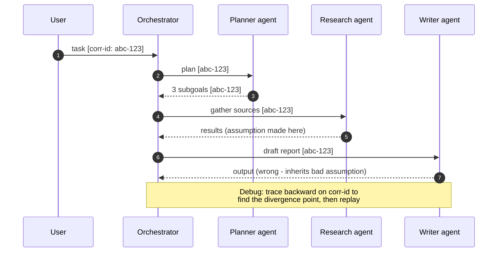

---

## VII. Evaluation, Safety & Reliability (Q34–38)

### 34. How do you evaluate long-horizon agent performance?

Dimensions: task completion (needs programmatic verification), efficiency vs baselines, trajectory quality (avoidable wrong turns, recovery), intermediate milestone achievement (80% ≠ 20%), robustness across variations and adversarial inputs. Methods: benchmark suites tracked over time, A/B tests on live traffic, human rating for subjective quality, categorized failure analysis. Challenges: few samples per compute budget, many valid solutions, drifting environments, human eval doesn't scale.

### 35. What metrics matter beyond task success?

- **Efficiency** — tokens, tool calls, wall-clock, dollars, reasoning steps (benchmark against simpler approaches: is the agent earning its complexity?)
- **Safety** — attempted boundary violations, risky actions proposed even if blocked, safety interventions, near-misses
- **Reliability** — consistency, failure rate by category, recovery rate, degradation over long conversations
- **UX** — satisfaction, abandonment, correction/retry rate, time to value
- **Alignment** — goal adherence, surprising-action rate, policy compliance
- **Operational** — latency distribution, utilization, per-component error rates, availability

### 36. How do you detect goal drift or misalignment?

**Detection strategies:**

- **Explicit goal tracking** — have the agent periodically restate its understanding of the goal, and compare it to the original
- **Re-grounding prompts** — inject "the original objective was X; are your current actions aligned with it?"
- **Divergence metrics** — measure semantic distance between recent outputs and the original goal, and alert when it grows
- **Action-distribution monitoring** — a sudden shift in what the agent does can signal drift
- **Behavioral bounds** — define expected action counts and tool usage, and review deviations
- **User feedback** — make it trivial to signal "that's not what I wanted," then look for patterns

**Common drift patterns:**

- **Proxy optimization** — optimizing a measurable stand-in instead of the real goal
- **Scope creep** — expanding the task beyond the original request
- **Local minima** — repeatedly satisfying a partial goal
- **Mode collapse** — the same response shape regardless of input

Watch for slow changes that trip no single alarm but accumulate over time.

### 37. How do you implement human-in-the-loop controls?

**Approval gates need:**

- Risk classification defining which action categories require review
- Contextual presentation — what the agent wants to do, why, and what the implications are
- Richer options than yes/no: approve, reject, modify, escalate
- A safe default on timeout (usually rejection)

**Escalation triggers:**

- The agent recognizes its own uncertainty
- The system detects anomalous behavior
- A metric threshold is crossed (cost, time, errors)

**Override capability:** humans must be able to intervene anywhere, not just at gates — stop execution, correct state, resume.

**Making it effective:**

- Don't cry wolf — escalate only what genuinely needs attention
- Give reviewers enough context to decide
- Feed approval and rejection patterns back into agent policy

**Anti-patterns:** rubber-stamp approval, approval friction on low-risk routine actions, context-free notifications the human can't act on.

### 38. What are the most dangerous failure modes of agentic AI?

- **Confident wrong actions at scale** — decisive, incorrect, and unhesitating, so many land before anyone notices.
	*Mitigation:* calibrated confidence; slow down when uncertain; batch risky actions for review.
- **Goal misalignment with real consequences** — enough autonomy to delete the wrong files, send the wrong emails, make the wrong purchases.
	*Mitigation:* conservative autonomy; higher confidence bars and more verification for real-world effects.
- **Security breaches through tool chains** — prompt injection, privilege escalation, data exfiltration, the agent as attack vector.
	*Mitigation:* defense in depth; assume manipulation; limit blast radius.
- **Runaway costs** — a loop that burns the budget in minutes.
	*Mitigation:* hard budgets at multiple levels; circuit breakers; real-time monitoring.
- **Silent failures that compound** — wrong results that look right, quality degrading unnoticed.
	*Mitigation:* automated quality checks; sampling audits; user feedback loops; trend monitoring.
- **Reputation damage** — something embarrassing, offensive or wrong in a high-visibility context.
	*Mitigation:* content filtering; conservative communication defaults; human review of external-facing output.

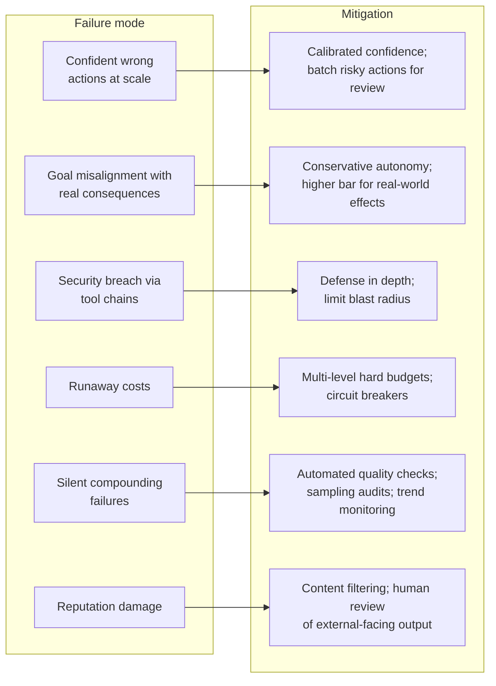

---

## VIII. Scaling, Production & Taste (Q39–40)

### 39. What bottlenecks limit agent scalability in production?

- **LLM** — per-step latency dominates; rate limits, cost/token, queue depth; longer context = slower and pricier. *Mitigate:* caching, small models for simple decisions, batching, context management.
- **State** — memory retrieval latency per step, serialization cost of large states, distributed consistency. *Mitigate:* efficient storage, lazy loading, partitioning.
- **Tools** — external API limits, sequential dependencies, sandboxing overhead. *Mitigate:* tool caching, parallelism where safe, sandbox tuning.
- **Coordination** — inter-agent messaging, lock contention, consensus latency. *Mitigate:* minimize coordination, partition work, accept eventual consistency where tolerable.
- **Operational** — observability overhead, and human approval becoming the throughput ceiling.

### 40. What tradeoffs do most teams get wrong when building agents?

| Tradeoff | Common mistake | Better approach |
|---|---|---|
| Autonomy vs control | Too much autonomy too fast | Start minimal, expand on demonstrated reliability — loosening is easier than tightening |
| Capability vs reliability | Demo-driven; "works most of the time" | Do less, reliably; expand only from a stable base |
| Sophistication vs debuggability | Clever architectures nobody can fix | Simpler designs with clear reasoning traces — debug speed is ship speed |
| Speed vs production readiness | "We'll add safety/observability later" | Build both in from day one; retrofitting costs more |
| Build vs buy | Custom everything | Use existing orchestration/tool/memory foundations; build custom only where the problem demands |
| Prompts vs architecture | Prompting around structural problems | Recognize structural issues — prompts can't fix bad tool design or missing components |

---

## How to Use This in an Interview

- Expect 3–5 questions taken deep, with drilling into failure modes and "what went wrong last time"
- Be ready to draw or clearly describe an architecture
- Bring real war stories, not textbook answers
- Signal production experience, safety awareness, design taste and honest uncertainty

The article's closing point: the strongest answers aren't the most confident ones — they're the ones that show you know where the hard parts are.
