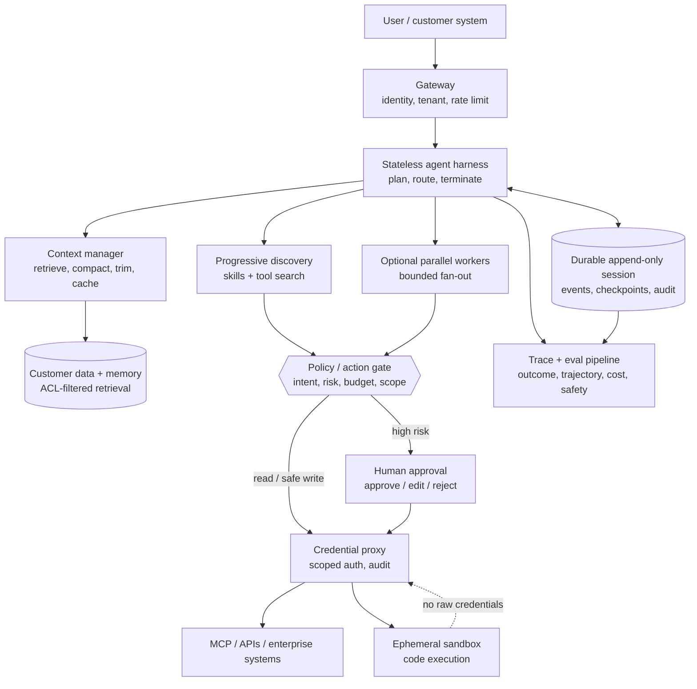

# Anthropic Agent Systems — FDE System Design Notes (2025–Present)

Companion to [[google-fde-multi-agent-interview-prep]], [[agentic-ai-system-design-interview-guide-2026]], and [[google-fde-python-coding-prep]].

This note distills Anthropic's official engineering, research, and product publications from January 2025 through September 11, 2026, with one foundational December 2024 architecture post included where later articles explicitly build on it. It is **not a Claude product guide**. The goal is to extract portable system-design knowledge and industry signals useful in Forward Deployed Engineer interviews.

> [!important] How to read the claims
> - **Anthropic finding** means Anthropic reported a measurement, production lesson, or architectural choice.
> - **FDE implication** is the practical inference drawn from that source; it is not necessarily Anthropic's wording.
> - Product behavior and benchmark numbers are snapshots at publication time. Use the architectural lesson in interviews, not the vendor-specific number alone.

---

## Contents

- **[[#1. The executive summary|1. The executive summary]]**
- **[[#2. The architecture Anthropic's writing converges on|2. The architecture Anthropic's writing converges on]]**
- **[[#3. Ten system-design lessons|3. Ten system-design lessons]]**
- **[[#4. Industry trends visible across the publications|4. Industry trends visible across the publications]]**
- **[[#5. How to use this in an FDE interview|5. How to use this in an FDE interview]]**
- **[[#6. Topic-by-topic system-design interview drills|6. Topic-by-topic system-design interview drills]]**
- **[[#7. Publication timeline|7. Publication timeline]]**
- **[[#8. Official sources|8. Official sources]]**

---

## 1. The executive summary

Anthropic's 2025–2026 writing points to one central shift:

> The hard part of an agent system is no longer merely prompting the model. It is building the **harness, context, tools, execution boundary, durable state, policy layer, and evaluation system** around it.

The highest-value ideas for an FDE system-design round are:

1. **Start with the simplest architecture that works.** Use workflows for predictable paths and agents only where the path genuinely cannot be known in advance.
2. **Treat context as scarce working memory, not a data warehouse.** Retrieve, filter, compact, and progressively disclose information rather than filling the window.
3. **Treat tools as interfaces for a probabilistic caller.** Clear names, distinct scopes, useful error messages, compact responses, and examples materially change agent performance.
4. **Move deterministic work out of the model loop.** Use code for filtering, loops, joins, validation, and bulk tool operations; reserve inference for decisions that require judgment.
5. **Use multi-agent systems for parallel, high-value work—not by default.** They buy independent context windows and breadth, but add coordination failure and steep token cost.
6. **Externalize state for long-running work.** A durable event log, checkpoints, progress artifacts, and explicit completion criteria matter more than an ever-longer conversation.
7. **Separate the agent's “brain” from its “hands.”** Stateless orchestration, durable sessions, replaceable sandboxes, and tools behind stable interfaces improve recovery, security, and deployment flexibility.
8. **Put credentials and policy outside the execution environment.** Filesystem and network isolation must work together; a model should never possess a credential it only needs to exercise indirectly.
9. **Evaluate outcomes and trajectories, not self-reports.** The database state, created artifact, or passing tests determine success—not “done” in the final message.
10. **Human approval is a scarce operational resource.** Risk-tier actions, establish safe autonomy zones, and escalate only meaningful decisions to avoid approval fatigue.

These principles align closely with Google's ADK/A2A/MCP vocabulary in [[google-fde-multi-agent-interview-prep#6. Google's agent stack — vocabulary you must have]], but they are framework-independent.

---

## 2. The architecture Anthropic's writing converges on

This is a synthesized reference architecture, not a diagram copied from a single Anthropic post.

The boundaries matter more than the boxes:

- **Harness vs session:** compute can restart; history must survive.
- **Model context vs session:** the context window is a curated view; the session is the recoverable record.
- **Reasoning vs execution:** the model proposes; deterministic code, policy, and tools execute.
- **Sandbox vs credentials:** untrusted generated code must not be able to read reusable secrets.
- **Capability vs authorization:** finding a tool does not imply permission to use it.
- **Offline eval vs production monitoring:** one prevents known regressions; the other catches drift and unknown failures.

---

## 3. Ten system-design lessons

### 3.1 Choose workflows before agents

Anthropic's late-2024 foundation, repeatedly referenced in its 2025–2026 engineering posts, distinguishes:

- **Workflow:** LLMs and tools follow a predefined control path.
- **Agent:** the model dynamically decides how to use tools and directs its own process.

The practical rule is to begin with the least complex design that meets the requirement. Routing, prompt chaining, parallelization, orchestrator-worker, and evaluator-optimizer are composable patterns; a fully autonomous loop is not the starting point.

**FDE implication:** ask whether the customer's process is genuinely open-ended. A fixed claims process with six policy states is probably a state machine with model-powered steps. Open-ended incident investigation may justify an agent.

**Interview line:** “I would earn autonomy with task uncertainty. If I can draw the path reliably, I will encode it rather than pay an LLM to rediscover it on every run.”

Source: [Building effective agents](https://www.anthropic.com/research/building-effective-agents).

### 3.2 Context engineering replaces prompt-only thinking

Anthropic defines context engineering as curating the complete token state available during inference: instructions, tools, retrieved data, message history, and intermediate results. Longer windows do not eliminate this work. Anthropic cites “context rot”: recall and reasoning can degrade as irrelevant material accumulates.

Design for the **smallest high-signal context** that can support the next decision:

- Keep system instructions clear and at the right level of abstraction.
- Retrieve just-in-time instead of preloading an entire corpus.
- Remove stale tool results and duplicate history.
- Compact completed phases, but preserve raw history outside the context window.
- Store durable notes or artifacts when knowledge must survive a reset.
- Isolate subtasks in subagents when their detailed context is not needed by the lead agent.

**FDE implication:** “We have a one-million-token window” is not an architecture. You still need access control, freshness, relevance ranking, observability, cost control, and a policy for what survives between turns.

**Interview line:** “The session is the source of truth; the prompt is a lossy, task-specific projection of it.”

Sources: [Effective context engineering for AI agents](https://www.anthropic.com/engineering/effective-context-engineering-for-ai-agents) and [Scaling Managed Agents](https://www.anthropic.com/engineering/managed-agents).

### 3.3 Design tools for agents, not only developers

A conventional API is a contract between deterministic programs. An agent tool is a contract between deterministic infrastructure and a probabilistic caller. Schema validity alone does not ensure the model will select or use it correctly.

Anthropic's reported principles:

- Build a small set of clearly differentiated tools.
- Match tool boundaries to natural tasks, such as `get_customer_context` rather than forcing several low-level fetches.
- Namespace related tools so large catalogs remain legible.
- Write descriptions that explain selection criteria, constraints, and important relationships.
- Return only information useful for the next decision, with stable identifiers and actionable errors.
- Support response-detail controls, pagination, and filtering to avoid context bloat.
- Include realistic examples where schemas cannot express usage conventions.
- Evaluate tool use on real multi-step tasks and inspect raw traces.

**FDE implication:** tool design is part of model quality. When an agent “hallucinates” parameters or repeatedly chooses the wrong API, first inspect the affordance, overlap, description, and error response before changing the model.

**Interview line:** “I would version and evaluate the tool contract like a prompt or model change, because it directly changes agent behavior.”

Source: [Writing effective tools for agents—with agents](https://www.anthropic.com/engineering/writing-tools-for-agents).

### 3.4 Discover tools and knowledge progressively

Static loading breaks down when agents have hundreds or thousands of tools. Anthropic's 2025 publications converge on **progressive disclosure**:

1. Load only a short name and description initially.
2. Search or select the relevant capability.
3. Load its full schema, instructions, examples, or resources only when needed.
4. Execute and return a compact result.

Agent Skills apply the same pattern to procedural knowledge: lightweight metadata routes the task; detailed instructions and supporting files load only after selection. MCP applies it to external capabilities and data.

**FDE implication:** separate three concepts:

- **MCP/tool:** what the system can access or do.
- **Skill/procedure:** how the organization wants the work performed.
- **Policy:** whether this user and session may perform the action.

**Interview line:** “Discovery is not authorization. Loading a refund skill or finding a billing tool must not grant the right to move money.”

Sources: [Equipping agents for the real world with Agent Skills](https://www.anthropic.com/engineering/equipping-agents-for-the-real-world-with-agent-skills), [Introducing advanced tool use](https://www.anthropic.com/engineering/advanced-tool-use), and [MCP donation to the Agentic AI Foundation](https://www.anthropic.com/news/donating-the-model-context-protocol-and-establishing-of-the-agentic-ai-foundation).

### 3.5 Move loops and data plumbing into code

Direct tool calling makes every intermediate value travel through the model. Anthropic showed a pattern in which MCP tools are exposed as code APIs inside a sandbox so an agent can discover definitions on demand and perform joins, loops, filters, and transformations locally.

The model should decide **what** computation is needed; deterministic code should handle:

- Large-result filtering and aggregation
- Bulk record transformations
- Loops, branching, and retry schedules
- Cross-system joins
- Schema checks and arithmetic
- Moving data between tools without copying it through model context

Anthropic reported one illustrative workflow dropping from 150,000 context tokens to 2,000 using this design. The number is workload-specific; the portable lesson is that context is the wrong data plane.

**FDE implication:** code execution trades token cost and latency for sandboxing and operational complexity. Use it for sufficiently large or compositional workloads, with CPU, memory, time, filesystem, and egress limits.

**Interview line:** “Natural language is the control plane for ambiguous decisions; code is the data plane for deterministic transformations.”

Source: [Code execution with MCP](https://www.anthropic.com/engineering/code-execution-with-mcp).

### 3.6 Use multi-agent systems only where parallel context is valuable

Anthropic's Research system uses an orchestrator-worker design: a lead agent decomposes an open-ended query, parallel subagents search independently, and a separate citation process grounds claims.

Anthropic reported:

- A lead Opus 4 agent with Sonnet 4 workers outperformed a single Opus 4 agent by 90.2% on an internal research evaluation.
- Token use explained 80% of variance in its BrowseComp analysis.
- Agents used roughly 4× the tokens of chat interactions; multi-agent systems used roughly 15×.
- Multi-agent designs were best for valuable breadth-first tasks with independent directions, more information than one context can hold, or many complex tools.
- They were a poor fit where workers require the same context or have dense dependencies.

Treat these as Anthropic's workload-specific measurements, not universal multipliers.

Good delegation includes an objective, output format, allowed tools and sources, boundaries, and a budget. The orchestrator should synthesize compact worker results, not ingest every worker transcript.

**FDE implication:** the business value must justify parallel inference. For routine customer support, a routed single agent is usually cheaper and easier to debug. For an urgent cross-region incident investigation, bounded parallel agents may be worthwhile.

**Interview line:** “Multi-agent is a scaling strategy for independent search and context, not a synonym for sophistication.”

Source: [How we built our multi-agent research system](https://www.anthropic.com/engineering/multi-agent-research-system).

### 3.7 Long-running agents need durable artifacts and explicit completion

Compaction alone did not solve Anthropic's long-running coding experiments. Agents attempted too much at once, lost state mid-feature, or declared success prematurely after seeing partial progress.

Practices that improved continuity:

- Use an initializer to establish the environment and decompose requirements.
- Represent the full requirement set as structured, testable items.
- Work incrementally and leave the environment clean after each unit.
- Persist progress notes and use version history as recovery artifacts.
- Reset context when needed and hand off a structured state summary.
- Verify through end-to-end behavior, not only unit tests or the agent's claim.
- Separate generation from skeptical evaluation for complex or subjective outputs.

The 2026 follow-up used planner, generator, and evaluator roles. Its most portable idea is not “always use three agents”; it is that self-evaluation is systematically lenient, so independent grading with explicit criteria is a useful control.

**FDE implication:** for a workflow that lasts hours or awaits human approval, store a resumable state machine and idempotency keys. Never rely on an in-memory conversation loop staying alive.

**Interview line:** “A long-running agent is a distributed workflow with probabilistic steps. I design crash recovery and resume semantics before increasing the step limit.”

Sources: [Effective harnesses for long-running agents](https://www.anthropic.com/engineering/effective-harnesses-for-long-running-agents) and [Harness design for long-running application development](https://www.anthropic.com/engineering/harness-design-long-running-apps).

### 3.8 Separate brain, session, and hands

Anthropic's 2026 Managed Agents architecture separates:

- **Brain:** model plus replaceable orchestration harness
- **Session:** durable, append-only event history
- **Hands:** sandboxes and tools reached through stable execution interfaces

This makes harnesses and sandboxes disposable. A failed harness can reconstruct state from the session log; a failed sandbox can be reprovisioned. Remote or customer-VPC execution becomes easier because the harness no longer assumes tools live beside it.

Anthropic reported that lazy sandbox provisioning in this architecture reduced p50 time-to-first-token by roughly 60% and p95 by more than 90% for that service.

**FDE implication:** this is directly relevant to customer deployment topology. The control plane can be managed centrally while data-plane “hands” run inside the customer's trust boundary. Stable interfaces also protect the platform from rapidly changing model-specific harness strategies.

**Interview line:** “I keep the durable session outside both inference and execution, so either side can fail independently without losing the job.”

Source: [Scaling Managed Agents: Decoupling the brain from the hands](https://www.anthropic.com/engineering/managed-agents).

### 3.9 Security should constrain capability structurally

Anthropic's security writing emphasizes that prompt injection is not solved by more prompting. A safe agent architecture limits what a compromised or overeager agent can reach.

Core controls:

- Filesystem isolation: allow access only to task-scoped paths.
- Network isolation: allow only approved destinations through a proxy.
- Credential isolation: store real tokens in a vault or proxy outside the sandbox.
- Least privilege: issue task-, tenant-, resource-, and time-scoped capabilities.
- Action classification: distinguish read, reversible write, irreversible write, external communication, and security changes.
- Input screening: treat tool output, retrieved documents, and web pages as untrusted data.
- Output gating: evaluate the real-world effect of a proposed action against explicit user authority.
- Audit and intervention: retain traces and let humans stop or redirect execution.

Filesystem and network isolation must work together: either one alone leaves a path for exfiltration or escape.

Anthropic's 2026 auto-mode work also exposes an important limit: an action classifier reduced routine friction but still missed 17% of a small, real “overeager action” evaluation set. Anthropic explicitly says it is not a replacement for careful review of high-stakes infrastructure.

**FDE implication:** a learned guard is one layer, not the security boundary. High-impact actions still need deterministic policy, narrow permissions, sandboxing, and sometimes human approval.

**Interview line:** “I assume the model can be convinced. My security case rests on what the execution layer makes impossible, not what the system prompt asks it to avoid.”

Sources: [Beyond permission prompts](https://www.anthropic.com/engineering/claude-code-sandboxing), [Claude Code auto mode](https://www.anthropic.com/engineering/claude-code-auto-mode), and [Framework for safe and trustworthy agents](https://www.anthropic.com/news/our-framework-for-developing-safe-and-trustworthy-agents).

### 3.10 Evals measure the whole system, under controlled infrastructure

Anthropic's eval framework distinguishes:

- **Task:** one scenario with inputs and success criteria
- **Trial:** one stochastic attempt; run multiple trials
- **Transcript/trajectory:** tool calls, reasoning, intermediate results, and messages
- **Outcome:** the final state of the environment
- **Agent harness:** the scaffold around the model
- **Eval harness:** infrastructure that runs, records, grades, and aggregates trials

Use complementary graders:

| Grader | Best for | Main limitation |
|---|---|---|
| Deterministic code/state checks | Database state, tests, schema, policy invariants | Brittle for valid open-ended variation |
| Model-based rubric | Tone, groundedness, completeness, judgment | Stochastic; must be calibrated with experts |
| Human/SME review | Gold-standard domain judgment | Slow and expensive |

Separate **capability evals** (“what new hard tasks can it do?”) from **regression evals** (“does it still do known tasks reliably?”). Track task success alongside turns, tool calls, tokens, latency, errors, safety interventions, and cost.

For conversational agents, verify both the end state and interaction quality. A refund agent should actually create the correct refund, follow identity and policy steps, remain within a turn budget, and communicate appropriately.

Infrastructure is part of an agent eval. Anthropic measured a six-percentage-point spread on Terminal-Bench 2.0 between resource configurations—larger than many model leaderboard gaps. CPU, memory, network, sandbox, dependency, and time-limit differences can change both failure rate and agent strategy.

**FDE implication:** pin and record the model, prompt, tools, data snapshot, harness, sandbox image, and resource limits. Separate infrastructure failures from model failures before drawing conclusions.

**Interview line:** “I grade the state the agent changed, inspect the path it took, and control the environment it ran in.”

Sources: [Demystifying evals for AI agents](https://www.anthropic.com/engineering/demystifying-evals-for-ai-agents) and [Quantifying infrastructure noise in agentic coding evals](https://www.anthropic.com/engineering/infrastructure-noise).

---

## 4. Industry trends visible across the publications

### Trend 1 — Chat is becoming durable delegated work

Anthropic's June 2026 Economic Index says its usage increasingly consists of long-running agentic sessions rather than simple assistant conversations. Its September 2025 report had already found directive use rising from 27% in late 2024 to 39% in its 2025 sample, with automation exceeding augmentation for the first time in that report.

**FDE consequence:** design around jobs, events, checkpoints, cancellation, budgets, resumability, notifications, and audit—not only synchronous request/response APIs.

Sources: [Economic Index: Uneven geographic and enterprise AI adoption](https://www.anthropic.com/research/anthropic-economic-index-september-2025-report) and [Economic Index: Cadences](https://www.anthropic.com/research/economic-index-june-2026-report).

### Trend 2 — Enterprise adoption starts narrow and high-value

Anthropic's enterprise API analysis found usage concentrated in specialized tasks where deployment was comparatively easy, capability robust, and economic value high; software development dominated early API use. Later reports show use broadening, while coding increasingly moves from chat-style augmentation into automated API and agent workflows.

**FDE consequence:** do not begin with “transform the whole company.” Find one bounded workflow with clean ownership, measurable value, enough volume, recoverable failure, and usable data. Prove it, then expand.

Sources: [Economic Index: Uneven adoption](https://www.anthropic.com/research/anthropic-economic-index-september-2025-report) and [Economic Index: Learning curves](https://www.anthropic.com/research/economic-index-march-2026-report).

### Trend 3 — Adoption capability includes organizational learning

Anthropic reported that users with at least six months of tenure had a 10% higher conversation success rate after controlling for measured factors, while carefully noting this may reflect learning-by-doing or differences among early adopters.

**FDE consequence:** deployment success is not only a model metric. Budget for user training, workflow redesign, feedback collection, champions, operating procedures, and handover. Adoption and customer capability are system components.

Source: [Economic Index: Learning curves](https://www.anthropic.com/research/economic-index-march-2026-report).

### Trend 4 — Model routing becomes an economic control

Anthropic observed that experienced API users select stronger model classes more often for higher-value tasks. Its engineering stack similarly uses cheap first-stage filters and escalates only uncertain or risky cases to more expensive reasoning.

**FDE consequence:** route by task value, uncertainty, latency objective, and risk—not just intent. Cache deterministic or repetitive paths, use small models for classification, and reserve frontier inference for cases where it changes the outcome.

Sources: [Economic Index: Learning curves](https://www.anthropic.com/research/economic-index-march-2026-report) and [Claude Code auto mode](https://www.anthropic.com/engineering/claude-code-auto-mode).

### Trend 5 — Open protocols are becoming infrastructure

MCP moved from an Anthropic-launched protocol to a Linux Foundation project under the Agentic AI Foundation in December 2025. Anthropic reported more than 10,000 active public servers and adoption across major AI products and clouds at that time.

**FDE consequence:** the integration layer is standardizing, but governance remains customer-specific. Ask about server identity, authentication, tenant isolation, connector allowlists, versioning, async operations, audit, and data residency. Protocol compatibility does not equal production readiness.

Source: [Donating MCP and establishing the Agentic AI Foundation](https://www.anthropic.com/news/donating-the-model-context-protocol-and-establishing-of-the-agentic-ai-foundation).

### Trend 6 — Reliability bugs can masquerade as model behavior

Anthropic's September 2025 postmortem describes overlapping routing, runtime, and compiler problems that intermittently changed output quality across hardware platforms. Sticky routing and low initial incidence made customer reports appear contradictory.

**FDE consequence:** when staging and production differ, segment by provider, model snapshot, region, hardware/backend, context mode, tenant, routing path, and time. Preserve request IDs and traces. A nondeterministic-looking model regression may be deterministic infrastructure skew.

Source: [A postmortem of three recent issues](https://www.anthropic.com/engineering/a-postmortem-of-three-recent-issues).

### Trend 7 — The harness has become a first-class product surface

Across Anthropic's long-running agent, evaluator, auto-mode, and managed-agent publications, performance improvements come from orchestration and environment design as often as from model changes. At the same time, Anthropic warns that harness assumptions can become obsolete as models improve.

**FDE consequence:** version the harness separately from the model, measure each combination, and prefer stable interfaces over permanent workarounds for one model generation. Delete scaffolding that no longer earns its cost.

Sources: [Effective harnesses](https://www.anthropic.com/engineering/effective-harnesses-for-long-running-agents), [Harness design](https://www.anthropic.com/engineering/harness-design-long-running-apps), and [Scaling Managed Agents](https://www.anthropic.com/engineering/managed-agents).

---

## 5. How to use this in an FDE interview

### 5.1 The Anthropic-informed design sequence

For an ambiguous enterprise-agent prompt, drive the discussion in this order:

1. **Value and outcome** — who uses it, what state must change, and how is value measured?
2. **Task shape** — deterministic workflow or open-ended agent? Where is judgment truly needed?
3. **Authority and blast radius** — read, reversible write, irreversible write, communication, money, production?
4. **Customer environment** — systems, data quality, APIs, identity, VPC, residency, latency, and operational ownership?
5. **Control architecture** — harness, context manager, tools, policy gate, sandbox, session store, and human review?
6. **Failure semantics** — retry, idempotency, timeout, compensation, pause/resume, and safe termination?
7. **Evaluation** — real tasks, verified outcomes, trajectory metrics, safety cases, repeated trials, and controlled infra?
8. **Rollout and handover** — offline replay, shadow, suggest-only, narrow autonomy, expansion, runbooks, and customer training?

### 5.2 Translate Anthropic ideas into Google/FDE language

| Portable concept | Anthropic example | Google/FDE framing |
|---|---|---|
| Agent harness | Claude Agent SDK / Managed Agents | ADK orchestration on Agent Engine or a custom control plane |
| Tool/data protocol | MCP | MCP beneath ADK; enterprise connectors behind policy and identity |
| Agent-to-agent boundary | Lead and research subagents | A2A Agent Cards with explicit task and authority contracts |
| Durable session | Append-only session event log | External state store/checkpoints; stateless scalable workers |
| Execution hand | Ephemeral sandbox or remote tool | Customer-VPC worker, sandbox, Cloud Run/GKE job, or controlled API |
| Progressive knowledge | Agent Skills | Versioned procedural packages and just-in-time context |
| Tool discovery | Tool Search | Tiered routing and dynamic registry lookup |
| Outcome evaluation | State checks plus trace graders | Golden set, component/trajectory evals, CI gate, online monitoring |

The interview signal is not that you memorized Anthropic's product names. It is that you recognize the same architectural pressures across vendors.

### 5.3 A strong two-minute answer

> “I would start by separating the deterministic workflow from the parts that require agent judgment. The agent runs in a stateless harness, while a durable session log stores every event and checkpoint so the job can resume after failure or human approval. Context is assembled just in time from ACL-filtered customer data; it is not the session database. Tools are discovered progressively and sit behind a policy and credential proxy, so the model can propose an action without possessing the underlying secret. Generated code runs in an ephemeral sandbox with filesystem, network, CPU, memory, and time limits. I would add parallel workers only for independent, high-value branches and cap their token and tool budgets. We evaluate actual end state plus trajectory, cost, latency, and policy compliance across repeated trials, then roll out from shadow or suggest-only mode into narrow autonomy.”

---

## 6. Topic-by-topic system-design interview drills

Each drill maps directly to one lesson in §3. Do not memorize the proposed architecture. Practice driving the answer in sequence, making assumptions explicit, and revising the design when the interviewer changes a constraint.

### The reusable answer frame

Use this seven-step frame before the topic-specific steps:

1. **Clarify the outcome** — users, job to be done, scale, latency, success metric, and unacceptable failure.
2. **Classify the task** — deterministic vs open-ended; read vs write; synchronous vs long-running.
3. **State assumptions** — choose reasonable numbers so the design can move forward.
4. **Draw the happy path** — request, decision, action, state update, response.
5. **Add production controls** — identity, policy, isolation, retries, budgets, observability, and human review.
6. **Define evaluation and rollout** — offline outcome checks, shadow traffic, narrow launch, and expansion criteria.
7. **Name the main tradeoff** — what the design optimizes, what it sacrifices, and what evidence would change it.

---

### 6.1 Workflows before agents

**Interview question**

> A global retailer wants an AI system to process product-return requests. It must read the request, check order and policy data, decide eligibility, issue a label or refund, and escalate exceptions. Design the system and decide where agents are actually necessary.

**Steps to address it**

1. **Clarify authority and policy complexity.** Ask whether the system can move money, which returns are irreversible, how frequently policies change, regional differences, request volume, and latency targets.
2. **Decompose the process by uncertainty.** Identity verification, order lookup, eligibility rules, refund limits, and ledger writes are deterministic. Understanding messy customer intent and summarizing exceptions may require a model.
3. **Choose a state-machine backbone.** Model states such as `received → identity_verified → order_found → policy_checked → approved/rejected/escalated → executed → notified`.
4. **Place LLM steps narrowly.** Use the model to classify intent, extract evidence, ask clarifying questions, and prepare escalation summaries. Do not let it invent policy or directly mutate the payment ledger.
5. **Put policy in code.** A versioned rules engine determines eligibility and required approval. The orchestrator validates every transition.
6. **Make writes safe.** Use idempotency keys for labels and refunds, transaction records, bounded retries, and compensation or reconciliation jobs.
7. **Evaluate component and end-to-end behavior.** Measure extraction accuracy, policy-decision agreement, correct final ledger state, escalation precision/recall, latency, and cost.
8. **Roll out by risk.** Begin with recommendation-only mode, then automate policy-clear labels, and only later automate bounded refunds.

**Likely follow-ups**

- What change would justify a fully agentic loop? Open-ended investigation across inconsistent evidence where the next data source cannot be predetermined.
- Why not put the whole policy in the prompt? It is difficult to validate, version, and guarantee; use prompts to explain policy, not enforce it.
- What is the strongest design signal? Knowing where **not** to use an agent.

**Core tradeoff:** flexibility vs predictability and auditability.

---

### 6.2 Context engineering

**Interview question**

> Design an enterprise assistant that answers questions across 40,000 documents, CRM records, support tickets, and a conversation that may continue for months. The customer says the model has a huge context window, so they want to load everything.

**Steps to address it**

1. **Clarify freshness and access.** Ask which systems are authoritative, document update rates, tenant and row-level permissions, retention rules, citation requirements, and the acceptable staleness window.
2. **Separate durable stores.** Keep raw documents in source systems, indexed chunks in retrieval storage, conversation events in a durable session store, and compact user-approved memory in a separate store.
3. **Create a just-in-time context pipeline.** Authenticate first, apply ACL and metadata filters, use hybrid retrieval, rerank candidates, deduplicate, then fit the highest-signal evidence into a token budget.
4. **Give different context different lifetimes.** Stable system rules are cached; current-task evidence is retrieved; tool results are trimmed after use; durable facts require explicit write criteria and provenance.
5. **Preserve recoverability.** Treat the prompt as a temporary projection. Store the full trace and source references outside the context window so compaction can be audited or reconstructed.
6. **Defend the boundary.** Mark retrieved text as untrusted data, separate instructions from evidence, and never let retrieved content expand tool authority.
7. **Evaluate retrieval and answer separately.** Measure recall@k, permission leakage, freshness, citation correctness, groundedness, answer quality, token use, and latency.
8. **Add degradation paths.** Ask a clarifying question on ambiguous identity or topic; say evidence is insufficient rather than answering from stale memory.

**Likely follow-ups**

- When do you use long context instead of RAG? For a bounded, permission-safe corpus that benefits from holistic reading and fits the cost/latency target.
- How do you correct bad memory? Keep provenance and versioning; tombstone or supersede facts and invalidate derived summaries.
- How do you prevent cross-tenant leakage? Enforce identity and ACL filters before retrieval, not after generation.

**Core tradeoff:** completeness vs attention quality, latency, cost, and privacy.

---

### 6.3 Tools as agent-facing contracts

**Interview question**

> A support agent can access CRM, billing, orders, inventory, and messaging APIs. In testing it picks the wrong tools, makes redundant calls, and invents parameters. Redesign the tool layer.

**Steps to address it**

1. **Collect failing traces.** Categorize wrong selection, ambiguous names, invalid arguments, missing data, poor error recovery, excessive calls, and unsafe actions.
2. **Map tools to user-level tasks.** Replace overlapping primitives with coherent operations where useful—for example, `get_customer_context` or `prepare_refund_quote`—while keeping irreversible execution separate.
3. **Define explicit semantics.** Give every tool a distinct verb, namespace, purpose, “use when / do not use when” description, typed schema, constraints, and examples.
4. **Design useful responses.** Return stable IDs, provenance, timestamps, next-action hints, and typed error categories. Support pagination, field selection, and concise/detail modes.
5. **Keep validation deterministic.** Reject invalid enums, unknown fields, stale versions, unauthorized resources, and impossible state transitions before reaching downstream systems.
6. **Separate propose from commit.** A read or quote tool may be broadly usable; a write tool receives an idempotency key and policy authorization and may require approval.
7. **Build a realistic tool eval.** Use real multi-step tasks, multiple trials, held-out cases, and measurements for selection, arguments, call count, errors, tokens, latency, and final outcome.
8. **Version and canary changes.** A tool-description edit can alter behavior as much as a code change; test it against regression suites before rollout.

**Likely follow-ups**

- Why not expose every backend endpoint? Backend APIs reflect service ownership, not the mental model an agent needs to solve tasks.
- Should one tool do everything? No; consolidate natural context gathering, but keep distinct risk and transaction boundaries visible.
- What should an error return? Machine-readable category, human-readable recovery guidance, retryability, and a correlation ID—never a silent empty result.

**Core tradeoff:** broad composability vs clear selection and controlled blast radius.

---

### 6.4 Progressive tool and knowledge discovery

**Interview question**

> Design an internal operations agent that can use 2,000 tools from dozens of teams and follow hundreds of company procedures without placing all definitions and manuals in every prompt.

**Steps to address it**

1. **Create a capability catalog.** Store short names, namespaces, descriptions, owners, versions, risk class, required scopes, and health status.
2. **Use hierarchical discovery.** Route to a domain, search within that domain, load a compact summary, then fetch the full schema or procedural skill only for selected capabilities.
3. **Separate capability, procedure, and permission.** Tools describe what can be done; skills explain how to do a business process; a policy engine independently determines whether the session may do it.
4. **Rank with more than semantic similarity.** Include tenant, user role, task intent, tool health, locality, version compatibility, cost, and risk.
5. **Control loaded context.** Limit the number of candidates and full definitions; evict unused schemas and retain only compact results after execution.
6. **Handle collisions and drift.** Namespace tools, define ownership, pin compatible versions per workflow, and provide migration or deprecation metadata.
7. **Secure discovery.** Do not reveal the names or descriptions of capabilities the user cannot know about. Recheck authorization at execution time.
8. **Evaluate the funnel.** Measure domain-routing recall, top-k tool recall, final selection, parameter correctness, unauthorized discovery, context tokens, and task success.

**Likely follow-ups**

- What if the search misses the right tool? Allow bounded query reformulation or escalation to a broader catalog, then log misses for catalog improvement.
- Can the agent install new tools itself? Discovery and installation are different privileges; installation should be reviewed, scanned, pinned, and isolated.
- How do skills stay current? Assign owners, versions, tests, dependencies, and review dates; run their scenarios when underlying tools change.

**Core tradeoff:** discovery breadth vs context load, latency, and attack surface.

---

### 6.5 Code execution as the deterministic data plane

**Interview question**

> A finance agent must retrieve a 100,000-row spreadsheet, join it with ERP invoices, identify discrepancies, create a summary, and open remediation tickets. Design it without sending all raw data through the model.

**Steps to address it**

1. **Clarify data sensitivity and locality.** Ask whether records can leave the customer VPC, which fields contain PII, expected size, runtime, and reconciliation precision.
2. **Assign responsibilities.** The model plans the analysis and explains anomalies; sandboxed code performs reads, joins, filters, arithmetic, batching, and schema validation.
3. **Keep raw data on the data plane.** Let code call governed MCP/API clients and return aggregates, samples, and exception IDs—not the full dataset—to model context.
4. **Design an isolated runtime.** Use ephemeral containers, no embedded credentials, read-only inputs by default, bounded scratch storage, CPU/memory/time limits, restricted egress, and dependency allowlists.
5. **Broker credentials outside the sandbox.** A proxy applies tenant, row, field, destination, and operation policy and records an audit event for each call.
6. **Make ticket creation transactional.** Produce a reviewable discrepancy artifact first; after approval, create tickets with idempotency keys and checkpoint batch progress.
7. **Verify deterministically.** Recalculate totals independently, reconcile source counts, validate invariants, and retain code plus input snapshot identifiers for replay.
8. **Evaluate economics and failure.** Compare direct tool calling with code execution on accuracy, context tokens, runtime, infrastructure cost, and recovery behavior.

**Likely follow-ups**

- How can PII move between systems without entering model context? Tokenize or proxy fields so real values flow only through governed deterministic components.
- What if generated code loops forever? Enforce wall-clock, CPU, memory, process, output, and tool-call budgets outside the model.
- Why not use a fixed ETL job? Use one when the transformation is stable; retain agent planning only if schemas and investigation paths vary materially.

**Core tradeoff:** token efficiency and flexible composition vs sandbox cost and operational complexity.

---

### 6.6 Multi-agent orchestration

**Interview question**

> Design an agent that investigates a global production incident across application logs, cloud metrics, recent deployments, support tickets, and several regional environments.

**Steps to address it**

1. **Clarify the incident objective.** Is the system diagnosing only, proposing remediation, or executing changes? Establish severity, time budget, data access, and command authority.
2. **Test whether parallelism is real.** Logs, deployment diffs, metrics, and regional symptoms can be investigated independently; correlated state changes and remediation should remain centrally coordinated.
3. **Use an orchestrator-worker topology.** A lead agent creates a bounded plan and delegates evidence-gathering tasks in parallel. Workers are specialized by source or hypothesis, not given identical vague prompts.
4. **Define the delegation contract.** Include objective, time window, environment, allowed tools, evidence format, citations/IDs, confidence, budget, and explicit exclusions.
5. **Centralize state and writes.** Workers return compact findings to the lead. Only the lead can propose a remediation, and a policy gate or incident commander authorizes production changes.
6. **Control coordination cost.** Cap fan-out, depth, tool calls, tokens, and wall time. Deduplicate assignments and stop workers when evidence is sufficient.
7. **Resolve disagreement with evidence.** Preserve source links and timestamps; use deterministic correlation where possible and request targeted follow-up rather than agent voting alone.
8. **Evaluate incident outcomes.** Measure time to useful hypothesis, evidence coverage, false leads, duplicate work, token cost, correct root cause, unsafe proposals, and recovery time.
9. **Degrade gracefully.** If orchestration fails, return partial findings and a human-ready trace rather than restarting an expensive investigation blindly.

**Likely follow-ups**

- When would a single agent be better? When all reasoning depends on one shared context or tasks are sequential and tightly coupled.
- How do you prevent 50 useless workers? Hard fan-out budgets plus an expected-value rule: each delegation must name a distinct information gain.
- Can workers write to production? Prefer read-only workers; route all state-changing proposals through one serialized authority boundary.

**Core tradeoff:** breadth and latency reduction vs token cost, coordination, and debuggability.

---

### 6.7 Long-running and resumable agents

**Interview question**

> Design an agent that migrates a customer's legacy document system over several days, pauses for human review, survives crashes and credential expiry, and proves that nothing was lost or duplicated.

**Steps to address it**

1. **Define the durable unit of work.** Represent each document or bounded batch with a stable ID, source version, target state, attempt count, and terminal status.
2. **Create an explicit state machine.** Use states such as `discovered → validated → transformed → awaiting_approval → written → verified`, with failure and compensation paths.
3. **Separate orchestration from execution.** A durable workflow service schedules jobs; stateless agent workers handle ambiguous mapping; deterministic workers perform transfers and verification.
4. **Make every side effect idempotent.** Derive idempotency keys from source/version/operation; use upserts, compare-and-set transitions, and a reconciliation ledger.
5. **Persist structured handoff artifacts.** Store decisions, mapping rationale, unresolved exceptions, source evidence, and the next action. Do not rely on conversation summaries alone.
6. **Resume from verified state.** On restart, load the last committed event, revalidate external state, reacquire scoped credentials, and continue only incomplete units.
7. **Design human approval as an asynchronous event.** Include proposed change, evidence, impact, edit/reject options, expiry, and a safe timeout. Never hold a process open waiting.
8. **Prove completion independently.** Compare source and destination manifests, checksums, counts, permissions, and sampled semantic quality; require all completion invariants.
9. **Operate it.** Add progress dashboards, dead-letter queues, pause/cancel controls, per-tenant budgets, runbooks, and a customer-owned handover plan.

**Likely follow-ups**

- What if the source changes mid-migration? Capture versions or change-data events and run a final delta reconciliation before cutover.
- How do you avoid premature “done”? Completion comes from the manifest and verification checks, never the model's statement.
- What lives in model context after a reset? The current unit, relevant procedure, compact decision history, and pointers to recoverable evidence.

**Core tradeoff:** throughput vs consistency, recoverability, and review capacity.

---

### 6.8 Brain, session, and hands

**Interview question**

> Build a managed agent platform whose control plane runs in your cloud, while tools and code execution may run in customer VPCs across regions. Sessions last hours and must survive any individual process failure.

**Steps to address it**

1. **Clarify tenancy and topology.** Ask about data residency, supported clouds, concurrent sessions, tool locality, maximum task duration, availability, and recovery objectives.
2. **Define stable interfaces.** Model three resources: a durable session/event API, a stateless harness API, and an execution/tool API such as `execute(target, request)`.
3. **Keep the harness stateless.** Workers claim pending session events, acquire a lease, call the model, emit new events, and can be replaced after failure.
4. **Make the session authoritative.** Store append-only events with sequence numbers, idempotency keys, tenant encryption, retention, snapshots, and audit access. Model context is derived from this log.
5. **Place hands near the data.** Run sandbox/tool gateways in the customer VPC; establish authenticated outbound or mutually authenticated channels without exposing inbound customer networks unnecessarily.
6. **Remove reusable secrets from both brain and sandbox.** A credential broker exchanges session-scoped capability tokens for real credentials and enforces destination and operation policy.
7. **Provision execution lazily.** Start sandboxes only when required; pool safe base images where appropriate and destroy task state according to retention policy.
8. **Handle distributed failure.** Use leases, heartbeats, deduplicated events, bounded retries, circuit breakers, and deterministic replay. Assume messages can be delivered twice.
9. **Observe by boundary.** Trace model, harness, session, proxy, sandbox, and external tool separately with correlated IDs and tenant-safe logs.
10. **Version for change.** Pin model, harness, context policy, tool contracts, and sandbox image independently so any combination can be canaried or rolled back.

**Likely follow-ups**

- What if the event log is unavailable? Stop new side effects, buffer only safe local telemetry if permitted, and resume from the last committed sequence.
- How do you avoid two harnesses acting at once? Lease or compare-and-set the next sequence; still make downstream actions idempotent.
- Why separate session from context? Context management is lossy and model-specific; the durable session must remain complete and recoverable.

**Core tradeoff:** clean failure isolation and deployment flexibility vs distributed-system complexity.

---

### 6.9 Structural security and useful human control

**Interview question**

> Design a procurement agent that reads email and supplier documents, searches internal catalogs, negotiates draft terms, and can place orders up to a limit. Defend it against prompt injection, credential theft, and overeager actions without requiring approval for every step.

**Steps to address it**

1. **Write the threat model first.** Cover malicious external content, compromised suppliers, accidental ambiguity, model mistakes, scope escalation, data exfiltration, unsafe subprocesses, and insider misuse.
2. **Classify actions by impact.** Reads and drafts may be low risk; sending external messages, changing supplier records, and placing orders require progressively stronger controls.
3. **Create bounded autonomy zones.** Allow read-only and reversible actions inside explicit tenant, directory, domain, supplier, and monetary limits. Default-deny anything outside them.
4. **Treat all retrieved content as untrusted.** Screen and label email, PDFs, web pages, and tool results. Never derive identity, permissions, or policy from retrieved instructions.
5. **Gate proposed actions independently.** Evaluate the executable payload and its real effect against the user's explicit authority, current policy, resource ownership, and blast radius.
6. **Isolate execution.** Combine filesystem and network restrictions, block arbitrary credential access, constrain subprocesses, and proxy approved destinations.
7. **Broker scoped credentials.** Keep OAuth and signing material in a vault; issue short-lived, action-specific capability tokens and verify them at the tool boundary.
8. **Spend human attention on high stakes.** Present the order, price, supplier, evidence, policy result, and alternatives. Support approve, edit, reject, and timeout-to-deny.
9. **Use defense in depth.** A learned injection detector or action classifier supplements deterministic policy and sandboxing; it never replaces them.
10. **Test adversarially.** Measure blocked attacks, dangerous false negatives, benign false positives, cross-tenant leakage, unauthorized action attempts, and reviewer override patterns.

**Likely follow-ups**

- The user said “handle procurement”—does that authorize a $50,000 order? No. Goal relevance is not explicit authority for a particular blast radius.
- Why not rely on a policy prompt? The same model reading hostile content cannot be the sole enforcement boundary.
- How do you reduce approval fatigue? Auto-allow structurally safe actions, aggregate related approvals, remember only narrow explicit grants, and audit the remaining prompts.

**Core tradeoff:** autonomy and operator throughput vs residual risk and control friction.

---

### 6.10 Outcome-based agent evaluation

**Interview question**

> A deployed travel-support agent books and changes flights using several tools. Product says it “usually works,” while customers report inconsistent outcomes. Design the evaluation and release system.

**Steps to address it**

1. **Define success with domain experts.** For each scenario specify database end state, policy compliance, required confirmations, acceptable dialogue quality, time/turn limits, and forbidden actions.
2. **Build representative task strata.** Include common happy paths, policy edges, ambiguous users, tool failures, adversarial injection, different customer tiers, languages, and high-impact rare events.
3. **Use a controlled environment.** Seed deterministic reservations, inventory, clocks, APIs, and failure injection. Pin model, prompt, harness, tools, data, sandbox image, and resource budgets.
4. **Run repeated trials.** Report success distributions and pass^k-style consistency where every attempt matters; do not publish only a best run.
5. **Grade the outcome first.** Check actual reservations, charges, cancellations, identity verification, and notifications. The agent's final text cannot prove success.
6. **Grade the trajectory second.** Inspect tool choice and arguments, confirmation timing, policy violations, recovery, turns, tokens, latency, and cost.
7. **Combine graders deliberately.** Use code/state checks for invariants, calibrated model rubrics for communication, and sampled SME review as the reference standard.
8. **Separate suites.** Capability evals contain hard unsolved tasks; regression suites protect known behavior and should approach 100% reliability.
9. **Diagnose by component.** Attribute failure to routing, retrieval, reasoning, tool contract, external service, policy gate, or infrastructure instead of one aggregate score.
10. **Create a release gate.** Compare candidate vs baseline with confidence intervals, safety floors, segment checks, and cost/latency constraints; then shadow, canary, monitor, and roll back automatically.
11. **Feed production back safely.** Convert privacy-scrubbed incidents and low-confidence samples into reviewed regression cases without training on unverified outcomes.

**Likely follow-ups**

- How many eval cases are enough? Begin with the smallest set covering major risk and volume strata; use failure discovery and production sampling to grow it. Coverage matters more than a vanity count.
- Can an LLM judge another LLM? Yes for nuanced dimensions if the rubric is specific and regularly calibrated against expert humans; not as the only grader for verifiable state.
- Why might two teams get different benchmark scores? Harness, CPU, memory, timeouts, dependencies, and sandbox reliability can change both failures and strategies.

**Core tradeoff:** evaluation coverage and confidence vs execution cost, maintenance, and release speed.

---

### Drill map

| Anthropic topic | Interview system | Primary skill being tested |
|---|---|---|
| Workflow vs agent | Retail returns | Architecture judgment |
| Context engineering | Enterprise knowledge assistant | Retrieval, memory, and privacy |
| Agent-facing tools | Support operations | Interface and failure design |
| Progressive discovery | Company-wide operations agent | Scale and governance |
| Code execution | Finance reconciliation | Data plane and sandboxing |
| Multi-agent systems | Incident investigation | Parallelism and coordination |
| Long-running harnesses | Legacy migration | Durability and correctness |
| Brain/session/hands | Managed agent platform | Distributed systems and tenancy |
| Structural security | Procurement agent | Threat modeling and human control |
| Agent evals | Travel support | Measurement and safe rollout |

---

## 7. Publication timeline

This timeline includes the most system-design-relevant official posts reviewed, not every Anthropic announcement.

| Date | Official publication | Portable lesson |
|---|---|---|
| 2025-01-06 | [Raising the bar on SWE-bench Verified](https://www.anthropic.com/engineering/swe-bench-sonnet) | Agent performance depends on the harness and test environment, not the model alone |
| 2025-03-20 | [The “think” tool](https://www.anthropic.com/engineering/claude-think-tool) | Add deliberate reasoning around complex tool results and policy-heavy decisions; later models may change the best mechanism |
| 2025-04-18 | [Claude Code best practices](https://www.anthropic.com/engineering/claude-code-best-practices) | Explore, plan, implement, verify; give agents feedback-rich environments |
| 2025-05-22 | [New capabilities for building agents](https://www.anthropic.com/news/agent-capabilities-api) | Code execution, files, connectors, and caching are agent infrastructure primitives |
| 2025-06-13 | [Multi-agent research system](https://www.anthropic.com/engineering/multi-agent-research-system) | Parallel agents buy independent search/context at significant coordination and token cost |
| 2025-08-04 | [Safe and trustworthy agents](https://www.anthropic.com/news/our-framework-for-developing-safe-and-trustworthy-agents) | Human control, transparency, privacy, and secure interaction must be designed together |
| 2025-09-11 | [Writing effective tools](https://www.anthropic.com/engineering/writing-tools-for-agents) | Tool semantics and descriptions are part of agent performance |
| 2025-09-15 | [Economic Index: Uneven adoption](https://www.anthropic.com/research/anthropic-economic-index-september-2025-report) | Enterprise adoption begins concentrated in automatable, high-value tasks |
| 2025-09-17 | [Postmortem of three issues](https://www.anthropic.com/engineering/a-postmortem-of-three-recent-issues) | Infrastructure skew can look like nondeterministic model degradation |
| 2025-09-29 | [Effective context engineering](https://www.anthropic.com/engineering/effective-context-engineering-for-ai-agents) | Optimize context signal, not merely context length |
| 2025-10-16 | [Agent Skills](https://www.anthropic.com/engineering/equipping-agents-for-the-real-world-with-agent-skills) | Package domain procedure separately and load it progressively |
| 2025-10-20 | [Beyond permission prompts](https://www.anthropic.com/engineering/claude-code-sandboxing) | Filesystem plus network isolation creates safer autonomy zones |
| 2025-11-04 | [Code execution with MCP](https://www.anthropic.com/engineering/code-execution-with-mcp) | Move deterministic data plumbing out of model context |
| 2025-11-24 | [Advanced tool use](https://www.anthropic.com/engineering/advanced-tool-use) | Search tools on demand, call them programmatically, and provide usage examples |
| 2025-11-26 | [Effective harnesses for long-running agents](https://www.anthropic.com/engineering/effective-harnesses-for-long-running-agents) | Persist progress, work incrementally, and verify completion end to end |
| 2025-12-09 | [MCP donation / AAIF](https://www.anthropic.com/news/donating-the-model-context-protocol-and-establishing-of-the-agentic-ai-foundation) | Agent connectivity is consolidating around open, cross-vendor infrastructure |
| 2026-01-09 | [Demystifying evals](https://www.anthropic.com/engineering/demystifying-evals-for-ai-agents) | Evaluate stochastic trials, trajectories, actual outcomes, and the whole harness |
| 2026-01-15 | [Economic primitives](https://www.anthropic.com/research/economic-index-primitives) | Track complexity, skill, purpose, autonomy, and success—not usage volume alone |
| 2026-02-05 | [Infrastructure noise in agentic evals](https://www.anthropic.com/engineering/infrastructure-noise) | Resource configuration can exceed leaderboard-sized performance gaps |
| 2026-03-24 | [Harness design for long-running apps](https://www.anthropic.com/engineering/harness-design-long-running-apps) | Structured handoffs and independent evaluators improve long-horizon coherence |
| 2026-03-24 | [Economic Index: Learning curves](https://www.anthropic.com/research/economic-index-march-2026-report) | User experience and task/model matching contribute to realized value |
| 2026-03-25 | [Claude Code auto mode](https://www.anthropic.com/engineering/claude-code-auto-mode) | Layer fast policy filters, deeper review, and injection defenses; retain humans for high stakes |
| 2026-04-08 | [Scaling Managed Agents](https://www.anthropic.com/engineering/managed-agents) | Decouple stateless brains, durable sessions, and replaceable hands |
| 2026-06-26 | [Economic Index: Cadences](https://www.anthropic.com/research/economic-index-june-2026-report) | Usage is shifting from chat turns toward long-running agentic tasks and artifacts |

---

## 8. Official sources

All substantive sources above are first-party Anthropic pages. The most valuable reading order for system design is:

1. [Building effective agents](https://www.anthropic.com/research/building-effective-agents)
2. [Effective context engineering for AI agents](https://www.anthropic.com/engineering/effective-context-engineering-for-ai-agents)
3. [Writing effective tools for agents—with agents](https://www.anthropic.com/engineering/writing-tools-for-agents)
4. [How we built our multi-agent research system](https://www.anthropic.com/engineering/multi-agent-research-system)
5. [Code execution with MCP](https://www.anthropic.com/engineering/code-execution-with-mcp)
6. [Effective harnesses for long-running agents](https://www.anthropic.com/engineering/effective-harnesses-for-long-running-agents)
7. [Demystifying evals for AI agents](https://www.anthropic.com/engineering/demystifying-evals-for-ai-agents)
8. [Beyond permission prompts](https://www.anthropic.com/engineering/claude-code-sandboxing)
9. [Scaling Managed Agents](https://www.anthropic.com/engineering/managed-agents)
10. [Economic Index reports](https://www.anthropic.com/economic-index)

> [!tip] The one-sentence takeaway
> A production agent is best treated as a **recoverable distributed system whose planner is probabilistic**: constrain it with deterministic interfaces and policy, feed it deliberately curated context, verify real outcomes, and grant autonomy only where measured value exceeds cost and risk.
