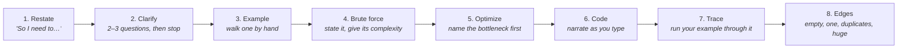
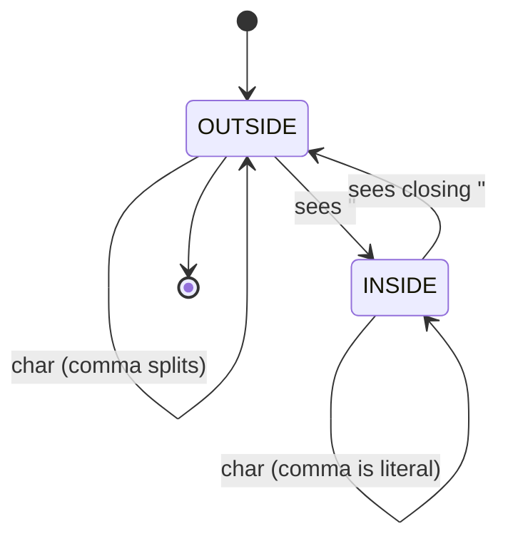
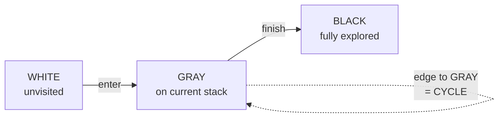
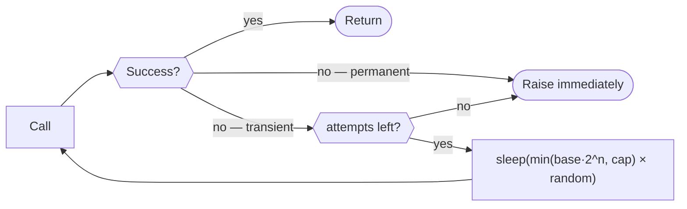
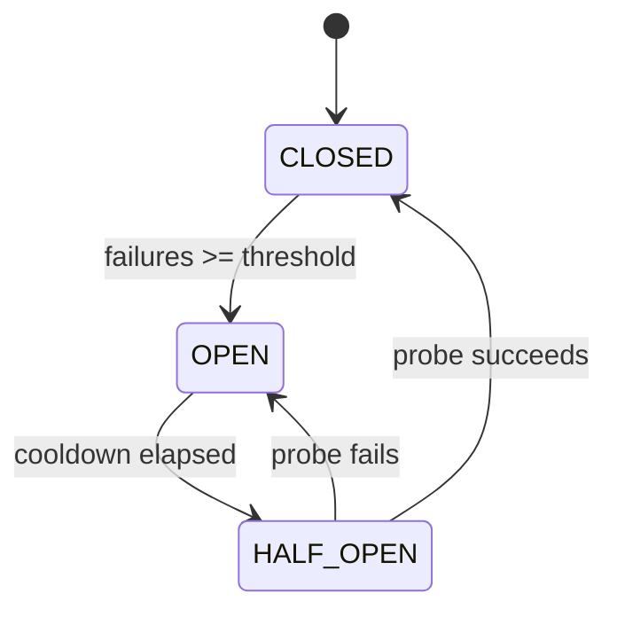
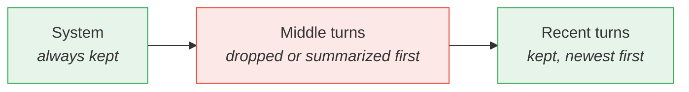
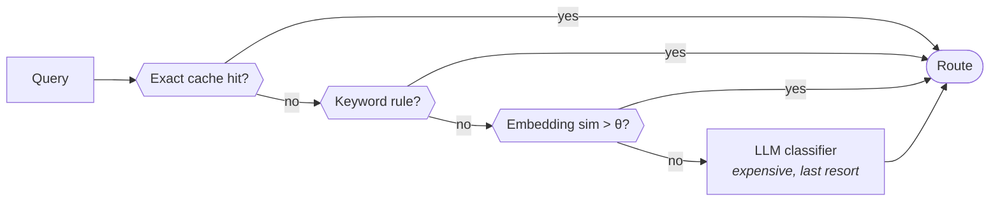
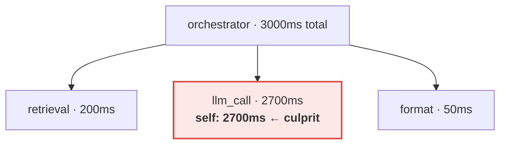
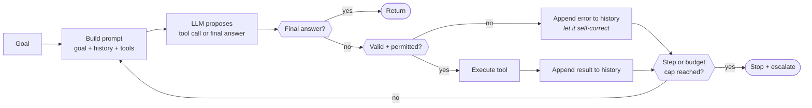

# Google FDE — 50 Python Coding Questions

Companion to [[google-fde-multi-agent-interview-prep]] and [[agentic-ai-system-design-interview-guide-2026]].

These are **not** generic LeetCode drills. Every question here is shaped by what the FDE loop actually tests: practical algorithms narrated out loud, messy customer data, flaky third-party integrations, and the plumbing underneath agentic systems. Roughly a third are classic DSA with an FDE framing (the reported DSA round is "practical, not LeetCode-hard"); the rest are the production-shaped problems that show up in the vibe-coding round and in the job itself.

> [!important] How to use this note
> Do not read the solutions first. For each question: set a 25-minute timer, **talk out loud**, write the code, then compare. The first-hand account of this loop is explicit that the candidate stalled on a problem and still valued narrating their reasoning — transparent thinking is scored independently of whether you land the optimal answer.

---

## The interview protocol

Run this loop on every problem. It is worth more than any single algorithm.



**The three clarifying questions that always pay off:**

- What's the input size? (decides whether O(n²) is even a problem)
- Can the input be empty, malformed, or duplicated? (FDE answer: customer data always can)
- Do I optimize for time, memory, or readability here?

**Narration phrases that score points:**

- "The brute force is O(n²) — let me state it, then improve it."
- "I'm trading memory for time here with a hash map."
- "Let me handle the happy path first, then come back for the edge cases."
- "In a customer environment I'd expect this input to be dirty, so I'd validate at the boundary."

---

## Part 1 — Arrays, strings and hashing

### Q1. Deduplicate customer records by a composite key, keeping the newest

**Prompt.** Given a list of dicts with `id`, `email`, `updated_at`, return one record per `email`, keeping the most recently updated. Preserve first-seen order of emails.

**Why FDE:** every customer data migration starts here. Dedup with a tiebreak is the single most common real task in this job.

**Thinking process**

- Clarify: is `updated_at` a string or datetime? Are emails case-sensitive? (Real answer: normalize them.)
- Brute force is sort-then-group, O(n log n). But one pass with a dict is O(n) — say that out loud.
- The trap is *order preservation*: `dict` preserves insertion order in Python 3.7+, so a single dict gives you both dedup and order for free. Say that; it shows you know the language.

```python
def dedupe_latest(records):
    best = {}
    for r in records:
        key = r["email"].strip().lower()
        cur = best.get(key)
        if cur is None or r["updated_at"] > cur["updated_at"]:
            best[key] = r
    return list(best.values())
```

**Complexity:** O(n) time, O(n) space. String comparison on ISO-8601 timestamps sorts correctly — call that out, and note it breaks if formats are mixed.

**Follow-ups:** What if the file is 50 GB? (Stream it, keep only the dict — or sort externally.) What if `updated_at` is missing on some rows? (Treat as oldest; never crash on customer data.)

---

### Q2. Two-sum on a transaction ledger

**Prompt.** Given a list of transaction amounts and a target, return the indices of the two that sum to it.

**Why FDE:** the canonical warm-up. Expect it as question one of three, and expect them to watch *how fast you get to the hash map*.

**Thinking process**

- Say the brute force (O(n²) nested loop) in one sentence, then immediately: "but I can do one pass with a hash map by looking for the complement."
- The key insight: check the map *before* inserting, so you never match an element with itself.

```python
def two_sum(nums, target):
    seen = {}
    for i, n in enumerate(nums):
        if target - n in seen:
            return [seen[target - n], i]
        seen[n] = i
    return []
```

**Complexity:** O(n) time, O(n) space.

**Follow-ups:** Duplicates? (Works — the earlier index is kept and matched.) All pairs rather than one? (Then you need to handle the duplicate-value case explicitly.) Sorted input? (Two pointers, O(1) space.)

---

### Q3. Longest substring without repeating characters

**Prompt.** Return the length of the longest substring with no repeated characters.

**Why FDE:** the sliding-window template. Once you own this pattern you own a dozen variants, including token-window problems later in this note.

**Thinking process**

- Name the pattern out loud: "This is a sliding window with a last-seen map."
- The subtle part is the left-pointer jump: `left = max(left, last[ch] + 1)`. Without the `max`, a stale index drags the window backwards. Explain *why* the `max` is there — that's the whole question.

```python
def longest_unique(s):
    last = {}
    left = best = 0
    for right, ch in enumerate(s):
        if ch in last:
            left = max(left, last[ch] + 1)
        last[ch] = right
        best = max(best, right - left + 1)
    return best
```

**Complexity:** O(n) time, O(min(n, charset)) space.

**Follow-ups:** Return the substring itself. Allow at most K repeats. Unicode/grapheme clusters — a genuinely good FDE aside about real-world text.

---

### Q4. Group support tickets by normalized subject

**Prompt.** Group ticket subjects that are anagrams of each other (a stand-in for "canonically the same").

**Why FDE:** anagram grouping is the standard vehicle for testing "can you build the right key?" — which is the core skill in every data-reconciliation task.

**Thinking process**

- The whole problem is choosing the canonical key. Sorted characters is the obvious one, O(k log k) per string.
- Better: a 26-length count tuple, O(k). Mention both and pick based on string length.
- Use `defaultdict(list)` — it removes a whole branch of code.

```python
from collections import defaultdict

def group_anagrams(words):
    groups = defaultdict(list)
    for w in words:
        counts = [0] * 26
        for ch in w:
            counts[ord(ch) - ord('a')] += 1
        groups[tuple(counts)].append(w)
    return list(groups.values())
```

**Complexity:** O(n·k) time where k is word length.

**Follow-ups:** Non-ASCII? (Use a `Counter` and `frozenset(counter.items())`.) Near-duplicates rather than exact? (Now you're in fuzzy matching — a great segue to embeddings.)

---

### Q5. Merge overlapping maintenance windows

**Prompt.** Given `[(start, end), ...]` intervals, merge all overlapping ones.

**Why FDE:** scheduling, SLA windows, deduplicating time ranges from logs. This appears constantly in deployment work.

**Thinking process**

- Sort by start. Say why: after sorting, you only ever compare against the *last* merged interval, which collapses the problem to one pass.
- Decide the boundary rule explicitly and ask: does `[1,2]` merge with `[2,3]`? Touching vs. overlapping is a real ambiguity — flag it rather than assuming.

```python
def merge_intervals(intervals):
    if not intervals:
        return []
    intervals.sort(key=lambda x: x[0])
    out = [list(intervals[0])]
    for start, end in intervals[1:]:
        if start <= out[-1][1]:          # touching counts as overlap
            out[-1][1] = max(out[-1][1], end)
        else:
            out.append([start, end])
    return [tuple(x) for x in out]
```

**Complexity:** O(n log n) time, dominated by the sort.

**Follow-ups:** Insert one interval into an already-sorted list (O(n), no sort). Find the gaps instead. Max concurrent overlap — that's a sweep line, worth naming.

---

### Q6. Top-K most frequent error codes

**Prompt.** Given a stream of error codes, return the K most frequent.

**Why FDE:** this *is* log triage. You will do this on a customer's incident on week one.

**Thinking process**

- Counting is O(n) with a `Counter`. The question is the selection step.
- Full sort is O(m log m). A heap is O(m log k). For k much smaller than m, the heap wins — say the comparison, then note that `Counter.most_common(k)` already does exactly this internally.
- Showing you know the stdlib does it is a plus, but write the heap version if asked to implement it.

```python
import heapq
from collections import Counter

def top_k(codes, k):
    counts = Counter(codes)
    return [c for c, _ in heapq.nlargest(k, counts.items(), key=lambda kv: kv[1])]
```

**Complexity:** O(n + m log k).

**Follow-ups:** Streaming with bounded memory? (Count-Min Sketch / Space-Saving — naming the approximate-counting family is a senior signal.) Ties broken alphabetically?

---

### Q7. Parse a messy CSV line with quoted commas

**Prompt.** Split a CSV line where fields may be quoted and quoted fields may contain commas and escaped quotes.

**Why FDE:** the single most predictable "customer data is dirty" question. Everyone naively reaches for `line.split(",")` and everyone is wrong.

**Thinking process**

- **Say this first: "In production I'd use the `csv` module — hand-rolling this is a bug factory."** Then offer to implement it since they're asking. That sentence is the FDE signal.
- Model it as a small state machine: inside-quotes or not. Track the toggle; a doubled quote inside a quoted field is a literal quote.



```python
def parse_csv_line(line):
    fields, cur, in_q, i = [], [], False, 0
    while i < len(line):
        ch = line[i]
        if ch == '"':
            if in_q and i + 1 < len(line) and line[i + 1] == '"':
                cur.append('"')                 # escaped quote
                i += 1
            else:
                in_q = not in_q
        elif ch == ',' and not in_q:
            fields.append(''.join(cur))
            cur = []
        else:
            cur.append(ch)
        i += 1
    fields.append(''.join(cur))
    return fields
```

**Complexity:** O(n) single pass.

**Follow-ups:** Embedded newlines inside quotes (now you can't split by line at all — a great real-world point). Different delimiters. Malformed input: raise, or best-effort? For customer data, best-effort plus a logged warning usually beats crashing the pipeline.

---

### Q8. Validate records against a schema and partition good from bad

**Prompt.** Given records and a schema of `{field: (type, required)}`, return `(valid, errors)` where errors explain each rejection.

**Why FDE:** ingestion boundaries. The FDE-grade instinct is *never drop a bad row silently* — you return it with a reason so the customer can fix their source.

**Thinking process**

- Collect *all* errors per record, don't fail on the first. A customer fixing 400 rows wants every problem at once.
- Partition rather than filter — the rejects are the deliverable.
- Structure the error so it's machine-readable, not a formatted string.

```python
def validate(records, schema):
    valid, errors = [], []
    for i, rec in enumerate(records):
        problems = []
        for field, (typ, required) in schema.items():
            if field not in rec or rec[field] is None:
                if required:
                    problems.append(f"missing required field '{field}'")
                continue
            if not isinstance(rec[field], typ):
                problems.append(
                    f"field '{field}' expected {typ.__name__}, "
                    f"got {type(rec[field]).__name__}"
                )
        (errors if problems else valid).append(
            {"row": i, "record": rec, "problems": problems} if problems else rec
        )
    return valid, errors
```

**Complexity:** O(n · fields).

**Follow-ups:** Nested schemas (recurse). Coercion — should `"42"` pass an `int` field? (Ask; for customer CSVs the answer is usually yes with a warning.) Why not Pydantic? (In production, yes — say so.)

---

## Part 2 — Trees, graphs and dependencies

### Q9. Detect a cycle in an agent handoff graph

**Prompt.** Agents hand off to each other. Given edges `{agent: [targets]}`, detect whether a handoff cycle exists and return one if so.

**Why FDE:** this is Q32 of your agentic note as code — the A→B→A loop that neither agent recognizes. Being able to *implement* the detection, not just describe it, is the differentiator.

**Thinking process**

- Directed graph → DFS with three colors, not a plain `visited` set. Explain why: a node already fully explored (black) is fine to revisit; a node currently on the stack (gray) means a cycle.
- Keep a parent map so you can reconstruct the cycle rather than just returning `True`. Interviewers almost always ask for the path next — get ahead of it.



```python
def find_cycle(graph):
    WHITE, GRAY, BLACK = 0, 1, 2
    color = {n: WHITE for n in graph}
    parent = {}

    def dfs(u):
        color[u] = GRAY
        for v in graph.get(u, []):
            if color.get(v, WHITE) == GRAY:        # back edge
                cycle, cur = [v], u
                while cur != v:
                    cycle.append(cur)
                    cur = parent[cur]
                cycle.append(v)
                return cycle[::-1]
            if color.get(v, WHITE) == WHITE:
                parent[v] = u
                got = dfs(v)
                if got:
                    return got
        color[u] = BLACK
        return None

    for n in list(graph):
        if color[n] == WHITE:
            got = dfs(n)
            if got:
                return got
    return None
```

**Complexity:** O(V + E).

**Follow-ups:** Recursion depth on a deep graph → convert to an explicit stack. How would you *prevent* the loop at runtime rather than detect it after? (Handoff counter per session, capped — tie back to your design note.)

---

### Q10. Topologically order a deployment's task dependencies

**Prompt.** Given tasks with prerequisites, return a valid execution order, or report that none exists.

**Why FDE:** deployment runbooks, data pipeline DAGs, agent tool chains with prerequisites. Extremely on-theme.

**Thinking process**

- Kahn's algorithm (BFS on in-degrees) over DFS here, because the leftover-nodes check gives you cycle detection for free and the code is easier to explain.
- Bonus insight worth saying: nodes that come off the queue *together* can run in parallel. That reframes the answer from "an order" to "a schedule," which is what a deployment actually needs.

```python
from collections import deque, defaultdict

def topo_order(tasks):                       # tasks: {task: [prereqs]}
    indeg = {t: 0 for t in tasks}
    children = defaultdict(list)
    for t, prereqs in tasks.items():
        for p in prereqs:
            indeg.setdefault(p, 0)
            children[p].append(t)
            indeg[t] += 1

    q = deque([t for t, d in indeg.items() if d == 0])
    order = []
    while q:
        t = q.popleft()
        order.append(t)
        for c in children[t]:
            indeg[c] -= 1
            if indeg[c] == 0:
                q.append(c)

    if len(order) != len(indeg):
        raise ValueError(f"cycle among: {set(indeg) - set(order)}")
    return order
```

**Complexity:** O(V + E).

**Follow-ups:** Return parallel *waves* instead of a flat order (process the queue level by level). Weight tasks by duration and find the critical path.

---

### Q11. Flatten a deeply nested customer config

**Prompt.** Turn `{"a": {"b": {"c": 1}}}` into `{"a.b.c": 1}`, and write the inverse.

**Why FDE:** every customer hands you nested YAML/JSON config that must map onto a flat settings store or a dataframe column set.

**Thinking process**

- Recursion with a prefix accumulator is the natural shape. State the base case first: a non-dict value emits a leaf.
- Ask the ambiguity out loud: **what about lists?** Index them as `a.0.b`, or leave them opaque? There's no universally right answer — showing you spotted it is the point.

```python
def flatten(obj, prefix="", sep="."):
    out = {}
    for k, v in obj.items():
        key = f"{prefix}{sep}{k}" if prefix else str(k)
        if isinstance(v, dict) and v:
            out.update(flatten(v, key, sep))
        else:
            out[key] = v
    return out

def unflatten(flat, sep="."):
    out = {}
    for key, v in flat.items():
        parts = key.split(sep)
        node = out
        for p in parts[:-1]:
            node = node.setdefault(p, {})
        node[parts[-1]] = v
    return out
```

**Complexity:** O(total leaves × depth).

**Follow-ups:** A key legitimately containing a dot — now your separator is ambiguous and you need escaping. Empty dict as a value (note the `and v` guard preserves it as a leaf).

---

### Q12. Lowest common ancestor in an org / category tree

**Prompt.** Given a tree and two nodes, find their lowest common ancestor.

**Why FDE:** permissions inheritance, category rollups, "which team owns both of these services."

**Thinking process**

- The elegant recursion: if the current node is either target, return it; recurse both sides; if both sides return non-null, *this* node is the LCA.
- Say the invariant plainly — "each call returns either a target it found or the LCA of the subtree" — because the code looks like magic until you state it.

```python
def lca(root, p, q):
    if root is None or root is p or root is q:
        return root
    left = lca(root.left, p, q)
    right = lca(root.right, p, q)
    if left and right:
        return root          # targets split across children -> this is the LCA
    return left or right
```

**Complexity:** O(n) time, O(h) stack.

**Follow-ups:** N-ary tree (count non-null child results ≥ 2). Nodes might not exist in the tree — the classic version silently returns wrong; you'd need a found-flag pass. Parent pointers available? Then it's the two-pointer trick, O(h) with no recursion.

---

### Q13. Shortest path through a service dependency graph

**Prompt.** Find the fewest hops between two services in an unweighted graph, and return the path.

**Why FDE:** blast-radius analysis — "if this service degrades, how many hops until it reaches the customer-facing API?"

**Thinking process**

- Unweighted → BFS, not Dijkstra. Say why explicitly: BFS is already optimal here and Dijkstra's heap is wasted overhead.
- Track a parent map to reconstruct the path. Mark nodes visited *on enqueue*, not on dequeue — otherwise duplicates pile into the queue.

```python
from collections import deque

def shortest_path(graph, src, dst):
    if src == dst:
        return [src]
    parent, q = {src: None}, deque([src])
    while q:
        u = q.popleft()
        for v in graph.get(u, []):
            if v in parent:
                continue
            parent[v] = u
            if v == dst:
                path, cur = [], v
                while cur is not None:
                    path.append(cur)
                    cur = parent[cur]
                return path[::-1]
            q.append(v)
    return None
```

**Complexity:** O(V + E).

**Follow-ups:** Weighted by latency → Dijkstra. All pairs → Floyd-Warshall, and note it's O(V³) so only for small graphs. Bidirectional BFS for large graphs.

---

### Q14. Serialize and restore agent conversation state

**Prompt.** Serialize a tree-shaped conversation (branching retries) to a string and reconstruct it.

**Why FDE:** checkpointing and resumption — Q10/Q11 of your design note, made concrete.

**Thinking process**

- Preorder with explicit null markers is the standard trick. Explain the *why*: preorder alone is ambiguous, the null sentinels restore uniqueness.
- Use an iterator on deserialization so the recursion consumes tokens naturally without index bookkeeping.

```python
def serialize(node):
    out = []
    def walk(n):
        if n is None:
            out.append("#")
            return
        out.append(str(n.val))
        walk(n.left)
        walk(n.right)
    walk(node)
    return ",".join(out)

def deserialize(data):
    it = iter(data.split(","))
    def build():
        tok = next(it)
        if tok == "#":
            return None
        n = Node(int(tok))
        n.left, n.right = build(), build()
        return n
    return build()
```

**Complexity:** O(n) both directions.

**Follow-ups:** Values containing commas → use JSON or length-prefixing. **Schema evolution:** what happens when you add a field and try to load last week's checkpoint? That's the real production question and ties straight to Q12 of your design note (state format must stay backward-compatible).

---

### Q15. Number of connected components in a customer's entity graph

**Prompt.** Given undirected edges between records, count distinct clusters (entity resolution).

**Why FDE:** record linkage — "these 12 rows are actually 3 customers." Constant in data-integration work.

**Thinking process**

- Two valid answers: DFS/BFS flood fill, or union-find. Union-find is better if edges stream in incrementally — say that, because it's the FDE framing.
- Include path compression and union by size; mention the near-constant amortized cost rather than quoting the inverse-Ackermann function pedantically.

```python
class DSU:
    def __init__(self):
        self.parent, self.size = {}, {}

    def find(self, x):
        self.parent.setdefault(x, x)
        self.size.setdefault(x, 1)
        while self.parent[x] != x:
            self.parent[x] = self.parent[self.parent[x]]   # path compression
            x = self.parent[x]
        return x

    def union(self, a, b):
        ra, rb = self.find(a), self.find(b)
        if ra == rb:
            return False
        if self.size[ra] < self.size[rb]:
            ra, rb = rb, ra
        self.parent[rb] = ra
        self.size[ra] += self.size[rb]
        return True

def count_components(edges, nodes):
    dsu = DSU()
    for a, b in edges:
        dsu.union(a, b)
    return len({dsu.find(n) for n in nodes})
```

**Complexity:** near O(E·α(N)) — effectively linear.

**Follow-ups:** Return the clusters themselves, not just the count. Edges arriving as a stream (union-find shines). Fuzzy matching to build the edges in the first place — a natural bridge to embeddings.

---

## Part 3 — Integration, retries and reliability

This part is the heart of the FDE-specific material. Your agentic note covers these as *concepts* (Q22, Q24); here you implement them.

### Q16. Retry with exponential backoff and jitter

**Prompt.** Write a decorator that retries a flaky call with exponential backoff, jitter, a max attempt count, and retries only on transient errors.

**Why FDE:** the most likely single piece of code you will write on the job. Google's own postings describe the role as clearing integration blockers.

**Thinking process**

- Lead with the failure taxonomy from your design note: **transient → retry; permanent → never retry; partial → hardest.** Saying this before coding frames you as someone who's been paged at 3am.
- **Jitter is the point.** Without it, every client retries in lockstep and you get a thundering herd that keeps the recovering service down. Say this — it's the detail that separates copied code from understood code.
- Cap the delay. Unbounded exponential means attempt 10 sleeps for 17 minutes.



```python
import random, time, functools

class Transient(Exception): pass
class Permanent(Exception): pass

def retry(attempts=5, base=0.5, cap=30.0, retry_on=(Transient,)):
    def deco(fn):
        @functools.wraps(fn)
        def wrapper(*args, **kwargs):
            for n in range(attempts):
                try:
                    return fn(*args, **kwargs)
                except retry_on as e:
                    if n == attempts - 1:
                        raise
                    delay = min(base * (2 ** n), cap)
                    time.sleep(delay * (0.5 + random.random()))   # full-ish jitter
            raise RuntimeError("unreachable")
        return wrapper
    return deco
```

**Complexity:** worst-case wall time is the sum of the capped delays — be ready to compute it.

**Follow-ups:** Respect a `Retry-After` header (you should prefer the server's number over your own). Budget the *total* time rather than the attempt count. Idempotency — see Q17, and volunteer the connection.

---

### Q17. Make a create-resource call idempotent

**Prompt.** A `create_order` API is not idempotent; a retry can double-charge. Wrap it so retries are safe.

**Why FDE:** the partial-failure case. The request succeeded server-side but the response was lost — retrying naively creates a second order.

**Thinking process**

- Two mechanisms, name both: an **idempotency key** the server honors, or **check-before-create** if it doesn't.
- Be honest that check-before-create has a race window; the key is strictly better when the API supports it. Interviewers like candidates who name the weakness of their own fallback.
- Derive the key deterministically from the request content so a retry of the *same logical operation* reuses it.

```python
import hashlib, json

class IdempotentClient:
    def __init__(self, api):
        self.api = api
        self._cache = {}                       # in prod: Redis with a TTL

    def _key(self, payload):
        blob = json.dumps(payload, sort_keys=True).encode()
        return hashlib.sha256(blob).hexdigest()

    def create_order(self, payload):
        key = self._key(payload)
        if key in self._cache:
            return self._cache[key]
        existing = self.api.find_by_idempotency_key(key)   # server-side check
        if existing:
            self._cache[key] = existing
            return existing
        result = self.api.create_order(payload, idempotency_key=key)
        self._cache[key] = result
        return result
```

**Follow-ups:** Where does the cache live if you have 10 workers? (Shared store, not process memory — and say why.) What TTL? What if the customer legitimately wants two identical orders? (Then the key must include a client-supplied nonce — a genuinely good catch.)

---

### Q18. Token bucket rate limiter

**Prompt.** Implement a rate limiter allowing N requests per second with bursts up to a capacity.

**Why FDE:** every customer API has limits, and you will be the one who trips them.

**Thinking process**

- Explain the model in one sentence: tokens refill at a constant rate, each call spends one, empty bucket means wait. It naturally allows bursts up to capacity — which is usually what you actually want.
- Lazily compute refill from elapsed time rather than running a background thread. Simpler and testable.
- Use a monotonic clock — `time.time()` can jump backwards on NTP sync.

```python
import time, threading

class TokenBucket:
    def __init__(self, rate, capacity):
        self.rate, self.capacity = rate, capacity
        self.tokens = float(capacity)
        self.updated = time.monotonic()
        self.lock = threading.Lock()

    def acquire(self, n=1, blocking=True):
        with self.lock:
            now = time.monotonic()
            self.tokens = min(self.capacity,
                              self.tokens + (now - self.updated) * self.rate)
            self.updated = now
            if self.tokens >= n:
                self.tokens -= n
                return 0.0
            if not blocking:
                return None
            wait = (n - self.tokens) / self.rate
        time.sleep(wait)                       # sleep outside the lock
        return self.acquire(n)
```

**Complexity:** O(1) per call.

**Follow-ups:** Distributed across workers (Redis with a Lua script for atomicity). Token bucket vs. leaky bucket vs. sliding window — know that token bucket permits bursts and sliding-window-log is the most accurate but most expensive.

---

### Q19. Paginate a customer API that keeps changing underneath you

**Prompt.** Write a generator that fetches all pages from a cursor-paginated API and yields records.

**Why FDE:** the "pull everything from their CRM" task. The subtlety is what happens when data mutates mid-pagination.

**Thinking process**

- Yield rather than accumulate — the dataset may not fit in memory, and a generator lets the caller stop early.
- **Offset pagination is unsafe under concurrent writes:** a row inserted on page 1 shifts everything and you silently skip a record. Cursor pagination doesn't have this problem. Raising this unprompted is a strong signal.
- Guard against an API that returns the same cursor forever — an infinite loop in production.

```python
def fetch_all(client, endpoint, page_size=100, max_pages=10_000):
    cursor, seen_cursors, pages = None, set(), 0
    while True:
        resp = client.get(endpoint, cursor=cursor, limit=page_size)
        for record in resp["items"]:
            yield record
        cursor = resp.get("next_cursor")
        if not cursor:
            return
        if cursor in seen_cursors:
            raise RuntimeError(f"API returned repeating cursor {cursor!r}")
        seen_cursors.add(cursor)
        pages += 1
        if pages >= max_pages:
            raise RuntimeError("pagination exceeded max_pages — likely a loop")
```

**Follow-ups:** Resume after a crash (persist the cursor). Parallelize (you usually can't with cursors — say so). Rate limit interaction (compose with Q18).

---

### Q20. Circuit breaker

**Prompt.** Implement a circuit breaker that stops calling a failing dependency and probes for recovery.

**Why FDE:** Q9 and Q24 of your design note as code. Prevents your agent from burning its budget hammering a dead API.

**Thinking process**

- Three states — CLOSED, OPEN, HALF_OPEN. Draw them. The half-open state is the interesting one: let exactly one probe through, and let it decide.
- Contrast with retry: retry handles *this* call, the breaker protects the *system* from a sustained outage. They compose; they're not alternatives.



```python
import time

class CircuitBreaker:
    def __init__(self, threshold=5, cooldown=30.0):
        self.threshold, self.cooldown = threshold, cooldown
        self.failures, self.opened_at, self.state = 0, None, "CLOSED"

    def call(self, fn, *args, **kwargs):
        if self.state == "OPEN":
            if time.monotonic() - self.opened_at < self.cooldown:
                raise RuntimeError("circuit open — failing fast")
            self.state = "HALF_OPEN"
        try:
            result = fn(*args, **kwargs)
        except Exception:
            self.failures += 1
            if self.state == "HALF_OPEN" or self.failures >= self.threshold:
                self.state, self.opened_at = "OPEN", time.monotonic()
            raise
        self.failures, self.state = 0, "CLOSED"
        return result
```

**Follow-ups:** Failure *rate* over a window rather than a raw count (better under low traffic). Per-endpoint breakers. What does the agent do when the breaker is open — degrade gracefully or escalate to a human?

---

### Q21. Reconcile two systems of record

**Prompt.** Given records from a source and a target system, report what to create, update, and delete.

**Why FDE:** the core of every sync integration you will ever build.

**Thinking process**

- Index both sides by key first — then the three sets fall out of simple set operations. Say that; it turns a fiddly problem into three lines.
- Ask the critical question: **is delete safe?** In real integrations you almost always soft-delete or report rather than hard-delete, because a source-side outage looks exactly like "everything was deleted." That instinct is the answer they want.

```python
def reconcile(source, target, key="id", compare=None):
    src = {r[key]: r for r in source}
    tgt = {r[key]: r for r in target}
    compare = compare or (lambda a, b: a == b)

    to_create = [src[k] for k in src.keys() - tgt.keys()]
    to_delete = [tgt[k] for k in tgt.keys() - src.keys()]
    to_update = [src[k] for k in src.keys() & tgt.keys()
                 if not compare(src[k], tgt[k])]
    return {"create": to_create, "update": to_update, "delete": to_delete}
```

**Complexity:** O(n + m).

**Follow-ups:** A safety valve — refuse to run if deletions exceed 10% of the target, since that signals a broken source rather than real deletions. This single guard has saved more production data than any other line of code in integration work.

---

### Q22. Parse and aggregate a log file to find an error spike

**Prompt.** Given log lines with timestamps and levels, find the minute with the most errors and return the top error messages in it.

**Why FDE:** exactly the triage task in the reported scenario "the agent is inconsistent in production but was fine in staging."

**Thinking process**

- Stream line by line — log files are large and you should never `read()` one whole.
- Bucket by truncated timestamp. Be defensive: malformed lines are normal in real logs, so skip and count them rather than crashing.
- Report the skipped count. Silently ignoring 30% of a file is how you reach a confidently wrong conclusion.

```python
import re
from collections import Counter, defaultdict

LINE = re.compile(r"^(?P<ts>\S+T\d{2}:\d{2}):\d{2}\S*\s+(?P<level>\w+)\s+(?P<msg>.*)$")

def error_spike(lines):
    per_minute = Counter()
    messages = defaultdict(Counter)
    skipped = 0
    for line in lines:
        m = LINE.match(line)
        if not m:
            skipped += 1
            continue
        if m["level"].upper() not in ("ERROR", "CRITICAL"):
            continue
        minute = m["ts"]
        per_minute[minute] += 1
        messages[minute][m["msg"][:120]] += 1
    if not per_minute:
        return {"skipped": skipped, "peak": None}
    peak, count = per_minute.most_common(1)[0]
    return {"peak": peak, "count": count,
            "top_messages": messages[peak].most_common(5),
            "skipped": skipped}
```

**Complexity:** O(n) time, O(distinct minutes × distinct messages) space.

**Follow-ups:** Normalize messages with IDs in them before counting, or every message looks unique — a very real gotcha. Detect spikes relative to a baseline instead of taking the raw max.

---

### Q23. Bounded LRU cache for expensive tool calls

**Prompt.** Implement an LRU cache with a size bound and per-entry TTL.

**Why FDE:** caching tool and retrieval results is the first cost lever you pull on an agent (Q24, Q39 of your design note).

**Thinking process**

- `OrderedDict` gives O(1) LRU with `move_to_end` and `popitem(last=False)`. Say you'd normally reach for `functools.lru_cache` but that it has no TTL, which is why you're hand-rolling.
- TTL needs a stored expiry per entry, checked on read. An expired hit is a miss.

```python
import time
from collections import OrderedDict

class TTLCache:
    def __init__(self, maxsize=128, ttl=300.0):
        self.maxsize, self.ttl = maxsize, ttl
        self.data = OrderedDict()              # key -> (value, expires_at)
        self.hits = self.misses = 0

    def get(self, key):
        item = self.data.get(key)
        if item is None or item[1] < time.monotonic():
            self.data.pop(key, None)
            self.misses += 1
            return None
        self.data.move_to_end(key)
        self.hits += 1
        return item[0]

    def put(self, key, value):
        self.data[key] = (value, time.monotonic() + self.ttl)
        self.data.move_to_end(key)
        while len(self.data) > self.maxsize:
            self.data.popitem(last=False)      # evict least recently used
```

**Complexity:** O(1) per operation.

**Follow-ups:** Track and expose the hit rate — you need it to prove the cache is worth its memory. Thread safety. What must *never* be cached? (Anything permission-scoped: caching a retrieval result across users leaks data between customers. Volunteer this — it's a security answer inside a performance question.)

---

## Part 4 — Agent and LLM plumbing

These are the questions most likely to blur into the agentic design round. Answer them as code, but narrate the design tradeoff alongside.

### Q24. Fit conversation history into a token budget

**Prompt.** Given a list of messages with token counts and a budget, select which to keep: always the system prompt, always the most recent turns, drop from the middle.

**Why FDE:** context management is the number-one practical constraint in production agents.

**Thinking process**

- State the policy before coding: system prompt is pinned, recency wins, the middle is negotiable. Different products choose differently — ask which matters here.
- Walk backwards from the newest message so recency falls out naturally.
- Don't split a tool call from its result — an orphaned tool response confuses the model. Mentioning this pairing constraint is a strong production signal.



```python
def fit_to_budget(messages, budget):
    system = [m for m in messages if m["role"] == "system"]
    rest = [m for m in messages if m["role"] != "system"]

    used = sum(m["tokens"] for m in system)
    if used > budget:
        raise ValueError("system prompt alone exceeds the budget")

    kept = []
    for m in reversed(rest):                    # newest first
        if used + m["tokens"] > budget:
            break
        kept.append(m)
        used += m["tokens"]
    return system + list(reversed(kept))
```

**Complexity:** O(n).

**Follow-ups:** Summarize the dropped middle instead of discarding it (then the summary costs tokens too — budget for it). Token counts are model-specific; you need the real tokenizer, not a word count. What if a *single* message exceeds the budget? (Truncate it, and say which end.)

---

### Q25. Chunk a document for retrieval with overlap

**Prompt.** Split text into chunks of at most N tokens with M tokens of overlap, without splitting mid-sentence where avoidable.

**Why FDE:** you will do this on every customer's document corpus, and chunking quality dominates RAG quality more than the embedding model does.

**Thinking process**

- Explain *why* overlap exists: a fact spanning a boundary is otherwise unretrievable from either chunk.
- Prefer semantic boundaries — split on paragraphs, fall back to sentences, then hard-split only if a single sentence is oversized.
- Attach metadata (source, offset) to every chunk. Without provenance you cannot cite, and without citation enterprise users won't trust the answer.

```python
import re

def chunk_text(text, max_tokens=500, overlap=50, count=len):
    paragraphs = [p.strip() for p in re.split(r"\n\s*\n", text) if p.strip()]
    chunks, cur, cur_n = [], [], 0

    def flush():
        if cur:
            chunks.append(" ".join(cur))

    for para in paragraphs:
        n = count(para)
        if cur_n + n <= max_tokens:
            cur.append(para); cur_n += n
            continue
        flush()
        if n > max_tokens:                       # oversized paragraph
            sentences = re.split(r"(?<=[.!?])\s+", para)
            cur, cur_n = [], 0
            for s in sentences:
                if cur_n + count(s) > max_tokens:
                    flush(); cur, cur_n = [], 0
                cur.append(s); cur_n += count(s)
        else:
            tail = cur[-1:] if overlap else []   # carry overlap forward
            cur, cur_n = tail + [para], sum(count(x) for x in tail) + n
    flush()
    return chunks
```

**Follow-ups:** Tables and code blocks break sentence splitting entirely. How do you evaluate chunking? (Retrieval recall@k on a golden question set — tie back to your design note's eval section.)

---

### Q26. Cosine similarity and top-k retrieval without a vector DB

**Prompt.** Given query and document embeddings, return the top-k most similar documents.

**Why FDE:** you'll prototype retrieval before the customer has any vector infrastructure provisioned.

**Thinking process**

- Normalize once up front, then cosine similarity is just a dot product. Say this — it's the optimization that matters.
- With numpy it's a single matrix-vector product. Mention that this is fine up to roughly a hundred thousand vectors, and beyond that you want an ANN index (HNSW/ScaNN).

```python
import numpy as np

def top_k_similar(query_vec, doc_matrix, k=5):
    q = query_vec / (np.linalg.norm(query_vec) + 1e-10)
    d = doc_matrix / (np.linalg.norm(doc_matrix, axis=1, keepdims=True) + 1e-10)
    scores = d @ q                                  # cosine, since both normalized
    idx = np.argpartition(-scores, min(k, len(scores) - 1))[:k]   # O(n), not O(n log n)
    return sorted(((int(i), float(scores[i])) for i in idx),
                  key=lambda x: -x[1])
```

**Complexity:** O(n·d) for scoring, O(n) for selection via `argpartition`.

**Follow-ups:** Why cosine over Euclidean? (Magnitude carries little meaning in embedding space.) Where does pure vector search fail? (Exact IDs, negation, recency — Q28 of your design note. Answer: hybrid with keyword and metadata filters.)

---

### Q27. Detect a stuck agent loop

**Prompt.** Given a stream of agent steps (tool name + arguments), detect when it's looping and should be interrupted.

**Why FDE:** Q15 of your design note as code. Also directly relevant to the reported "Coder writes the same bug, Reviewer flags it, repeat" question.

**Thinking process**

- Two cheap signals before you reach for embeddings: **exact repeat** of `(tool, args)` and **state hash repetition**. Do the cheap checks first — say that explicitly, because reaching straight for semantic similarity is over-engineering.
- Only escalate to embedding similarity for *reasoning text*, where exact matching won't fire.

```python
import hashlib, json
from collections import deque

class LoopDetector:
    def __init__(self, window=6, repeat_threshold=3):
        self.window = deque(maxlen=window)
        self.counts = {}
        self.repeat_threshold = repeat_threshold

    def _sig(self, tool, args):
        blob = json.dumps({"t": tool, "a": args}, sort_keys=True).encode()
        return hashlib.sha1(blob).hexdigest()

    def record(self, tool, args):
        sig = self._sig(tool, args)
        self.counts[sig] = self.counts.get(sig, 0) + 1
        self.window.append(sig)
        if self.counts[sig] >= self.repeat_threshold:
            return f"identical call {tool} repeated {self.counts[sig]}x"
        if len(self.window) == self.window.maxlen and len(set(self.window)) <= 2:
            return "alternating between two actions — no progress"
        return None
```

**Complexity:** O(1) per step.

**Follow-ups:** Distinguish a legitimate retry from a loop (identical call three times *with the same failure* is a loop; with different results it may be polling). What do you do on detection — soft interrupt, hard stop, or human escalation? Tie to Q15/Q37.

---

### Q28. Route a query to the right agent without calling a large model

**Prompt.** Build a tiered router: exact-match cache, then keyword rules, then embedding similarity, and only then an LLM.

**Why FDE:** this is the reported multi-agent probe *and* the core cost lever in the support-chatbot design. High-value question.

**Thinking process**

- Order the tiers by cost and state the economics: if 60% of traffic resolves in the first two tiers, that's a 60% cut to your dominant cost line.
- Every tier needs a confidence threshold and a fallthrough. A router that's confidently wrong is worse than one that escalates.



```python
class TieredRouter:
    def __init__(self, rules, exemplars, embed, llm_route, threshold=0.82):
        self.cache, self.rules = {}, rules          # rules: {keyword: agent}
        self.exemplars = exemplars                  # [(vec, agent)]
        self.embed, self.llm_route = embed, llm_route
        self.threshold = threshold
        self.stats = {"cache": 0, "rule": 0, "embed": 0, "llm": 0}

    def route(self, query):
        q = query.strip().lower()
        if q in self.cache:
            self.stats["cache"] += 1
            return self.cache[q]
        for kw, agent in self.rules.items():
            if kw in q:
                self.stats["rule"] += 1
                return self._remember(q, agent)
        vec = self.embed(q)
        best, score = max(((a, cosine(vec, v)) for v, a in self.exemplars),
                          key=lambda x: x[1], default=(None, 0.0))
        if score >= self.threshold:
            self.stats["embed"] += 1
            return self._remember(q, best)
        self.stats["llm"] += 1
        return self._remember(q, self.llm_route(query))

    def _remember(self, q, agent):
        self.cache[q] = agent
        return agent
```

**Follow-ups:** How do you tune the threshold? (Label a set, sweep it, pick by precision/recall tradeoff — and note that a wrong route costs more than an escalation.) How do you detect router drift over time?

---

### Q29. Tool registry with schema validation

**Prompt.** Build a registry where tools are registered with a JSON schema, and a proposed call is validated before execution.

**Why FDE:** Q19/Q20 of your design note. A likely vibe-coding task, since it's open-ended and production-shaped.

**Thinking process**

- Separate the three concerns: **registration**, **validation**, **dispatch**. Say the separation out loud; it's the design point.
- Validate *before* executing, and never dispatch a tool name that isn't registered — a hallucinated tool must fail closed, not raise a confusing `KeyError` deep in the stack.
- Auto-derive the schema from type hints if you can; it removes a class of drift between docs and code.

```python
import inspect
from typing import get_type_hints

class ToolRegistry:
    def __init__(self):
        self.tools = {}

    def register(self, fn=None, *, risk="read"):
        def deco(f):
            hints = get_type_hints(f)
            sig = inspect.signature(f)
            params = {
                name: {
                    "type": hints.get(name, str).__name__,
                    "required": p.default is inspect.Parameter.empty,
                }
                for name, p in sig.parameters.items()
            }
            self.tools[f.__name__] = {
                "fn": f, "params": params, "risk": risk,
                "doc": (f.__doc__ or "").strip(),
            }
            return f
        return deco(fn) if fn else deco

    def validate(self, name, args):
        spec = self.tools.get(name)
        if spec is None:
            return [f"unknown tool {name!r}"]           # fail closed
        problems = []
        for p, meta in spec["params"].items():
            if meta["required"] and p not in args:
                problems.append(f"missing required arg {p!r}")
        for k in args:
            if k not in spec["params"]:
                problems.append(f"unexpected arg {k!r}")
        return problems

    def call(self, name, args, allowed_risk=("read",)):
        problems = self.validate(name, args)
        if problems:
            raise ValueError("; ".join(problems))
        if self.tools[name]["risk"] not in allowed_risk:
            raise PermissionError(f"{name} requires approval")
        return self.tools[name]["fn"](**args)
```

**Follow-ups:** How do you keep the model's tool list short when you have 50 tools? (Context-scoped subsets — Q19: fewer tools is better.) How do you version a tool schema without breaking running sessions?

---

### Q30. Track and enforce a cost budget across an agent session

**Prompt.** Implement a budget tracker that refuses an operation whose estimated cost would exceed the remaining limit.

**Why FDE:** Q24 of your design note. Runaway cost is a named top-five dangerous failure mode.

**Thinking process**

- Check *before* the call with an estimate, then record actual after. The gap between estimate and actual is itself worth monitoring.
- Enforce in the orchestrator, never by asking the model to be frugal. Say this line — it's the core principle from your design note.
- Multiple scopes: session, user, and per-operation.

```python
class BudgetExceeded(Exception): pass

class BudgetTracker:
    def __init__(self, session_limit, per_op_limits=None):
        self.limit = session_limit
        self.spent = 0.0
        self.per_op_limits = per_op_limits or {}
        self.per_op_spent = {}

    def check(self, op, estimated):
        if self.spent + estimated > self.limit:
            raise BudgetExceeded(
                f"session budget: spent {self.spent:.4f}, "
                f"need {estimated:.4f}, limit {self.limit:.4f}")
        cap = self.per_op_limits.get(op)
        if cap is not None and self.per_op_spent.get(op, 0.0) + estimated > cap:
            raise BudgetExceeded(f"per-op budget exhausted for {op!r}")

    def record(self, op, actual):
        self.spent += actual
        self.per_op_spent[op] = self.per_op_spent.get(op, 0.0) + actual

    @property
    def remaining(self):
        return self.limit - self.spent
```

**Follow-ups:** How do you estimate cost before a call? (Input tokens are known; output is bounded by `max_tokens` — so estimate the worst case.) What happens on exhaustion — hard stop, or degrade to a cheaper model? Both are defensible; state the tradeoff.

---

### Q31. Redact PII before sending to a model

**Prompt.** Detect and mask emails, phone numbers and card-like numbers in text, with the ability to restore them afterward.

**Why FDE:** compliance is a hard gate in enterprise deployments; this is often a precondition to launch.

**Thinking process**

- Reversible masking via placeholder tokens, so the model can reason about "the customer's email" and you can restore it in the final response.
- Be explicit about limits: **regex catches format, not meaning.** Names and addresses need an NER model. Claiming regex is sufficient for PII is a credibility loss — say what it misses.
- Apply a Luhn check to card candidates to cut false positives.

```python
import re

PATTERNS = {
    "EMAIL": re.compile(r"\b[\w.+-]+@[\w-]+\.[\w.]+\b"),
    "PHONE": re.compile(r"\b(?:\+?\d{1,2}[\s-]?)?\(?\d{3}\)?[\s.-]?\d{3}[\s.-]?\d{4}\b"),
    "CARD":  re.compile(r"\b(?:\d[ -]*?){13,19}\b"),
}

def luhn(num):
    digits = [int(c) for c in re.sub(r"\D", "", num)][::-1]
    total = sum(d if i % 2 == 0 else (d * 2 - 9 if d * 2 > 9 else d * 2)
                for i, d in enumerate(digits))
    return len(digits) >= 13 and total % 10 == 0

def redact(text):
    mapping, counter = {}, {}
    def sub(kind):
        def _f(m):
            if kind == "CARD" and not luhn(m.group()):
                return m.group()
            counter[kind] = counter.get(kind, 0) + 1
            tok = f"<{kind}_{counter[kind]}>"
            mapping[tok] = m.group()
            return tok
        return _f
    for kind, pat in PATTERNS.items():
        text = pat.sub(sub(kind), text)
    return text, mapping

def restore(text, mapping):
    for tok, original in mapping.items():
        text = text.replace(tok, original)
    return text
```

**Follow-ups:** Ordering matters — run CARD before PHONE or a card gets partially eaten. Where does the mapping live, and is *it* now sensitive? (Yes — it's a re-identification key and needs the same protection as the raw data.)

---

### Q32. Stream partial results to the user

**Prompt.** A request triggers five sequential tool calls taking 30 seconds. Yield progress events so the UI isn't a dead spinner.

**Why FDE:** a reported multi-agent interview probe, and a real UX requirement in every chatbot deployment.

**Thinking process**

- Generators are the natural Python answer: yield structured events, let the transport (SSE/WebSocket) worry about delivery.
- Emit *typed* events, not strings — the client needs to distinguish a status update from the final answer from an error.
- Perceived latency is what matters. Streaming "Looking up your order…" at 200ms beats a correct answer at 30s with silence.

```python
def run_with_progress(steps, ctx):
    yield {"type": "start", "total": len(steps)}
    results = []
    for i, step in enumerate(steps, 1):
        yield {"type": "progress", "step": i, "label": step.label}
        try:
            r = step.run(ctx)
        except Exception as e:
            yield {"type": "error", "step": i, "message": str(e)}
            return
        results.append(r)
        yield {"type": "step_done", "step": i}
    yield {"type": "final", "result": results}
```

**Follow-ups:** What if the client disconnects mid-stream? (Detect and cancel, or you pay for work nobody receives.) Can you parallelize independent steps? (Yes — and then progress is no longer a simple counter.)

---

### Q33. Deterministic replay of an agent trace

**Prompt.** Given a recorded trace of LLM and tool calls, replay it so a bug reproduces exactly.

**Why FDE:** Q9 and Q33 of your design note. Without replay you cannot debug a customer's incident.

**Thinking process**

- The key idea: a **content-addressed cache keyed by the request**, so replay returns the recorded response instead of calling out.
- Strict mode should *fail* on an unrecorded request rather than falling through to a live call — a silent live call makes the replay a lie.
- Note the honest limitation: replay only reproduces behavior when the model call is deterministic (temperature 0 and a pinned model version).

```python
import hashlib, json

class ReplayClient:
    def __init__(self, recording, strict=True, live=None):
        self.recording, self.strict, self.live = recording, strict, live

    def _key(self, kind, payload):
        blob = json.dumps({"k": kind, "p": payload}, sort_keys=True).encode()
        return hashlib.sha256(blob).hexdigest()

    def call(self, kind, payload):
        key = self._key(kind, payload)
        if key in self.recording:
            return self.recording[key]
        if self.strict:
            raise KeyError(
                f"no recorded response for {kind} — trace diverged here")
        return self.live(kind, payload)
```

**Follow-ups:** How do you handle timestamps and UUIDs that differ every run? (Inject them as dependencies so replay can pin them — this is the real answer and most candidates miss it.) How large do traces get, and what do you sample?

---

## Part 5 — Concurrency, streaming and performance

### Q34. Fan out N independent tool calls with bounded concurrency

**Prompt.** Call 500 endpoints, at most 10 in flight, collecting results and errors without letting one failure kill the batch.

**Why FDE:** enriching a customer's records against an API is a weekly task, and unbounded concurrency will get you rate-limited or banned.

**Thinking process**

- Say the shape first: this is I/O-bound, so threads or asyncio both work and the GIL isn't the constraint. Choose asyncio if the client library supports it, `ThreadPoolExecutor` otherwise.
- A semaphore bounds concurrency. Bound it — "as fast as possible" is how you take down a customer's staging environment.
- Never let one exception abort the batch: capture per-item results.

```python
import asyncio

async def fan_out(items, worker, limit=10):
    sem = asyncio.Semaphore(limit)
    async def guarded(item):
        async with sem:
            try:
                return {"item": item, "ok": True, "value": await worker(item)}
            except Exception as e:
                return {"item": item, "ok": False, "error": repr(e)}
    return await asyncio.gather(*(guarded(i) for i in items))
```

**Complexity:** wall time ≈ `ceil(n / limit) × per-call latency`.

**Follow-ups:** Add a timeout per call (`asyncio.wait_for`) so one hung request doesn't hold a slot forever. Compose with the rate limiter from Q18. Threads vs. asyncio vs. processes — be ready to say CPU-bound work needs processes because of the GIL.

---

### Q35. Merge K sorted event streams by timestamp

**Prompt.** Given K sorted log streams, produce one globally sorted stream without loading everything into memory.

**Why FDE:** correlating logs across services during an incident — exactly the multi-agent debugging problem from your design note.

**Thinking process**

- A heap of size K gives O(n log K). Concatenate-and-sort is O(n log n) and needs all the data in memory — state the comparison.
- `heapq.merge` does this in the stdlib and is lazy. Mention it, then implement if they want the mechanics.
- Include the stream index in the tuple to break ties and avoid comparing dicts.

```python
import heapq

def merge_streams(streams, key=lambda e: e["ts"]):
    heap = []
    iters = [iter(s) for s in streams]
    for i, it in enumerate(iters):
        first = next(it, None)
        if first is not None:
            heapq.heappush(heap, (key(first), i, first))
    while heap:
        _, i, event = heapq.heappop(heap)
        yield event
        nxt = next(iters[i], None)
        if nxt is not None:
            heapq.heappush(heap, (key(nxt), i, nxt))
```

**Complexity:** O(n log K) time, O(K) memory — the memory bound is the selling point.

**Follow-ups:** Clock skew between services means "sorted" is a lie; you may need a watermark/grace window. Duplicate events across streams → dedupe by event ID.

---

### Q36. Producer-consumer pipeline with backpressure

**Prompt.** Read records from a fast source, process them with slower workers, write results — without unbounded memory growth.

**Why FDE:** every ingestion pipeline. The failure mode is a producer that outruns consumers until the process OOMs.

**Thinking process**

- **Backpressure is the whole question.** A bounded queue provides it for free: when full, `put` blocks and the producer naturally slows.
- Use a sentinel to shut workers down cleanly — one per worker so each gets one.
- Say what an unbounded queue would do: memory grows until the process dies, usually at 3am on the customer's largest file.

```python
import queue, threading

SENTINEL = object()

def pipeline(source, process, sink, workers=4, maxsize=100):
    q = queue.Queue(maxsize=maxsize)          # bounded -> backpressure
    errors = []

    def worker():
        while True:
            item = q.get()
            if item is SENTINEL:
                q.task_done()
                return
            try:
                sink(process(item))
            except Exception as e:
                errors.append((item, repr(e)))
            finally:
                q.task_done()

    threads = [threading.Thread(target=worker, daemon=True) for _ in range(workers)]
    for t in threads:
        t.start()
    for item in source:
        q.put(item)                            # blocks when full
    for _ in threads:
        q.put(SENTINEL)
    for t in threads:
        t.join()
    return errors
```

**Follow-ups:** What if the sink is the bottleneck? (Batch writes.) How do you make this restartable mid-file? (Checkpoint offsets.) Ordering — this pipeline doesn't preserve it; say so before they catch it.

---

### Q37. Batch requests with a size and time trigger

**Prompt.** Accumulate items and flush when either 100 items or 200ms have accumulated, whichever comes first.

**Why FDE:** batching embedding calls is one of the largest cost and latency wins available in a RAG deployment.

**Thinking process**

- Two triggers, and the time trigger is the one people forget. Without it, a low-traffic period leaves items waiting forever.
- Flush must be safe to call from both the timer and the size check — guard with a lock.

```python
import threading, time

class Batcher:
    def __init__(self, flush_fn, max_items=100, max_delay=0.2):
        self.flush_fn, self.max_items, self.max_delay = flush_fn, max_items, max_delay
        self.buf, self.lock, self.timer = [], threading.Lock(), None

    def add(self, item):
        with self.lock:
            self.buf.append(item)
            if len(self.buf) >= self.max_items:
                self._flush_locked()
            elif self.timer is None:
                self.timer = threading.Timer(self.max_delay, self.flush)
                self.timer.daemon = True
                self.timer.start()

    def flush(self):
        with self.lock:
            self._flush_locked()

    def _flush_locked(self):
        if self.timer:
            self.timer.cancel()
            self.timer = None
        if self.buf:
            batch, self.buf = self.buf, []
            self.flush_fn(batch)
```

**Follow-ups:** What happens to in-flight items on shutdown? (Flush on exit, or you lose data.) How does batching interact with per-request latency SLAs? (It trades tail latency for throughput — name the tradeoff.)

---

### Q38. Find the slowest span in a distributed trace

**Prompt.** Given spans with `span_id`, `parent_id`, `start`, `end`, find the critical path and the span with the largest *self* time.

**Why FDE:** performance triage on a customer's slow agent. Self time vs. total time is the distinction that finds the actual culprit.

**Thinking process**

- Define self time out loud: total duration minus time spent in children. A parent looks slow only because its child is slow — self time exposes the real offender.
- Build a children index first, then one pass computes self time.



```python
from collections import defaultdict

def analyze(spans):
    children = defaultdict(list)
    for s in spans:
        children[s["parent_id"]].append(s)

    out = []
    for s in spans:
        dur = s["end"] - s["start"]
        child_time = sum(c["end"] - c["start"] for c in children[s["span_id"]])
        out.append({**s, "duration": dur, "self_time": dur - child_time})
    return sorted(out, key=lambda x: -x["self_time"])
```

**Complexity:** O(n).

**Follow-ups:** Overlapping concurrent children mean naive subtraction double-counts — you'd need interval union (Q5 comes back). What's the critical path through the DAG?

---

### Q39. Sliding-window rate of errors for alerting

**Prompt.** Maintain the error rate over the last 60 seconds in a high-throughput stream, in O(1) amortized time per event.

**Why FDE:** the alerting layer for a deployed agent. Also the "failure rate over a window" follow-up to the circuit breaker in Q20.

**Thinking process**

- A deque of timestamps with eviction from the front gives amortized O(1). Each event is added once and removed once.
- Track successes and errors separately so you can compute a *rate*, not just a count — a rate is robust to traffic volume changes, which is why it's the better alert signal.

```python
from collections import deque

class SlidingErrorRate:
    def __init__(self, window=60.0):
        self.window = window
        self.events = deque()          # (timestamp, is_error)
        self.errors = 0

    def record(self, ts, is_error):
        self.events.append((ts, is_error))
        self.errors += is_error
        self._evict(ts)

    def _evict(self, now):
        while self.events and now - self.events[0][0] > self.window:
            _, was_error = self.events.popleft()
            self.errors -= was_error

    def rate(self, now):
        self._evict(now)
        return self.errors / len(self.events) if self.events else 0.0
```

**Complexity:** amortized O(1) per event, O(events in window) memory.

**Follow-ups:** Memory at a million events per minute → switch to bucketed counters (one per second, 60 buckets) which is O(1) memory. Why not alert on a raw count? (It fires spuriously during traffic spikes.)

---

## Part 6 — Classic DSA most likely in the algorithms round

The reported DSA round is **practical, not LeetCode-hard**, with a maximum of three questions. These are the highest-probability patterns. Drill them until the narration is automatic, because the round is scored on reasoning as much as on landing the answer.

### Q40. Binary search on an answer — smallest batch size meeting a latency budget

**Prompt.** Larger batches are more efficient but slower per request. Given `latency(batch_size)` which is monotonically increasing, find the largest batch size whose latency stays under a budget.

**Why FDE:** tuning a deployment's batch size is a real task, and "binary search the answer" is the pattern most candidates fail to recognize outside a sorted array.

**Thinking process**

- Name the insight: **you don't need a sorted array, you need a monotonic predicate.** Once `latency` is monotone, the feasible region is a prefix, so binary search applies.
- Be careful with the invariant. Use "largest feasible" framing: keep the best-known-good and move `lo` past it.

```python
def largest_ok(lo, hi, ok):
    """Largest x in [lo, hi] with ok(x) True, assuming ok is monotone."""
    best = None
    while lo <= hi:
        mid = (lo + hi) // 2
        if ok(mid):
            best, lo = mid, mid + 1
        else:
            hi = mid - 1
    return best

best_batch = largest_ok(1, 1024, lambda b: latency(b) <= budget_ms)
```

**Complexity:** O(log range) evaluations.

**Follow-ups:** What if `latency` is noisy so the predicate isn't truly monotone? (Measure repeatedly and take a percentile — a great real-world caveat.) Off-by-one: trace `lo == hi` out loud, it's where everyone breaks.

---

### Q41. Valid parentheses / balanced tags in a generated response

**Prompt.** Check whether brackets in a model-generated string are balanced.

**Why FDE:** validating structured LLM output — truncated JSON from a hit token limit is a daily occurrence.

**Thinking process**

- Stack, one pass. State the two failure conditions explicitly: a closer with the wrong (or empty) top, and a non-empty stack at the end.
- Connect it to the real use: this is how you detect a response truncated mid-structure before you try to parse it.

```python
PAIRS = {")": "(", "]": "[", "}": "{"}

def balanced(s):
    stack = []
    for ch in s:
        if ch in "([{":
            stack.append(ch)
        elif ch in PAIRS:
            if not stack or stack.pop() != PAIRS[ch]:
                return False
    return not stack
```

**Complexity:** O(n) time, O(n) space.

**Follow-ups:** Ignore brackets inside string literals (now you need the state machine from Q7). Repair rather than reject — close the open brackets and salvage partial JSON, which is genuinely useful for streaming output.

---

### Q42. Merge two sorted lists

**Prompt.** Merge two sorted lists into one sorted list.

**Why FDE:** the building block for Q35 and for any ordered reconciliation. Also a classic warm-up.

**Thinking process**

- Two pointers, no extra sort. Say the invariant: at each step the smaller head goes next.
- Don't forget the tail — after one list is exhausted, extend with the rest of the other.

```python
def merge_sorted(a, b, key=lambda x: x):
    out, i, j = [], 0, 0
    while i < len(a) and j < len(b):
        if key(a[i]) <= key(b[j]):
            out.append(a[i]); i += 1
        else:
            out.append(b[j]); j += 1
    out.extend(a[i:])
    out.extend(b[j:])
    return out
```

**Complexity:** O(n + m).

**Follow-ups:** Stability — `<=` keeps `a` first on ties; explain why that matters when merging a primary source with a fallback. Generalize to K lists (heap, Q35).

---

### Q43. Longest common prefix across API paths

**Prompt.** Given a list of endpoint paths, find their longest common prefix.

**Why FDE:** inferring a base URL or a shared route prefix when onboarding a customer's undocumented API.

**Thinking process**

- The clean trick: compare only the lexicographic min and max strings. Everything else lies between them, so their shared prefix is the global one. This is a nice one to state because it surprises people.
- Guard the empty-list case first.

```python
def longest_common_prefix(paths):
    if not paths:
        return ""
    lo, hi = min(paths), max(paths)
    for i, ch in enumerate(lo):
        if i >= len(hi) or hi[i] != ch:
            return lo[:i]
    return lo
```

**Complexity:** O(n) for the min/max scan plus O(len) for the comparison.

**Follow-ups:** Segment-wise rather than character-wise (you don't want `/api/us` from `/api/users` and `/api/usage`) — split on `/` first, which is the *correct* answer for the real use case. Volunteering that shows domain thinking.

---

### Q44. Word frequency with tie-breaking

**Prompt.** Return the K most frequent words; break ties alphabetically.

**Why FDE:** the tie-break is the whole question — it tests whether you can express a compound sort key cleanly.

**Thinking process**

- The trick is sorting by `(-count, word)`: negating the count gives descending frequency while the word stays ascending. Explain that composition; it's the reusable idea.
- Mention that this is why you can't just pass `reverse=True` — it would reverse both keys.

```python
from collections import Counter

def top_k_words(words, k):
    counts = Counter(words)
    return sorted(counts, key=lambda w: (-counts[w], w))[:k]
```

**Complexity:** O(m log m). With a heap and a custom comparator you can reach O(m log k) — mention the option.

**Follow-ups:** Case folding and punctuation stripping. Streaming with bounded memory (back to approximate counting from Q6).

---

### Q45. Level-order traversal of an agent's plan tree

**Prompt.** Return a tree's nodes grouped by depth.

**Why FDE:** rendering a plan, or computing which subtasks can run in parallel (each level is a wave).

**Thinking process**

- BFS with a **level-sized loop** — capture `len(queue)` before the inner loop so each iteration drains exactly one level. That single line is the whole technique; call it out.

```python
from collections import deque

def level_order(root):
    if not root:
        return []
    levels, q = [], deque([root])
    while q:
        n = len(q)                       # freeze this level's size
        level = []
        for _ in range(n):
            node = q.popleft()
            level.append(node.val)
            q.extend(c for c in node.children if c)
        levels.append(level)
    return levels
```

**Complexity:** O(n) time, O(width) space.

**Follow-ups:** Zigzag order. Right-side view (last element of each level). Maximum width — note that null-padding matters if they want positional width.

---

### Q46. In-place array partition — separate valid from invalid rows

**Prompt.** Reorder a list so all valid records come before invalid ones, in O(1) extra space.

**Why FDE:** memory-bounded processing of a large customer file, and a clean vehicle for the two-pointer pattern.

**Thinking process**

- Two pointers: a write index for the next valid slot, a read index scanning forward. Swap and advance.
- State the invariant: everything left of `write` is valid, everything between `write` and `read` is invalid. Stating an invariant is one of the strongest signals available in a coding round.
- Note the tradeoff: this is *not* stable. If order matters, you need the extra space.

```python
def partition_valid(rows, is_valid):
    write = 0
    for read in range(len(rows)):
        if is_valid(rows[read]):
            rows[write], rows[read] = rows[read], rows[write]
            write += 1
    return write            # rows[:write] valid, rows[write:] invalid
```

**Complexity:** O(n) time, O(1) space.

**Follow-ups:** Three-way partition (Dutch national flag) for valid/warning/invalid. Preserve relative order → stable partition needs O(n) space; say which the customer actually needs.

---

## Part 7 — Debugging and production scenarios

These are half coding, half judgment. Expect them in the vibe-coding round or as a design-round tangent.

### Q47. The agent is inconsistent in production but was correct in staging

**Prompt.** Debug it. Write whatever code helps.

**Why FDE:** a reported FDE technical-round question, near-verbatim.

**Thinking process**

Do not start guessing. Enumerate the *differences* between the environments, because the bug is always in a difference:

- **Non-determinism** — is temperature > 0? Is the model version pinned, or floating on the provider's latest?
- **Data** — staging has a clean fixture set; production has the customer's real, messy data
- **Scale and concurrency** — race conditions and shared-state bugs appear only under load
- **Config and secrets** — different endpoints, different tool permissions, different rate limits
- **Time** — retrieval index freshness, expired caches, TTLs

```python
def env_diff(staging_cfg, prod_cfg, ignore=("secret", "token", "key")):
    keys = set(staging_cfg) | set(prod_cfg)
    diffs = {}
    for k in sorted(keys):
        if any(w in k.lower() for w in ignore):
            continue                                     # never log secrets
        s, p = staging_cfg.get(k, "<missing>"), prod_cfg.get(k, "<missing>")
        if s != p:
            diffs[k] = {"staging": s, "prod": p}
    return diffs
```

**Say this:** "First I'd check whether it's reproducible — capture a failing trace and replay it (Q33). If it replays clean, the problem is environmental, not logical." That ordering is the answer they're listening for.

---

### Q48. Data quality degrades every Tuesday

**Prompt.** A customer's pipeline feeds your model, and quality drops every Tuesday. Build something to detect and handle it.

**Why FDE:** a reported scenario. Note the shape — a *periodic* signal points at a scheduled job, not random corruption.

**Thinking process**

- Say the hypothesis out loud: weekly periodicity means a batch job, a weekly export, or a maintenance window — not random noise.
- Build a profiler that snapshots per-batch statistics, then compare against a rolling baseline. Detection must be automatic; nobody will eyeball this weekly.
- Then the FDE half: **don't silently fix it.** Quarantine the bad batch, alert, and tell the customer which of their jobs is the likely cause.

```python
import statistics

def profile(rows, fields):
    prof = {"row_count": len(rows)}
    for f in fields:
        vals = [r.get(f) for r in rows]
        present = [v for v in vals if v is not None]
        prof[f] = {
            "null_rate": 1 - len(present) / len(vals) if vals else 1.0,
            "distinct": len({str(v) for v in present}),
            "mean": statistics.mean(present)
                    if present and all(isinstance(v, (int, float)) for v in present)
                    else None,
        }
    return prof

def detect_anomaly(current, baseline, null_rate_jump=0.10):
    alerts = []
    for f, stats in current.items():
        if f == "row_count" or f not in baseline:
            continue
        delta = stats["null_rate"] - baseline[f]["null_rate"]
        if delta > null_rate_jump:
            alerts.append(f"{f}: null rate rose {delta:.1%} above baseline")
    if current["row_count"] < 0.5 * baseline["row_count"]:
        alerts.append("row count less than half of baseline — partial load?")
    return alerts
```

**Follow-ups:** What does the pipeline do on alert — fail closed, or process and flag? (For a model's training input, fail closed; for a read-only dashboard, flag and continue.)

---

### Q49. Write the test suite for an agent's tool-calling layer

**Prompt.** How would you test an agent that calls tools? Write representative tests.

**Why FDE:** Google's postings explicitly name building evaluation pipelines. Testing non-deterministic systems is a distinguishing skill.

**Thinking process**

- Separate the deterministic from the stochastic. **The plumbing — schema validation, retries, budget enforcement, routing — is fully deterministic and must be unit-tested normally.** Only the model's judgment needs eval-style testing.
- Mock the LLM. Most candidates say "you can't test LLM apps"; the correct answer is that you can test the great majority of the system deterministically.
- Then layer evals on top for the judgment part, with a golden set and a regression gate in CI.

```python
def test_unknown_tool_fails_closed():
    reg = ToolRegistry()
    assert reg.validate("does_not_exist", {}) == ["unknown tool 'does_not_exist'"]

def test_missing_required_arg_is_rejected():
    reg = ToolRegistry()
    @reg.register
    def get_order(order_id: str): ...
    assert "missing required arg 'order_id'" in reg.validate("get_order", {})

def test_high_risk_tool_requires_approval():
    reg = ToolRegistry()
    @reg.register(risk="irreversible")
    def refund(order_id: str): return "refunded"
    try:
        reg.call("refund", {"order_id": "1"}, allowed_risk=("read",))
        assert False, "should have required approval"
    except PermissionError:
        pass

def test_budget_blocks_before_spending():
    b = BudgetTracker(session_limit=0.10)
    b.record("llm", 0.09)
    try:
        b.check("llm", 0.05)
        assert False, "should have raised"
    except BudgetExceeded:
        pass
```

**Follow-ups:** How do you test the model's judgment? (Golden set, component evals, a regression gate before any prompt or model change ships — and pin the model version.) What's your CI runtime budget for evals?

---

### Q50. Build a minimal agent loop from scratch

**Prompt.** In 30 minutes, build a working agent: it takes a goal, calls tools in a loop, and terminates. No frameworks.

**Why FDE:** the most likely vibe-coding task. It's open-ended, production-shaped, and it lets them watch you make design calls under time pressure.

**Thinking process**

- **Get something running before you make it good.** Say that out loud; "build working, then optimize" is explicitly scored in this round.
- Put the safety rails in from the first version — step cap, budget, unknown-tool handling. Retrofitting them looks like an afterthought; including them looks like experience.
- Keep the LLM behind an interface so it's mockable and the whole thing is testable without a network call.
- Narrate the boundary: **the orchestrator decides when to stop; the model only proposes.** That single sentence connects your code to the design round.



```python
class Agent:
    def __init__(self, llm, registry, max_steps=8, budget=None):
        self.llm, self.registry = llm, registry
        self.max_steps, self.budget = max_steps, budget

    def run(self, goal):
        history = []
        for step in range(self.max_steps):
            if self.budget:
                self.budget.check("llm", 0.01)
            proposal = self.llm.propose(goal, history, self.registry.tools)
            if self.budget:
                self.budget.record("llm", proposal.get("cost", 0.0))

            if proposal["type"] == "final":
                return {"status": "done", "answer": proposal["answer"],
                        "steps": step + 1}

            name, args = proposal["tool"], proposal["args"]
            problems = self.registry.validate(name, args)
            if problems:
                history.append({"role": "tool_error",
                                "content": "; ".join(problems)})
                continue                       # let the model self-correct

            try:
                result = self.registry.call(name, args)
                history.append({"role": "tool_result",
                                "tool": name, "content": result})
            except PermissionError as e:
                return {"status": "needs_approval", "tool": name,
                        "args": args, "reason": str(e)}
            except Exception as e:
                history.append({"role": "tool_error", "content": repr(e)})

        return {"status": "max_steps_exceeded", "history": history}
```

**Follow-ups they will definitely ask:**

- Where does state live if the process crashes? (Externalize it — Q11 of your design note.)
- How do you stop an infinite loop the step cap doesn't catch? (Q27's loop detector.)
- How do you know it's actually done? (Programmatic verification, not the model's claim — Q17 of your design note.)
- How would you add streaming? (Q32.)

---

## Drill schedule

**Week 1 — patterns (aim for 4 questions per day)**

| Day | Focus | Questions |
|---|---|---|
| 1 | Hashing and arrays | Q1–Q6 |
| 2 | Messy data and validation | Q7, Q8, Q22, Q48 |
| 3 | Graphs | Q9–Q13, Q15 |
| 4 | Reliability primitives | Q16–Q20 |
| 5 | Integration and caching | Q21, Q23, Q42, Q43 |

**Week 2 — the FDE-specific half**

| Day | Focus | Questions |
|---|---|---|
| 6 | Agent plumbing | Q24–Q28 |
| 7 | Agent safety and cost | Q29–Q33 |
| 8 | Concurrency | Q34–Q39 |
| 9 | Classic DSA under time pressure | Q40–Q46 |
| 10 | **Full vibe-coding rep** | Q50 from scratch, 30 min, no notes |

**The three to over-prepare:** Q50 (build an agent loop), Q28 (tiered routing), Q16 (retry with backoff). They are the most likely to appear, and each opens directly onto the design round.

> [!tip] The habit that transfers to every question
> After you finish coding, say: **"Let me trace my example through this."** Then actually do it, out loud, line by line. It catches most off-by-one errors before the interviewer does, and it demonstrates the verification instinct the role is hired for.
