# Production LLM Systems — Mermaid Diagram Atlas

A diagram-first reference for production multi-agent systems, RAG, enterprise wiki assistants, and durable LLM workflows. Supporting notes: [[agentic-ai-system-design-interview-guide-2026]], [[anthropic-agent-systems-fde-notes-2025-present]], and [[google-genai-fde-quick-cheatsheet]].

> [!tip] Interview rule
> Start with the smallest diagram that answers the question. Add security, state, failure handling, evaluation, and scale only when the interviewer asks or the risk requires them.

---

## 1. Complete production LLM platform

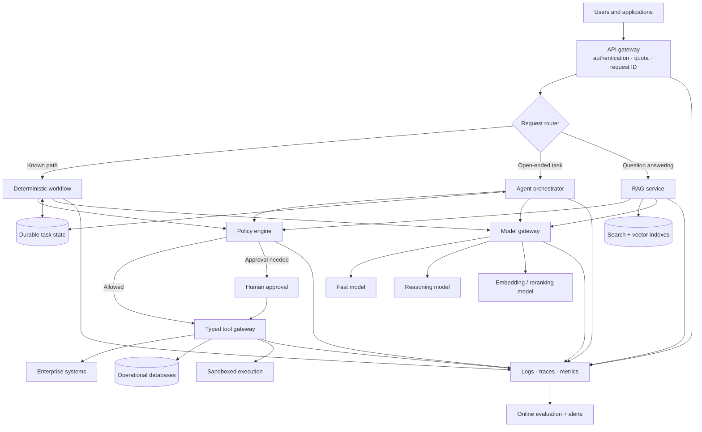
```mermaid
flowchart TB
    U["Users and applications"] --> E["API gateway<br/>authentication · quota · request ID"]
    E --> R{"Request router"}

    R -->|Known path| WF["Deterministic workflow"]
    R -->|Open-ended task| ORCH["Agent orchestrator"]
    R -->|Question answering| RAG["RAG service"]

    WF --> POL["Policy engine"]
    ORCH --> POL
    RAG --> POL

    ORCH <--> ST[("Durable task state")]
    WF <--> ST
    RAG --> IDX[("Search + vector indexes")]

    POL -->|Allowed| TOOLS["Typed tool gateway"]
    POL -->|Approval needed| HITL["Human approval"]
    HITL --> TOOLS

    TOOLS --> SYS["Enterprise systems"]
    TOOLS --> DATA[("Operational databases")]
    TOOLS --> EXEC["Sandboxed execution"]

    WF --> MGW["Model gateway"]
    ORCH --> MGW
    RAG --> MGW
    MGW --> M1["Fast model"]
    MGW --> M2["Reasoning model"]
    MGW --> M3["Embedding / reranking model"]

    E --> OBS["Logs · traces · metrics"]
    WF --> OBS
    ORCH --> OBS
    RAG --> OBS
    POL --> OBS
    TOOLS --> OBS
    MGW --> OBS
    OBS --> EV["Online evaluation + alerts"]
```

**Narrate:** authenticate → route → retrieve or reason → apply deterministic policy → execute typed tools → verify outcome → persist state → evaluate.

---

## 2. Workflow, single agent, or multi-agent decision

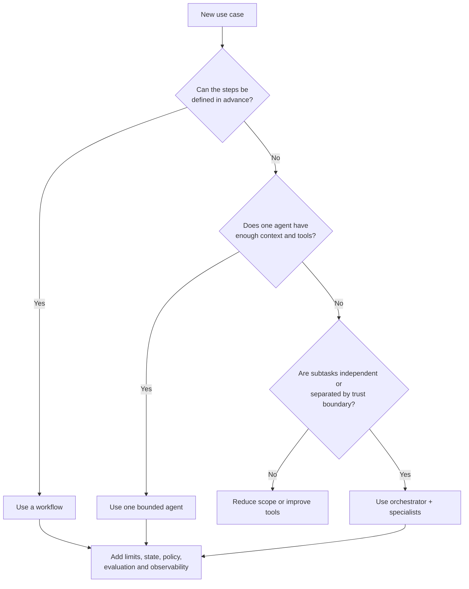
```mermaid
flowchart TD
    S["New use case"] --> P{"Can the steps be<br/>defined in advance?"}
    P -->|Yes| W["Use a workflow"]
    P -->|No| A{"Does one agent have<br/>enough context and tools?"}
    A -->|Yes| ONE["Use one bounded agent"]
    A -->|No| SPLIT{"Are subtasks independent or<br/>separated by trust boundary?"}
    SPLIT -->|No| REDUCE["Reduce scope or improve tools"]
    SPLIT -->|Yes| MULTI["Use orchestrator + specialists"]

    W --> GUARD["Add limits, state, policy,<br/>evaluation and observability"]
    ONE --> GUARD
    MULTI --> GUARD
```

---

## 3. Orchestrator-and-workers multi-agent system

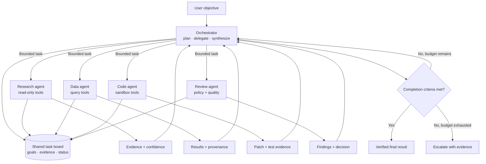
```mermaid
flowchart TB
    REQ["User objective"] --> O["Orchestrator<br/>plan · delegate · synthesize"]
    O --> B[("Shared task board<br/>goals · evidence · status")]

    O -->|Bounded task| R["Research agent<br/>read-only tools"]
    O -->|Bounded task| D["Data agent<br/>query tools"]
    O -->|Bounded task| C["Code agent<br/>sandbox tools"]
    O -->|Bounded task| V["Review agent<br/>policy + quality"]

    R --> B
    D --> B
    C --> B
    V --> B

    R --> EV1["Evidence + confidence"]
    D --> EV2["Results + provenance"]
    C --> EV3["Patch + test evidence"]
    V --> EV4["Findings + decision"]

    EV1 --> O
    EV2 --> O
    EV3 --> O
    EV4 --> O
    O --> DONE{"Completion criteria met?"}
    DONE -->|No, budget remains| O
    DONE -->|Yes| OUT["Verified final result"]
    DONE -->|No, budget exhausted| ESC["Escalate with evidence"]
```

**Production constraint:** workers return structured evidence. They do not communicate through hidden natural-language assumptions.

---

## 4. Multi-agent trust boundaries

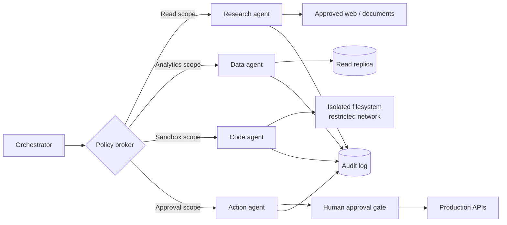
```mermaid
flowchart LR
    O["Orchestrator"] --> P{"Policy broker"}

    P -->|Read scope| RA["Research agent"]
    P -->|Analytics scope| DA["Data agent"]
    P -->|Sandbox scope| CA["Code agent"]
    P -->|Approval scope| AA["Action agent"]

    RA --> WEB["Approved web / documents"]
    DA --> RO[("Read replica")]
    CA --> SB["Isolated filesystem<br/>restricted network"]
    AA --> GATE["Human approval gate"]
    GATE --> PROD["Production APIs"]

    RA --> AUD[("Audit log")]
    DA --> AUD
    CA --> AUD
    AA --> AUD
```

**Rule:** split agents when permissions differ, not just because prompts differ.

---

## 5. Multi-agent execution sequence

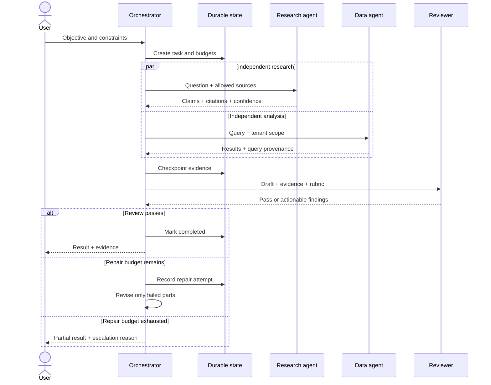
```mermaid
sequenceDiagram
    actor U as User
    participant O as Orchestrator
    participant S as Durable state
    participant R as Research agent
    participant D as Data agent
    participant V as Reviewer

    U->>O: Objective and constraints
    O->>S: Create task and budgets
    par Independent research
        O->>R: Question + allowed sources
        R-->>O: Claims + citations + confidence
    and Independent analysis
        O->>D: Query + tenant scope
        D-->>O: Results + query provenance
    end
    O->>S: Checkpoint evidence
    O->>V: Draft + evidence + rubric
    V-->>O: Pass or actionable findings
    alt Review passes
        O->>S: Mark completed
        O-->>U: Result + evidence
    else Repair budget remains
        O->>S: Record repair attempt
        O->>O: Revise only failed parts
    else Repair budget exhausted
        O-->>U: Partial result + escalation reason
    end
```

---

## 6. Enterprise wiki RAG ingestion

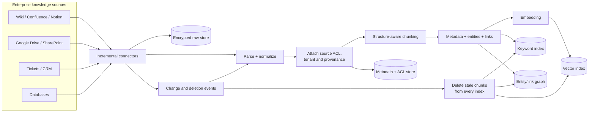
```mermaid
flowchart LR
    subgraph Sources["Enterprise knowledge sources"]
        W["Wiki / Confluence / Notion"]
        G["Google Drive / SharePoint"]
        T["Tickets / CRM"]
        DB["Databases"]
    end

    W --> CONN["Incremental connectors"]
    G --> CONN
    T --> CONN
    DB --> CONN

    CONN --> RAW[("Encrypted raw store")]
    CONN --> PARSE["Parse + normalize"]
    PARSE --> ACL["Attach source ACL,<br/>tenant and provenance"]
    ACL --> CHUNK["Structure-aware chunking"]
    CHUNK --> ENRICH["Metadata + entities + links"]
    ENRICH --> EMB["Embedding"]

    EMB --> VDB[("Vector index")]
    ENRICH --> TXT[("Keyword index")]
    ENRICH --> GRAPH[("Entity/link graph")]
    ACL --> META[("Metadata + ACL store")]

    CONN --> CDC["Change and deletion events"]
    CDC --> PARSE
    CDC --> DEL["Delete stale chunks<br/>from every index"]
    DEL --> VDB
    DEL --> TXT
    DEL --> GRAPH
```

**Production constraint:** ingestion must propagate edits, ACL changes, and deletions—not only add new embeddings.

---

## 7. Permission-aware RAG query path

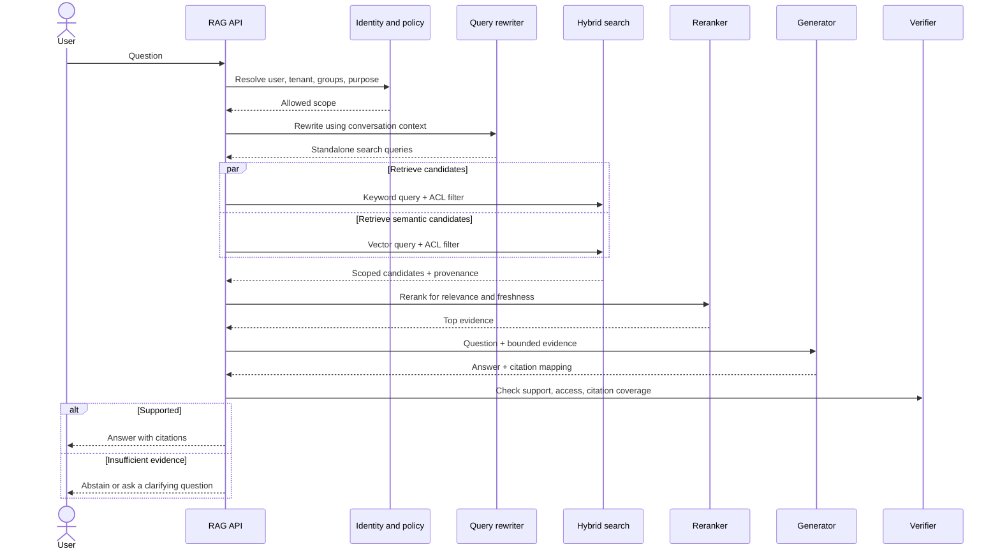
```mermaid
sequenceDiagram
    actor U as User
    participant API as RAG API
    participant IAM as Identity and policy
    participant RW as Query rewriter
    participant SR as Hybrid search
    participant RR as Reranker
    participant LLM as Generator
    participant EV as Verifier

    U->>API: Question
    API->>IAM: Resolve user, tenant, groups, purpose
    IAM-->>API: Allowed scope
    API->>RW: Rewrite using conversation context
    RW-->>API: Standalone search queries
    par Retrieve candidates
        API->>SR: Keyword query + ACL filter
    and Retrieve semantic candidates
        API->>SR: Vector query + ACL filter
    end
    SR-->>API: Scoped candidates + provenance
    API->>RR: Rerank for relevance and freshness
    RR-->>API: Top evidence
    API->>LLM: Question + bounded evidence
    LLM-->>API: Answer + citation mapping
    API->>EV: Check support, access, citation coverage
    alt Supported
        API-->>U: Answer with citations
    else Insufficient evidence
        API-->>U: Abstain or ask a clarifying question
    end
```

**Rule:** filter by authorization during retrieval, not after generation.

---

## 8. Hybrid RAG retrieval and ranking

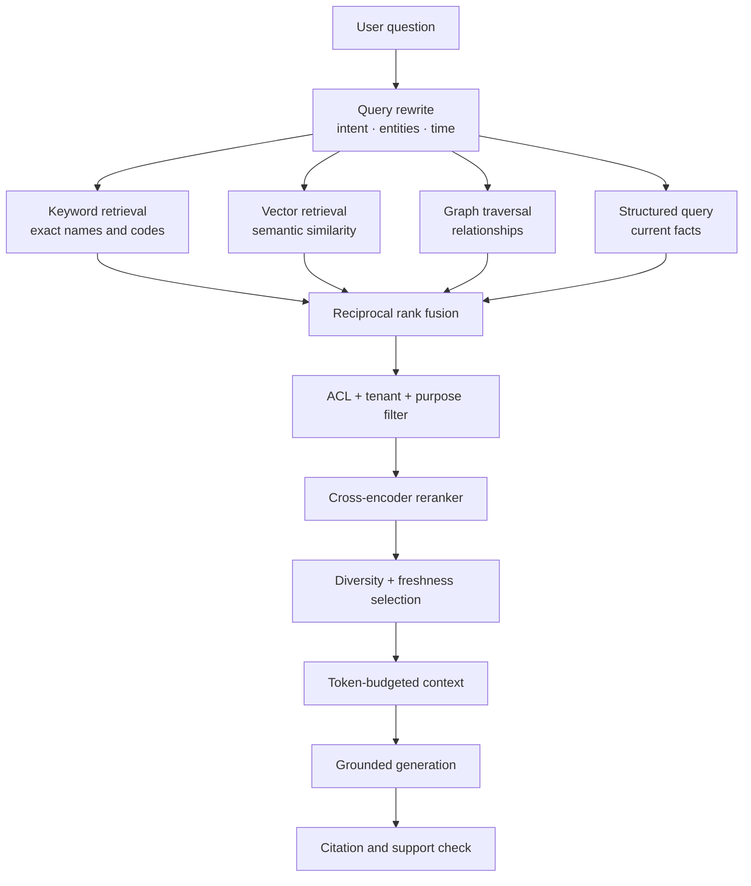
```mermaid
flowchart TB
    Q["User question"] --> QR["Query rewrite<br/>intent · entities · time"]
    QR --> BM["Keyword retrieval<br/>exact names and codes"]
    QR --> VS["Vector retrieval<br/>semantic similarity"]
    QR --> GS["Graph traversal<br/>relationships"]
    QR --> SQL["Structured query<br/>current facts"]

    BM --> MERGE["Reciprocal rank fusion"]
    VS --> MERGE
    GS --> MERGE
    SQL --> MERGE

    MERGE --> ACL["ACL + tenant + purpose filter"]
    ACL --> RR["Cross-encoder reranker"]
    RR --> DIV["Diversity + freshness selection"]
    DIV --> CTX["Token-budgeted context"]
    CTX --> GEN["Grounded generation"]
    GEN --> CIT["Citation and support check"]
```

---

## 9. Wiki assistant with conversational memory

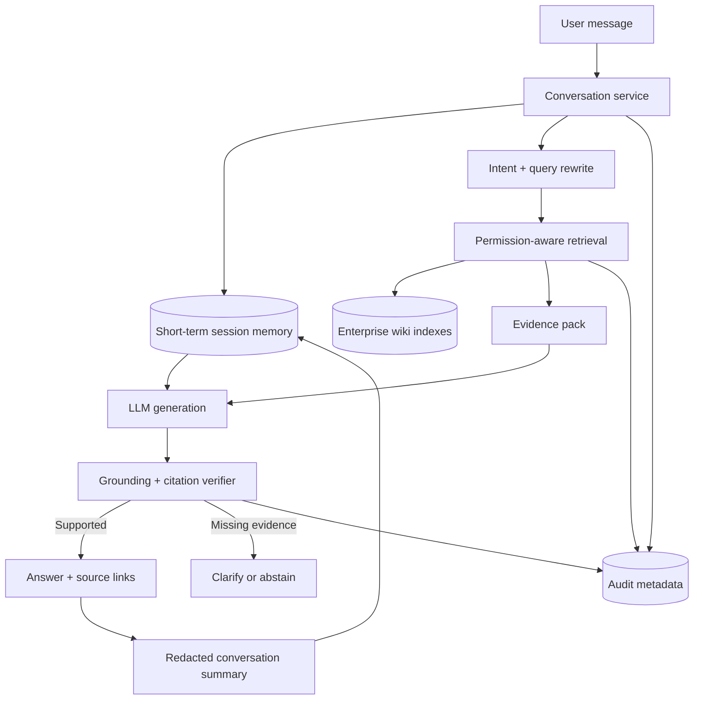
```mermaid
flowchart TB
    U["User message"] --> C["Conversation service"]
    C --> SM[("Short-term session memory")]
    C --> INT["Intent + query rewrite"]

    INT --> RET["Permission-aware retrieval"]
    RET --> KB[("Enterprise wiki indexes")]
    RET --> CTX["Evidence pack"]

    SM --> GEN["LLM generation"]
    CTX --> GEN
    GEN --> CHECK["Grounding + citation verifier"]

    CHECK -->|Supported| RESP["Answer + source links"]
    CHECK -->|Missing evidence| ASK["Clarify or abstain"]

    RESP --> SUM["Redacted conversation summary"]
    SUM --> SM

    C --> AUD[("Audit metadata")]
    RET --> AUD
    CHECK --> AUD
```

**Memory rule:** conversation memory improves continuity but does not grant access to knowledge the current user cannot retrieve.

---

## 10. Agentic RAG for complex research

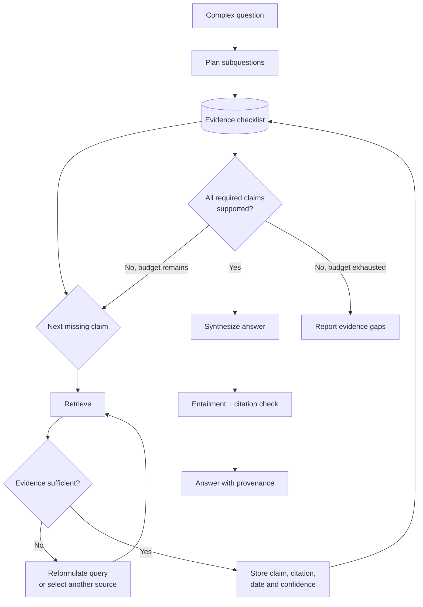
```mermaid
flowchart TD
    Q["Complex question"] --> PLAN["Plan subquestions"]
    PLAN --> TODO[("Evidence checklist")]

    TODO --> NEXT{"Next missing claim"}
    NEXT --> RET["Retrieve"]
    RET --> JUDGE{"Evidence sufficient?"}
    JUDGE -->|No| REFORM["Reformulate query<br/>or select another source"]
    REFORM --> RET
    JUDGE -->|Yes| NOTE["Store claim, citation,<br/>date and confidence"]
    NOTE --> TODO

    TODO --> COMPLETE{"All required claims<br/>supported?"}
    COMPLETE -->|No, budget remains| NEXT
    COMPLETE -->|Yes| SYN["Synthesize answer"]
    COMPLETE -->|No, budget exhausted| GAP["Report evidence gaps"]

    SYN --> VERIFY["Entailment + citation check"]
    VERIFY --> OUT["Answer with provenance"]
```

---

## 11. Durable LLM workflow

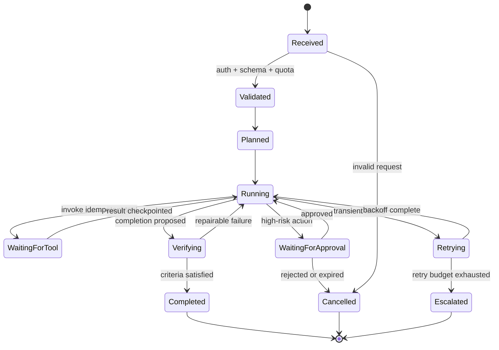
```mermaid
stateDiagram-v2
    [*] --> Received
    Received --> Validated: auth + schema + quota
    Validated --> Planned
    Planned --> Running
    Running --> WaitingForTool: invoke idempotent tool
    WaitingForTool --> Running: result checkpointed
    Running --> WaitingForApproval: high-risk action
    WaitingForApproval --> Running: approved
    WaitingForApproval --> Cancelled: rejected or expired
    Running --> Retrying: transient failure
    Retrying --> Running: backoff complete
    Retrying --> Escalated: retry budget exhausted
    Running --> Verifying: completion proposed
    Verifying --> Running: repairable failure
    Verifying --> Completed: criteria satisfied
    Received --> Cancelled: invalid request
    Completed --> [*]
    Cancelled --> [*]
    Escalated --> [*]
```

**Persist:** state, attempt number, idempotency key, tool result reference, approval decision, deadline, budget, and terminal reason.

---

## 12. Human approval for consequential actions

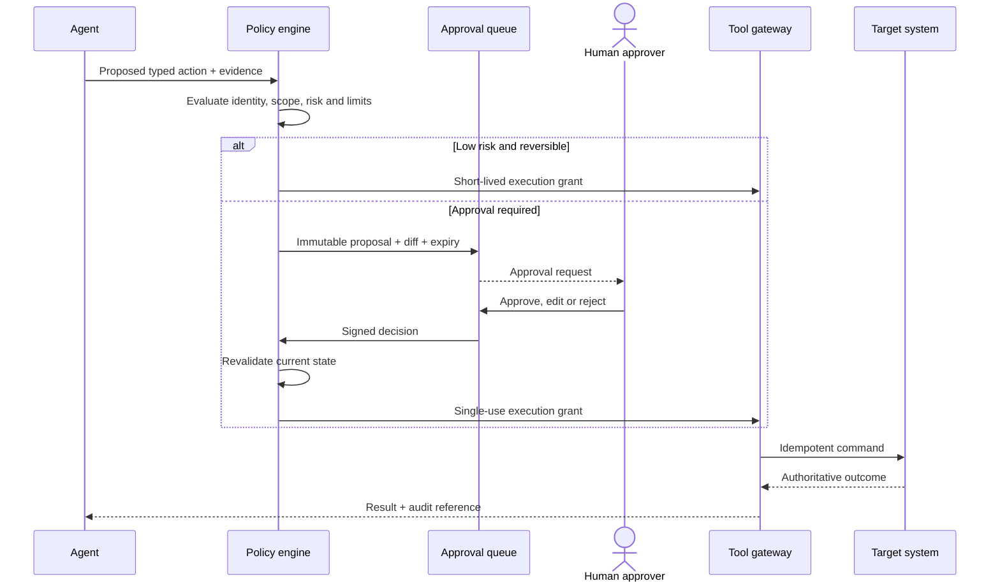
```mermaid
sequenceDiagram
    participant A as Agent
    participant P as Policy engine
    participant Q as Approval queue
    actor H as Human approver
    participant T as Tool gateway
    participant S as Target system

    A->>P: Proposed typed action + evidence
    P->>P: Evaluate identity, scope, risk and limits
    alt Low risk and reversible
        P->>T: Short-lived execution grant
    else Approval required
        P->>Q: Immutable proposal + diff + expiry
        Q-->>H: Approval request
        H->>Q: Approve, edit or reject
        Q->>P: Signed decision
        P->>P: Revalidate current state
        P->>T: Single-use execution grant
    end
    T->>S: Idempotent command
    S-->>T: Authoritative outcome
    T-->>A: Result + audit reference
```

---

## 13. Tool execution with idempotency and compensation

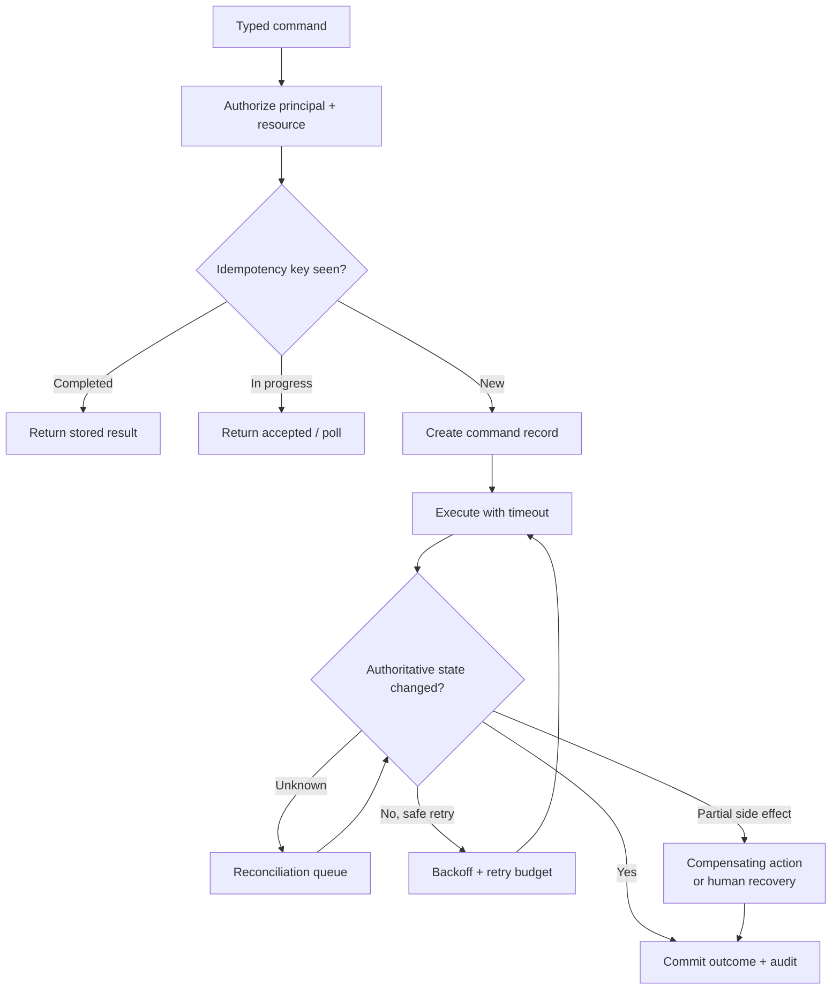
```mermaid
flowchart TD
    CMD["Typed command"] --> AUTH["Authorize principal + resource"]
    AUTH --> IDEM{"Idempotency key seen?"}
    IDEM -->|Completed| OLD["Return stored result"]
    IDEM -->|In progress| WAIT["Return accepted / poll"]
    IDEM -->|New| REC["Create command record"]

    REC --> EXEC["Execute with timeout"]
    EXEC --> VERIFY{"Authoritative state changed?"}
    VERIFY -->|Yes| DONE["Commit outcome + audit"]
    VERIFY -->|Unknown| RECON["Reconciliation queue"]
    VERIFY -->|No, safe retry| RETRY["Backoff + retry budget"]
    VERIFY -->|Partial side effect| COMP["Compensating action<br/>or human recovery"]

    RETRY --> EXEC
    RECON --> VERIFY
    COMP --> DONE
```

---

## 14. Model gateway and cost-aware routing

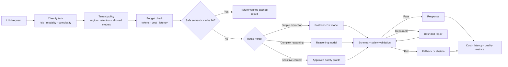
```mermaid
flowchart LR
    REQ["LLM request"] --> CLASS["Classify task<br/>risk · modality · complexity"]
    CLASS --> POL["Tenant policy<br/>region · retention · allowed models"]
    POL --> BUD["Budget check<br/>tokens · cost · latency"]
    BUD --> CACHE{"Safe semantic cache hit?"}
    CACHE -->|Yes| HIT["Return verified cached result"]
    CACHE -->|No| ROUTE{"Route model"}

    ROUTE -->|Simple extraction| SMALL["Fast low-cost model"]
    ROUTE -->|Complex reasoning| LARGE["Reasoning model"]
    ROUTE -->|Sensitive content| SAFE["Approved safety profile"]

    SMALL --> VAL["Schema + safety validation"]
    LARGE --> VAL
    SAFE --> VAL
    VAL -->|Pass| RES["Response"]
    VAL -->|Repairable| REPAIR["Bounded repair"]
    REPAIR --> VAL
    VAL -->|Fail| FALLBACK["Fallback or abstain"]

    RES --> MET["Cost · latency · quality metrics"]
    FALLBACK --> MET
```

---

## 15. Prompt-injection-resistant RAG and tools

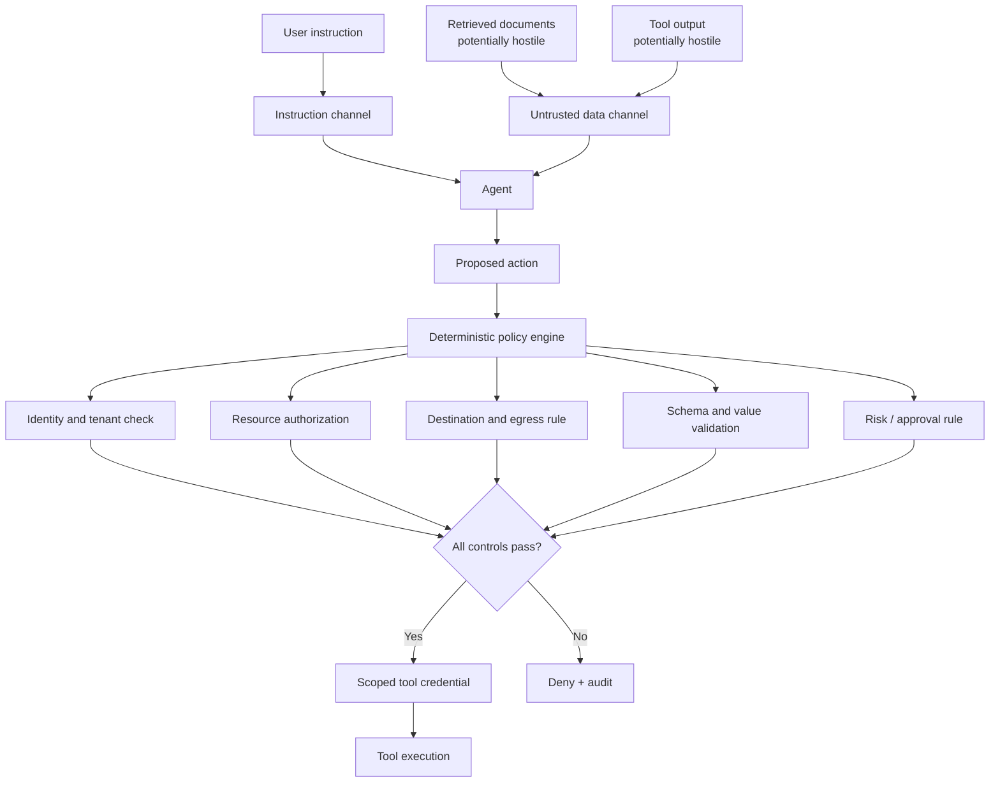
```mermaid
flowchart TB
    U["User instruction"] --> SEP["Instruction channel"]
    DOC["Retrieved documents<br/>potentially hostile"] --> DATA["Untrusted data channel"]
    TOOLR["Tool output<br/>potentially hostile"] --> DATA

    SEP --> AG["Agent"]
    DATA --> AG
    AG --> PROP["Proposed action"]
    PROP --> PE["Deterministic policy engine"]

    PE --> ID["Identity and tenant check"]
    PE --> ACL["Resource authorization"]
    PE --> DEST["Destination and egress rule"]
    PE --> ARG["Schema and value validation"]
    PE --> RISK["Risk / approval rule"]

    ID --> DEC{"All controls pass?"}
    ACL --> DEC
    DEST --> DEC
    ARG --> DEC
    RISK --> DEC

    DEC -->|Yes| TG["Scoped tool credential"]
    DEC -->|No| DENY["Deny + audit"]
    TG --> TOOL["Tool execution"]
```

**Rule:** retrieved text can inform a proposal; it cannot change permissions.

---

## 16. Sandboxed generated-code execution

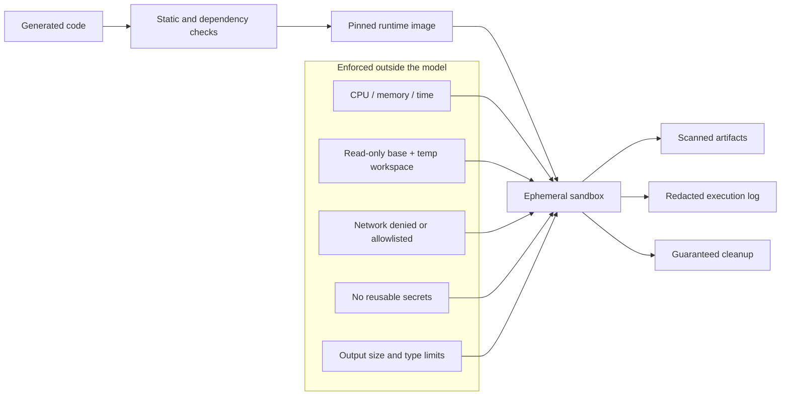
```mermaid
flowchart LR
    GEN["Generated code"] --> SCAN["Static and dependency checks"]
    SCAN --> IMG["Pinned runtime image"]
    IMG --> SB["Ephemeral sandbox"]

    subgraph Limits["Enforced outside the model"]
        CPU["CPU / memory / time"]
        FS["Read-only base + temp workspace"]
        NET["Network denied or allowlisted"]
        SEC["No reusable secrets"]
        OUT["Output size and type limits"]
    end

    CPU --> SB
    FS --> SB
    NET --> SB
    SEC --> SB
    OUT --> SB

    SB --> ART["Scanned artifacts"]
    SB --> LOG["Redacted execution log"]
    SB --> KILL["Guaranteed cleanup"]
```

---

## 17. End-to-end observability

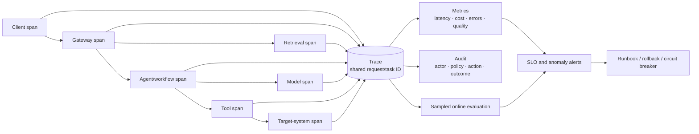
```mermaid
flowchart LR
    UI["Client span"] --> GW["Gateway span"]
    GW --> RET["Retrieval span"]
    GW --> AG["Agent/workflow span"]
    AG --> MOD["Model span"]
    AG --> TOOL["Tool span"]
    TOOL --> SYS["Target-system span"]

    UI --> TRACE[("Trace<br/>shared request/task ID")]
    GW --> TRACE
    RET --> TRACE
    AG --> TRACE
    MOD --> TRACE
    TOOL --> TRACE
    SYS --> TRACE

    TRACE --> MET["Metrics<br/>latency · cost · errors · quality"]
    TRACE --> AUD["Audit<br/>actor · policy · action · outcome"]
    TRACE --> EVAL["Sampled online evaluation"]

    MET --> ALERT["SLO and anomaly alerts"]
    EVAL --> ALERT
    ALERT --> RUN["Runbook / rollback / circuit breaker"]
```

### Trace shape

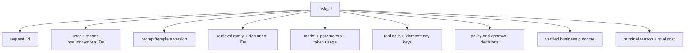
```mermaid
flowchart TB
    T["task_id"] --> R["request_id"]
    T --> U["user + tenant pseudonymous IDs"]
    T --> P["prompt/template version"]
    T --> K["retrieval query + document IDs"]
    T --> M["model + parameters + token usage"]
    T --> C["tool calls + idempotency keys"]
    T --> D["policy and approval decisions"]
    T --> O["verified business outcome"]
    T --> X["terminal reason + total cost"]
```

---

## 18. Offline and online evaluation loop

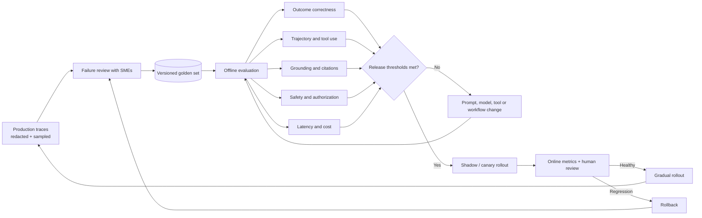
```mermaid
flowchart LR
    PROD["Production traces<br/>redacted + sampled"] --> CUR["Failure review with SMEs"]
    CUR --> GOLD[("Versioned golden set")]
    GOLD --> OFF["Offline evaluation"]

    OFF --> OUT["Outcome correctness"]
    OFF --> TRAJ["Trajectory and tool use"]
    OFF --> GRD["Grounding and citations"]
    OFF --> SAFE["Safety and authorization"]
    OFF --> OPS["Latency and cost"]

    OUT --> GATE{"Release thresholds met?"}
    TRAJ --> GATE
    GRD --> GATE
    SAFE --> GATE
    OPS --> GATE

    GATE -->|No| DEV["Prompt, model, tool or workflow change"]
    DEV --> OFF
    GATE -->|Yes| CAN["Shadow / canary rollout"]
    CAN --> ON["Online metrics + human review"]
    ON -->|Healthy| ROLL["Gradual rollout"]
    ON -->|Regression| RB["Rollback"]
    ROLL --> PROD
    RB --> CUR
```

---

## 19. Scalable deployment topology

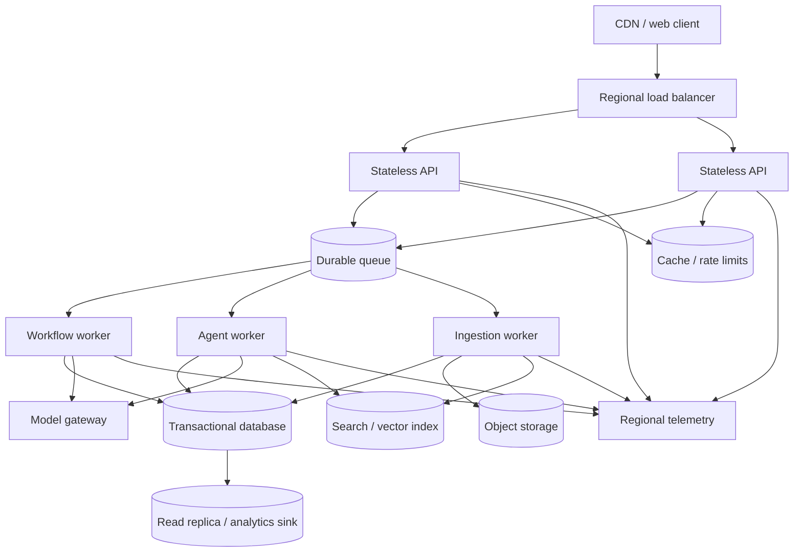
```mermaid
flowchart TB
    CDN["CDN / web client"] --> LB["Regional load balancer"]
    LB --> API1["Stateless API"]
    LB --> API2["Stateless API"]

    API1 --> Q[("Durable queue")]
    API2 --> Q
    API1 --> CACHE[("Cache / rate limits")]
    API2 --> CACHE

    Q --> W1["Workflow worker"]
    Q --> W2["Agent worker"]
    Q --> W3["Ingestion worker"]

    W1 --> DB[("Transactional database")]
    W2 --> DB
    W3 --> DB
    W1 --> MGW["Model gateway"]
    W2 --> MGW

    W3 --> OBJ[("Object storage")]
    W3 --> IDX[("Search / vector index")]
    W2 --> IDX

    DB --> REP[("Read replica / analytics sink")]
    API1 --> OBS["Regional telemetry"]
    API2 --> OBS
    W1 --> OBS
    W2 --> OBS
    W3 --> OBS
```

**Scale order:** quantify → find the bottleneck → queue variable work → add backpressure and fairness → scale stateless workers → partition state only when measurements require it.

---

## 20. Multi-tenant data isolation

```mermaid
flowchart TB
    IDP["Enterprise identity provider"] --> TOK["User + tenant + group claims"]
    TOK --> API["Application API"]
    API --> PDP["Policy decision point"]

    PDP --> RAG["RAG retrieval filter"]
    PDP --> TOOL["Tool resource scope"]
    PDP --> DB["Database row scope"]
    PDP --> OBJ["Object prefix / signed URL scope"]

    RAG --> T1I[("Shared index<br/>tenant + ACL metadata")]
    TOOL --> T1S["Tenant-scoped enterprise API"]
    DB --> T1D[("Tenant-keyed rows / RLS")]
    OBJ --> T1O[("Tenant-keyed objects")]

    API --> AUD[("Tenant-aware audit log")]
    PDP --> AUD
```

---

## 21. Production incident diagnosis

```mermaid
flowchart TD
    A["Alert or customer report"] --> S["Scope impact<br/>tenant · cohort · region · percentile"]
    S --> M["Mitigate safely<br/>rollback · disable tool · degrade"]
    M --> T["Trace one failed task end to end"]

    T --> C{"Failure layer"}
    C --> UI["Client / network"]
    C --> API["API / queue / state"]
    C --> RAG["Retrieval / ACL / freshness"]
    C --> LLM["Model / gateway / policy"]
    C --> TOOL["Tool / customer system"]

    UI --> H["Compare healthy and affected cohorts"]
    API --> H
    RAG --> H
    LLM --> H
    TOOL --> H

    H --> FIX["Test one falsifiable hypothesis"]
    FIX --> V{"Recovery verified by<br/>user outcome and SLO?"}
    V -->|No| T
    V -->|Yes| PM["Postmortem + regression test<br/>runbook + owner"]
```

---

## 22. Recommended interview drawing order

```mermaid
flowchart LR
    A["1 · Users and outcome"] --> B["2 · Request path"]
    B --> C["3 · Data and state"]
    C --> D["4 · Trust boundaries"]
    D --> E["5 · Failure and recovery"]
    E --> F["6 · Evaluation"]
    F --> G["7 · Scale and cost"]
    G --> H["8 · Rollout and ownership"]
```

### Fast narration checklist

- What is deterministic, and what may the model choose?
- Where is identity propagated and authorization enforced?
- What state survives a crash or human approval delay?
- Which calls are idempotent? Which require compensation?
- What stops loops, excessive cost, unsafe actions, and data leakage?
- How is completion verified from authoritative state?
- How are system correctness and model quality evaluated separately?
- What is the degraded mode when retrieval, a model, or a tool fails?

---

## 23. Compact one-board version

```mermaid
flowchart LR
    U["User"] --> G["Gateway<br/>identity · quota"]
    G --> R{"Route"}
    R --> W["Workflow"]
    R --> A["Agent"]
    R --> Q["RAG"]

    Q --> I[("ACL-filtered indexes")]
    A <--> S[("Durable state")]
    W <--> S

    W --> P{"Policy"}
    A --> P
    Q --> P
    P -->|Approve| H["Human"]
    P -->|Allow| T["Typed tools"]
    H --> T
    T --> X["Enterprise systems"]

    W --> M["Model gateway"]
    A --> M
    Q --> M

    G --> O["Trace + audit + eval"]
    I --> O
    S --> O
    P --> O
    T --> O
    M --> O
```

> “Identity and policy remain deterministic. RAG supplies permission-safe evidence. Workflows encode known paths. Agents choose among bounded tools when the next step depends on new evidence. Durable state, idempotency, evaluation and observability make the system operable.”
